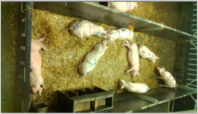
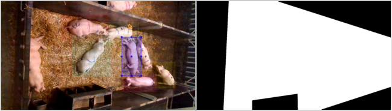
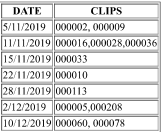
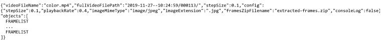
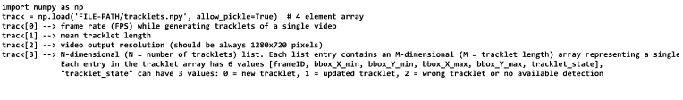
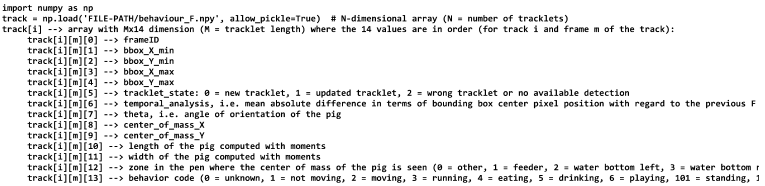

## Edinburgh Pig Behavior Video Dataset

Consiste en un conjunto de datos de 23 días (sobre 6 semanas) de captura de vídeo sobre ellos. Registra el color y profundidad de vídeo. Se capturarion 6 frames por segundo y se agruparon en lotes de 1800 frames (5 minutos). En la mayoría aparecen 8 cerdos.

El alimentador se puede ver en la parte inferior central y un bebedor a cada lado. Hay cerca de 3429000 frames.

### Índice

   * [Más detalles de segundo plano](#más-detalles-de-segundo-plano)
   * [Secuencias contrastadas](#secuencias-contrastadas)
   * [Fuente de los archivos de datos](#fuente-de-los-archivos-de-datos)
   * [Detección automática de cajas contenedoras y clasificación de comportamiento asociado](#detección-automática-de-cajas-contenedoras-y-clasificación-de-comportamiento-asociado)
   

### Más detalles de segundo plano

El dataset se recolectó entre el 5 de noviembre y el 11 de diciembre de 2019 en un mismo perímetro (5,8m x 1,9m) con 8 cerdos en el SRUC (Scotland's Rural Collegue). Los cerdos (tanto machos como hembras) pesaban alrededor de 30 kg al comienzo del estudio. Los datos fueron recolectados usando una cámara Intel RealSense D435i a 2,5m del suelo. Tanto la información RGB como la profundidad fue capturada a 6 fps con una resolución de 1280x720 y limitada a solo durante el día (7am a 7pm) debido a la ausencia de luz artificial.

### Secuencias contrastadas

12 de las secuencias se han contrastado manualmente con cajas contenedoras de ejes alineados, identificador de seguimiento persistente y una etiqueta de comportamiento. Las etiquetas se aplican a cada tercera imagen, por lo que hay 600 frames etiquetados en cada secuencia, unos 7200, cada uno con 8 etiquetas de cerdos.

Los archivos contrastados se encuentran en annotated.tar (3,2Gb), una carpeta para cada secuencia. Todas las secuencias están asociadas con una carpeta llamada 'Clip'.

Cada CLIP contiene:	

- background.png: el primer frame de color del vídeo.
- background\_depth.png: el primer frame de profundidad de imagen del vídeo.
- color.mp4: 1800 frames de vídeo de color registrado.
- depth.mp4: 1800 frames de vídeo de profundidad registrado.
- depth_scale.npy: escala de valores de píxeles a cm para el sensor de profundidad.
- inverse\_intrinsic.npy: inverso de los parámetros intrínsecos de la cámara usados para mapear los puntos de profundidad a puntos 3D.
- mask.png: una máscara binaria con 1 en el perímetro usable y 0 en el resto. (Archivo incorrecto, ignorar).
- output.json: cajas contenedoras corroboradas y otros datos. Ver [Formato del archivo JSON de corroborados y detecciones](#).
- rot.npy: los parámetros de rotación y traslación para la cámara (no se usan).
- times.txt: fecha y hora de cada frame capturado.

### Fuente de los archivos de datos

Hay 25 archivos, para 23 días de recolección. 23 son zip y 2 tar.

Hay una carpeta para cada clip de vídeo. Cada archivo de día contiene de 10 a 116 clips de vídeo separados en subcarpetas numeradas 000000, 000001, y en adelante. Quizás pueden faltar varias subcarpetas en una secuencia. Cada subcarpeta contiene 1 clip de vídeo de 5 minutos de duración con 1800 frames junto con los otros archivos descritos anteriormente.

### Detección automática de cajas contenedoras y clasificación de comportamiento asociado

Las cajas contenedoras y los comportamientos han sido computados para todos los cerdos en todos los frames. Están en results\_dataset.tar.gz (4,1Gb). No se garantiza la correción del resultado. 

En este archivo, el número de clio coincide con el número de clip real. Cada clip contiene 4 archivos python:

- tracklets.npy: describe las detecciones de seguimiento asociadas a cada cerdo.
- behavior\_F.npy: para F=15,20,25 frames. Describe las detecciones de seguimiento y comportamiento asociados a cada cerdo.

La descripción del contenido de cada archivo se describe en la sección [Formato de los archivos de detección automática de cerdos](#formato-de-los-archivos-de-detección-automática-de-cerdos).

### Reconocimiento

L. Bergamini, S. Pini, A. Simoni, R. Vezzani, S. Calderara, R. B. D'Eath, R. B. Fisher; Extracting Accurate Long-Term Behavior Changes from a Large Pig Dataset, Proc. Int. Conf. on Computer Vision Theory and Applications (VISAPP 2021), online 8-10 February 2021.

### Formato del archivo JSON de corroborados y detecciones

Consiste en una cabecera y una descripción para cada cerdo detectado y en seguimiento en cada frame. 
NOTA: como hay 600 frames corroborados, f corresponde al frame del vídeo en crudo (cada 3er frame) 3*f.
NOTA 2:un nuevo descriptor se añade cuando cambia la descripción, por lo que algunos frames corroborados no tienen un descriptor para cada frame (ej. si están durmiendo sin moverse).

**Formato de la cabecera**

**Formato de la lista de frames**

Hay una lista de frames para cada cerdo en seguimiento. 8 para los corroborados, pero quizás varía en los reales.

**Formato de los datos del frame**

Una entrada para cada cerdo detectado.

1. FNUM: el primer número de frame en el que cambian los datos desde la anterior entrada de datos de frame en la lista de frames (porque quizás no se mueve el cerdo y no hay cambios).
2. XXX: columna de la imagen del extremo superior izquierdo de la caja contenedora, donde 0 es el tope superior.
3. YYY: fila de la imagen del extremo superior izquierdo de la caja contenedora.
4. WWW: ancho en píxeles de la caja contenedora.
5. HHH: alto en píxeles de la caja contenedora.
6. "isGroundTruth":true: la anotación es parte de la corroboración.
7. "visible":true: la caja contenedora se dibujó usando herramientas de etiquetado.
8. BBB: uno de los comportamientos permitidos de {"chase", "drink"; "eat"; "figth"; "investigating"; "jump-on-top-of"; "lying"; "mount"; "nose-to-nose"; "nose-to-poke-elsewhere"; "play-with-toy"; "run"; "sitting"; "sleep"; "standing"; "tail-biting"; "walk"}

### Formato de los archivos de detección automática de cerdos

Cada carpeta de clip contiene 4 archivos python:
- tracklets.npy: describe las detecciones de seguimiento detectadas asociadas a cada cerdo.
- behavior\_F.npy: para F=15,20,25 frames. Describe la destecciones de seguimiento junto con los comportamientos asociados a cada cerdo.

Como la misma información de detección y de seguimiento se encuentra en los mencionados, solo se necesita uno de los tres archivos **behavior\_F.npy** y se puede ignorar **tracklets.npy**

**tracklets.npy**

**behavior\_F.npy**
El mínimo de movimiento está fijado a 25mm para cada frame para el comportamiento de movimiento y 110mm para el comportamiento de correr.

