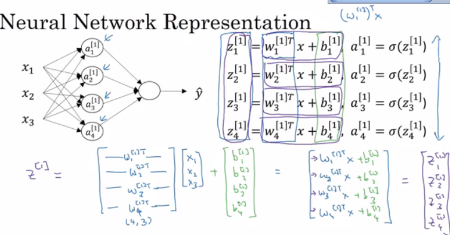
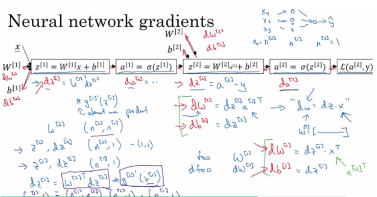
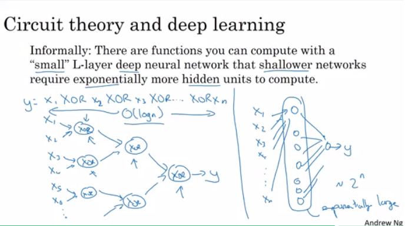

# TFG
En este archivo Readme se inclurán los conceptos más significativos de los cursos de Deeplearning.ai [Deep Learning Specialization](https://www.coursera.org/specializations/deep-learning) impartidos por Andrew Ng, de modo que sirva para afianzar conocimientos y resúmen de los mismos. Así mismo, se agradece la labor realizada por [Mahmoud Badry](https://github.com/mbadry1) de condensación del contenido, que se usará como referencia.

## Curso 1: Redes Neuronales y Deep Learning

### Índice

   * [Introducción al Deep Learning](#introducción-al-deep-learning)
      * [¿Qué es una Red Neuronal (Neural Network) NN?](#qué-es-una-red-neuronal-neural-network-nn)
      * [Aprendizaje supervisado con redes neuronales](#aprendizaje-supervisado-con-redes-neuronales)
      * [¿Por qué está despegando el Deep Learning?](#por-qué-está-despegando-el-deep-learning)
   * [Redes neuronales básicas](#redes-neuronales-básicas)
      * [Clasificación Binaria](#clasificación-binaria)
      * [Regresión Logística](#regresión-logística)
      * [Coste de la función de regresión logística](#coste-de-la-función-de-regresión-logística)
      * [Descenso de Gradiente](#descenso-de-gradiente)
      * [Grafos computacionales](#grafos-computacionales)
      * [Derivadas con grafos computacionales](#derivadas-con-grafos-computacionales)
      * [Descenso de Gradiente con regresión logística](#descenso-de-gradiente-con-regresión-logística)
      * [Descenso del Gradiente en m ejemplos](#descenso-del-gradiente-en-m-ejemplos)
      * [Vectorización](#vectorization)
      * [Vectorizando la regresión logística](#vectorizing-logistic-regression)
      * [Notas para Python y NumPy](#notes-on-python-and-numpy)
      * [Notas generales](#general-notes)
   * [Redes neuronales de poca profundidad](#shallow-neural-networks)
      * [Introducción](#neural-networks-overview)
      * [Representación de las redes neuronales](#neural-network-representation)
      * [Cálculo del resultado de una red neuronal](#computing-a-neural-networks-output)
      * [Vectorización a través de varios ejemplos](#vectorizing-across-multiple-examples)
      * [Función de activación](#activation-functions)
      * [Por qué se necesitan funciones de activación no lineales?](#why-do-you-need-non-linear-activation-functions)
      * [Derivadas de las funciones de activación](#derivatives-of-activation-functions)
      * [Descenso de gradiente para redes neuronales](#gradient-descent-for-neural-networks)
      * [Inicialización aleatoria](#random-initialization)
   * [Redes neuronales profundas](#deep-neural-networks)
      * [Redes neuronales profundas de N-capas](#deep-l-layer-neural-network)
      * [Propagación hacia adelante en una red profunda](#forward-propagation-in-a-deep-network)
      * [Estableciendo las dimensiones correctas de la matriz](#getting-your-matrix-dimensions-right)
      * [¿Por qué representaciones profundas?](#why-deep-representations)
      * [Construyendo bloques de redes neuronales profundas](#building-blocks-of-deep-neural-networks)
      * [Propagación hacia adelante y hacia atrás](#forward-and-backward-propagation)
      * [Parámetros e hiperparámetros](#parameters-vs-hyperparameters)
      * [¿Qué relación hay con el cerebro](#what-does-this-have-to-do-with-the-brain)
   * [Extra: entrevista a Ian Goodfellow](#extra-ian-goodfellow-interview)


## Introducción al Deep Learning

### ¿Qué es una Red Neuronal (Neural Network) NN?

- Una neurona == regresión linear sin aplicar la activación (perceptrón).
- Básicamente, una única neurona calculará la suma ponderada de la entrada (W.T*X) y, entonces, se establece el umbral para predecir el resultado del perceptrón. Si el la suma ponderada de entrada alcanza el umbral, el perceptrón lo devuelve.
- El perceptrón puede tomar valores reales de entrada o lógicos.
- Por lo tanto, si w⋅x+b=0, el perceptrón devuelve 0.
- La desventaja del perceptrón es que solo devuelve valores binarios, y si se intenta realizar algún cambio pequeño en los pesos, puede cambiar el resultado. Para solucionar esto, aparece la función Sigmoid.
- Si se cambia el perceptrón en la funcion sigmoid, solo devuelve un pequeño cambio en el resultado.
- Si se aplica la funcion de activación de sigmoid, la red de una única neurona actuará como un regresión logística.
- NN simple:
  - 
  - Image taken from [tutorialspoint.com](http://www.tutorialspoint.com/)
- RELU (rectified linear unit) es la función de activación más popular actual que permite entrenos de NNs profundas más rápidos.
- Las capas ocultas predicen la conexión entre las entradas de forma automática, esto es lo que se le da bien al deep learning.
- Una NN profunda consiste en más capas ocultas (capas más profundas)
  - 
  - Image taken from [opennn.net](http://www.opennn.net/)
- Cada entrada se conectará con la capa oculta y la NN decidirá las conexiones.
- El entrenamiento supervisado significa que existe (X,Y) y es necesario conseguir la función que mapee X con Y.

### Aprendizaje supervisado con redes neuronales

- Hay diferentes tipos de redes neuronales para aprendizaje supervisado:
  - CNN o redes convolucionales (útiles para visión artificial)
  - RNN o redes recurrentes (útiles para el reconocimiento de habla o NLP)
  - Standard NN (útil para datos estructurados)
  - Híbrida/personalizada o una colección de varios tipos
- Los datos estructurados se refiere a bases de datos y tablas.
- Los datos desestructurados se refieren a imagen, vídeo, audio y texto.

### ¿Por qué está despegando el Deep Learning?
  1. Datos:
       - 
     - Para una NN con pocos datos, se puede rendir con una regresión lineal o SVM (Support vector machine)
     - Cuanto más datos usemos, es más probable necesitar redes más profundas
  2. Computación:
     - GPUs.
     - CPUs.
     - Computación distribuída.
     - ASICs
  3. Algoritmos:
 		
	- Creativos algoritmos que han aparecido han cambiado el modo de trabajar de las redes neuronales.
        - Por ejemplo, RELU es mucho mejor que SIGMOID a la hora de entrenar ya que elimina el problema del gradiente.

  ​

## Redes neuronales básicas

### Clasificación Binaria

- Se centra en cómo realizar una regresión logística para hacer clasificaciones binarias.
  - 
  - Image taken from [3.bp.blogspot.com](http://3.bp.blogspot.com)
- Por ejemplo, reconocer en una imagen si aparece o no un gato.
- Anotaciones que serán usadas más adelante:
  - `M es el número de vectores de entrenamiento`
  - `Nx es el tamaño del vector de entrada`
  - `Ny es el tamaño del vector de salida`
  - `X(1) es el primer vector de entrada`
  - `Y(1) es el primer vector de salida`
  - `X = [x(1) x(2).. x(M)]`
  - `Y = (y(1) y(2).. y(M))`
- We will use python in this course.
- Con NumPy (una librería de Python)  se pueden crear matrices y operar con ellas con solo una sentencia.

### Regresión Logística

- Algoritmo que es usado para la clasificación de 2 clases.
- Ecuaciones:
  - Simple:	`y = wx + b`
  - Si x es un vector: `y = w(transposicion)x + b`
  - Si se necesita que y esté entre 0 y 1 (probabilidad): `y = sigmoid(w(transposicion)x + b)`
- En clasificación binaria `Y` toma valores entre `0` y `1`.
- En la última ecuación, `w` es un vector de `Nx` y `b` un valor real.

### Coste de la función de regresión logística

- La primera función de pérdida sería la raíz del error cuadrático medio:  `L(y',y) = 1/2 (y' - y)^2`
  - No será usada porque puede derivar en errores de optimización al tener posibles puntos óptimos locales.
- Se usará: `L(y',y) = - (y*log(y') + (1-y)*log(1-y'))`
- Explicación:
  - Si `y = 1` ==> `L(y',1) = -log(y')`  ==> se busca que `y'` sea el mayor posible ==> el máximo de `y`' es 1
  - Si `y = 0` ==> `L(y',0) = -log(1-y')` ==> se busca que `1-y'` el mayor posible ==> el mínimo `y'` para que resulte en valor 1.
- La función de coste: `J(w,b) = (1/m) * Sum(L(y'[i],y[i]))`
- La función de pérdida calcula el error para una sola muestra de entrenamiento; función de coste es la media de las funciones de pérdida de todo el conjunto de entrenamiento.

### Descenso de Gradiente

- Se desea `w` y `b` que minimicen la función de coste.
- Es una función convexa.
- Primero se inicializa `w` y `b` a 0,0 o valores aleatorios de la función y se intenta mejorar los valores para alcanzar el mínimo valor.
- En la regresión logística, normalmente se usa 0,0 en vez de valores aleatorios.
- El algoritmo del descenso de gradiente repite: `w = w - alpha * dw`
  donde alpha es el ratio de aprendizaje y `dw` es la derivada de `w` además de la pendiente de `w`
- La derivada permite conocer la dirección en la que modificar los parámetros de mejora.


- La ecuación:
  - `w = w - alpha * d(J(w,b) / dw)`        (cuánto cambia la pendiente en la dirección de w)
  - `b = b - alpha * d(J(w,b) / db)`        (cuánto cambia la pendiente en la dirección de d)


### Grafos computacionales

- Es un grafo que organiza el cálculo de izquierda a derecha. Por lo que será de ayuda a la hora de determinar la dependencia entre los valores.
  - 

### Derivadas con grafos computacionales

- Según la regla de la cadena de cálculo:
  Si `x -> y -> z`          (x afecta a 'y' y 'y' afecta a z)
  Entonces `d(z)/d(x) = d(z)/d(y) * d(y)/d(x)`
- Se muestra un ejemplo.
  - 
- Calcular las derivadas en un grafo de derecha a izquierda, facilitará el trabajo.
- `dvar` indica que las derivadas de un resultado final con respecto a cantidades intermedias.

### Descenso de Gradiente con regresión logística

- Se estudian las derivadas del descenso de gradiente para una muestra con dos características `x1` y `x2`.
  - 

### Descenso del Gradiente en m ejemplos

- Se tienen las siguientes variables:

  ```
  	X1                  Característica
  	X2                  Característica
  	W1                  Peso de la primera característica.
  	W2                  Peso de la segunda característica.
  	B                   Parámetro de la regresión logística.
  	M                   Número de los ejemplos de entrenamiento
  	Y(i)                Valor esperado de i
  ```

- Entonces:
  

- De derecha a izquierda se calculan las derivadas comparadas con el resultado:

  ```
  	d(a)  = d(l)/d(a) = -(y/a) + ((1-y)/(1-a))
  	d(z)  = d(l)/d(z) = a - y
  	d(W1) = X1 * d(z)
  	d(W2) = X2 * d(z)
  	d(B)  = d(z)
  ```

- Pseudo código de la regresión logística:

  `

  	J = 0; dw1 = 0; dw2 =0; db = 0;                 (# Derivadas.)
  	w1 = 0; w2 = 0; b=0;							(# Pesos)
  	for i = 1 to m
  		# Forward pass
  		z(i) = W1*x1(i) + W2*x2(i) + b
  		a(i) = Sigmoid(z(i))
  		J += (Y(i)*log(a(i)) + (1-Y(i))*log(1-a(i)))

  		# Backward pass
  		dz(i) = a(i) - Y(i)
  		dw1 += dz(i) * x1(i)
  		dw2 += dz(i) * x2(i)
  		db  += dz(i)
  	J /= m
  	dw1/= m
  	dw2/= m
  	db/= m

  	# Gradient descent
  	w1 = w1 - alpha * dw1
  	w2 = w2 - alpha * dw2
  	b = b - alpha * db
  
`

- El código debería ejecutarse varias iteraciones para minimizar el error.

- Por lo que habrán dos bucles anidados.

- Es importante la vectorización en el deep learning para reducir los bucles.

### Vectorization

- Deep learning shines when the dataset are big. However for loops will make you wait a lot for a result. Thats why we need vectorization to get rid of some of our for loops.
- NumPy library (dot) function is using vectorization by default.
- The vectorization can be done on CPU or GPU thought the SIMD operation. But its faster on GPU.
- Whenever possible avoid for loops.
- Most of the NumPy library methods are vectorized version.

### Vectorizing Logistic Regression

- We will implement Logistic Regression using one for loop then without any for loop.
- As an input we have a matrix `X` and its `[Nx, m]` and a matrix `Y` and its `[Ny, m]`.
- We will then compute at instance `[z1,z2...zm] = W' * X + [b,b,...b]`. This can be written in python as:

    		Z = np.dot(W.T,X) + b    # Vectorization, then broadcasting, Z shape is (1, m)
    		A = 1 / 1 + np.exp(-Z)   # Vectorization, A shape is (1, m)

- Vectorizing Logistic Regression's Gradient Output:

   			dz = A - Y                  # Vectorization, dz shape is (1, m)
   			dw = np.dot(X, dz.T) / m    # Vectorization, dw shape is (Nx, 1)
   			db = dz.sum() / m           # Vectorization, dz shape is (1, 1)

### Notes on Python and NumPy

- In NumPy, `obj.sum(axis = 0)` sums the columns while `obj.sum(axis = 1)` sums the rows.
- In NumPy, `obj.reshape(1,4)` changes the shape of the matrix by broadcasting the values.
- Reshape is cheap in calculations so put it everywhere you're not sure about the calculations.
- Broadcasting works when you do a matrix operation with matrices that doesn't match for the operation, in this case NumPy automatically makes the shapes ready for the operation by broadcasting the values.
- In general principle of broadcasting. If you have an (m,n) matrix and you add(+) or subtract(-) or multiply(*) or divide(/) with a (1,n) matrix, then this will copy it m times into an (m,n) matrix. The same with if you use those operations with a (m , 1) matrix, then this will copy it n times into (m, n) matrix. And then apply the addition, subtraction, and multiplication of division element wise.
- Some tricks to eliminate all the strange bugs in the code:
  - If you didn't specify the shape of a vector, it will take a shape of `(m,)` and the transpose operation won't work. You have to reshape it to `(m, 1)`
  - Try to not use the rank one matrix in ANN
  - Don't hesitate to use `assert(a.shape == (5,1))` to check if your matrix shape is the required one.
  - If you've found a rank one matrix try to run reshape on it.
- Jupyter / IPython notebooks are so useful library in python that makes it easy to integrate code and document at the same time. It runs in the browser and doesn't need an IDE to run.
  - To open Jupyter Notebook, open the command line and call: `jupyter-notebook` It should be installed to work.
- To Compute the derivative of Sigmoid:

  ```
  	s = sigmoid(x)
  	ds = s * (1 - s)       # derivative  using calculus
  ```

- To make an image of `(width,height,depth)` be a vector, use this:

  ```
  v = image.reshape(image.shape[0]*image.shape[1]*image.shape[2],1)  #reshapes the image.
  ```

- Gradient descent converges faster after normalization of the input matrices.

### General Notes

- The main steps for building a Neural Network are:
  - Define the model structure (such as number of input features and outputs)
  - Initialize the model's parameters.
  - Loop.
    - Calculate current loss (forward propagation)
    - Calculate current gradient (backward propagation)
    - Update parameters (gradient descent)
- Preprocessing the dataset is important.
- Tuning the learning rate (which is an example of a "hyperparameter") can make a big difference to the algorithm.
- [kaggle.com](kaggle.com) is a good place for datasets and competitions.
- [Pieter Abbeel](https://www2.eecs.berkeley.edu/Faculty/Homepages/abbeel.html) is one of the best in deep reinforcement learning.


## Shallow neural networks

> Learn to build a neural network with one hidden layer, using forward propagation and backpropagation.

### Neural Networks Overview

- In logistic regression we had:

  ```
  X1  \  
  X2   ==>  z = XW + B ==> a = Sigmoid(z) ==> l(a,Y)
  X3  /
  ```

- In neural networks with one layer we will have:

  ```
  X1  \  
  X2   =>  z1 = XW1 + B1 => a1 = Sigmoid(z1) => z2 = a1W2 + B2 => a2 = Sigmoid(z2) => l(a2,Y)
  X3  /
  ```


- `X` is the input vector `(X1, X2, X3)`, and `Y` is the output variable `(1x1)`
- NN is stack of logistic regression objects.

### Neural Network Representation

- We will define the neural networks that has one hidden layer.
- NN contains of input layers, hidden layers, output layers.
- Hidden layer means we cant see that layers in the training set.
- `a0 = x` (the input layer)
- `a1` will represent the activation of the hidden neurons.
- `a2` will represent the output layer.
- We are talking about 2 layers NN. The input layer isn't counted.

### Computing a Neural Network's Output

- Equations of Hidden layers:
  - 
- Here are some informations about the last image:
  - `noOfHiddenNeurons = 4`
  - `Nx = 3`
  - Shapes of the variables:
    - `W1` is the matrix of the first hidden layer, it has a shape of `(noOfHiddenNeurons,nx)`
    - `b1` is the matrix of the first hidden layer, it has a shape of `(noOfHiddenNeurons,1)`
    - `z1` is the result of the equation `z1 = W1*X + b`, it has a shape of `(noOfHiddenNeurons,1)`
    - `a1` is the result of the equation `a1 = sigmoid(z1)`, it has a shape of `(noOfHiddenNeurons,1)`
    - `W2` is the matrix of the second hidden layer, it has a shape of `(1,noOfHiddenNeurons)`
    - `b2` is the matrix of the second hidden layer, it has a shape of `(1,1)`
    - `z2` is the result of the equation `z2 = W2*a1 + b`, it has a shape of `(1,1)`
    - `a2` is the result of the equation `a2 = sigmoid(z2)`, it has a shape of `(1,1)`

### Vectorizing across multiple examples

- Pseudo code for forward propagation for the 2 layers NN:

  ```
  for i = 1 to m
    z[1, i] = W1*x[i] + b1      # shape of z[1, i] is (noOfHiddenNeurons,1)
    a[1, i] = sigmoid(z[1, i])  # shape of a[1, i] is (noOfHiddenNeurons,1)
    z[2, i] = W2*a[1, i] + b2   # shape of z[2, i] is (1,1)
    a[2, i] = sigmoid(z[2, i])  # shape of a[2, i] is (1,1)
  ```

- Lets say we have `X` on shape `(Nx,m)`. So the new pseudo code:

  ```
  Z1 = W1X + b1     # shape of Z1 (noOfHiddenNeurons,m)
  A1 = sigmoid(Z1)  # shape of A1 (noOfHiddenNeurons,m)
  Z2 = W2A1 + b2    # shape of Z2 is (1,m)
  A2 = sigmoid(Z2)  # shape of A2 is (1,m)
  ```

- If you notice always m is the number of columns.
- In the last example we can call `X` = `A0`. So the previous step can be rewritten as:

  ```
  Z1 = W1A0 + b1    # shape of Z1 (noOfHiddenNeurons,m)
  A1 = sigmoid(Z1)  # shape of A1 (noOfHiddenNeurons,m)
  Z2 = W2A1 + b2    # shape of Z2 is (1,m)
  A2 = sigmoid(Z2)  # shape of A2 is (1,m)
  ```

### Activation functions

- So far we are using sigmoid, but in some cases other functions can be a lot better.
- Sigmoid can lead us to gradient decent problem where the updates are so low.
- Sigmoid activation function range is [0,1]
  `A = 1 / (1 + np.exp(-z)) # Where z is the input matrix`
- Tanh activation function range is [-1,1]   (Shifted version of sigmoid function)
  - In NumPy we can implement Tanh using one of these methods:
    `A = (np.exp(z) - np.exp(-z)) / (np.exp(z) + np.exp(-z)) # Where z is the input matrix`

    Or
    `A = np.tanh(z)   # Where z is the input matrix`
- It turns out that the tanh activation usually works better than sigmoid activation function for hidden units because the mean of its output is closer to zero, and so it centers the data better for the next layer.
- Sigmoid or Tanh function disadvantage is that if the input is too small or too high, the slope will be near zero which will cause us the gradient decent problem.
- One of the popular activation functions that solved the slow gradient decent is the RELU function.
  `RELU = max(0,z) # so if z is negative the slope is 0 and if z is positive the slope remains linear.`
- So here is some basic rule for choosing activation functions, if your classification is between 0 and 1, use the output activation as sigmoid and the others as RELU.
- Leaky RELU activation function different of RELU is that if the input is negative the slope will be so small. It works as RELU but most people uses RELU.
  `Leaky_RELU = max(0.01z,z)  #the 0.01 can be a parameter for your algorithm.`
- In NN you will decide a lot of choices like:
  - No of hidden layers.
  - No of neurons in each hidden layer.
  - Learning rate.       (The most important parameter)
  - Activation functions.
  - And others..
- It turns out there are no guide lines for that. You should try all activation functions for example.

### Why do you need non-linear activation functions?

- If we removed the activation function from our algorithm that can be called linear activation function.
- Linear activation function will output linear activations
  - Whatever hidden layers you add, the activation will be always linear like logistic regression (So its useless in a lot of complex problems)
- You might use linear activation function in one place - in the output layer if the output is real numbers (regression problem). But even in this case if the output value is non-negative you could use RELU instead.

### Derivatives of activation functions

- Derivation of Sigmoid activation function:

  ```
  g(z)  = 1 / (1 + np.exp(-z))
  g'(z) = (1 / (1 + np.exp(-z))) * (1 - (1 / (1 + np.exp(-z))))
  g'(z) = g(z) * (1 - g(z))
  ```

- Derivation of Tanh activation function:

  ```
  g(z)  = (e^z - e^-z) / (e^z + e^-z)
  g'(z) = 1 - np.tanh(z)^2 = 1 - g(z)^2
  ```

- Derivation of RELU activation function:

  ```
  g(z)  = np.maximum(0,z)
  g'(z) = { 0  if z < 0
            1  if z >= 0  }
  ```

- Derivation of leaky RELU activation function:

  ```
  g(z)  = np.maximum(0.01 * z, z)
  g'(z) = { 0.01  if z < 0
            1     if z >= 0   }
  ```

### Gradient descent for Neural Networks
- In this section we will have the full back propagation of the neural network (Just the equations with no explanations).
- Gradient descent algorithm:
  - NN parameters:
    - `n[0] = Nx`
    - `n[1] = NoOfHiddenNeurons`
    - `n[2] = NoOfOutputNeurons = 1`
    - `W1` shape is `(n[1],n[0])`
    - `b1` shape is `(n[1],1)`
    - `W2` shape is `(n[2],n[1])`
    - `b2` shape is `(n[2],1)`
  - Cost function `I =  I(W1, b1, W2, b2) = (1/m) * Sum(L(Y,A2))`
  - Then Gradient descent:

    ```
    Repeat:
    		Compute predictions (y'[i], i = 0,...m)
    		Get derivatives: dW1, db1, dW2, db2
    		Update: W1 = W1 - LearningRate * dW1
    				b1 = b1 - LearningRate * db1
    				W2 = W2 - LearningRate * dW2
    				b2 = b2 - LearningRate * db2
    ```

- Forward propagation:

  ```
  Z1 = W1A0 + b1    # A0 is X
  A1 = g1(Z1)
  Z2 = W2A1 + b2
  A2 = Sigmoid(Z2)      # Sigmoid because the output is between 0 and 1
  ```

- Backpropagation (derivations):   
  ```
  dZ2 = A2 - Y      # derivative of cost function we used * derivative of the sigmoid function
  dW2 = (dZ2 * A1.T) / m
  db2 = Sum(dZ2) / m
  dZ1 = (W2.T * dZ2) * g'1(Z1)  # element wise product (*)
  dW1 = (dZ1 * A0.T) / m   # A0 = X
  db1 = Sum(dZ1) / m
  # Hint there are transposes with multiplication because to keep dimensions correct
  ```
- How we derived the 6 equations of the backpropagation:   
  

### Random Initialization

- In logistic regression it wasn't important to initialize the weights randomly, while in NN we have to initialize them randomly.

- If we initialize all the weights with zeros in NN it won't work (initializing bias with zero is OK):
  - all hidden units will be completely identical (symmetric) - compute exactly the same function
  - on each gradient descent iteration all the hidden units will always update the same

- To solve this we initialize the W's with a small random numbers:

  ```
  W1 = np.random.randn((2,2)) * 0.01    # 0.01 to make it small enough
  b1 = np.zeros((2,1))                  # its ok to have b as zero, it won't get us to the symmetry breaking problem
  ```

- We need small values because in sigmoid (or tanh), for example, if the weight is too large you are more likely to end up even at the very start of training with very large values of Z. Which causes your tanh or your sigmoid activation function to be saturated, thus slowing down learning. If you don't have any sigmoid or tanh activation functions throughout your neural network, this is less of an issue.

- Constant 0.01 is alright for 1 hidden layer networks, but if the NN is deep this number can be changed but it will always be a small number.

## Deep Neural Networks

> Understand the key computations underlying deep learning, use them to build and train deep neural networks, and apply it to computer vision.

### Deep L-layer neural network

- Shallow NN is a NN with one or two layers.
- Deep NN is a NN with three or more layers.
- We will use the notation `L` to denote the number of layers in a NN.
- `n[l]` is the number of neurons in a specific layer `l`.
- `n[0]` denotes the number of neurons input layer. `n[L]` denotes the number of neurons in output layer.
- `g[l]` is the activation function.
- `a[l] = g[l](z[l])`
- `w[l]` weights is used for `z[l]`
- `x = a[0]`, `a[l] = y'`
- These were the notation we will use for deep neural network.
- So we have:
  - A vector `n` of shape `(1, NoOfLayers+1)`
  - A vector `g` of shape `(1, NoOfLayers)`
  - A list of different shapes `w` based on the number of neurons on the previous and the current layer.
  - A list of different shapes `b` based on the number of neurons on the current layer.

### Forward Propagation in a Deep Network

- Forward propagation general rule for one input:

  ```
  z[l] = W[l]a[l-1] + b[l]
  a[l] = g[l](a[l])
  ```

- Forward propagation general rule for `m` inputs:

  ```
  Z[l] = W[l]A[l-1] + B[l]
  A[l] = g[l](A[l])
  ```

- We can't compute the whole layers forward propagation without a for loop so its OK to have a for loop here.
- The dimensions of the matrices are so important you need to figure it out.

### Getting your matrix dimensions right

- The best way to debug your matrices dimensions is by a pencil and paper.
- Dimension of `W` is `(n[l],n[l-1])` . Can be thought by right to left.
- Dimension of `b` is `(n[l],1)`
- `dw` has the same shape as `W`, while `db` is the same shape as `b`
- Dimension of `Z[l],` `A[l]`, `dZ[l]`, and `dA[l]`  is `(n[l],m)`

### Why deep representations?

- Why deep NN works well, we will discuss this question in this section.
- Deep NN makes relations with data from simpler to complex. In each layer it tries to make a relation with the previous layer. E.g.:
  - 1) Face recognition application:
      - Image ==> Edges ==> Face parts ==> Faces ==> desired face
  - 2) Audio recognition application:
      - Audio ==> Low level sound features like (sss,bb) ==> Phonemes ==> Words ==> Sentences
- Neural Researchers think that deep neural networks "think" like brains (simple ==> complex)
- Circuit theory and deep learning:
  - 
- When starting on an application don't start directly by dozens of hidden layers. Try the simplest solutions (e.g. Logistic Regression), then try the shallow neural network and so on.

### Building blocks of deep neural networks

- Forward and back propagation for a layer l:
  - 
- Deep NN blocks:
  - 

### Forward and Backward Propagation

- Pseudo code for forward propagation for layer l:

  ```
  Input  A[l-1]
  Z[l] = W[l]A[l-1] + b[l]
  A[l] = g[l](Z[l])
  Output A[l], cache(Z[l])
  ```

- Pseudo  code for back propagation for layer l:

  ```
  Input da[l], Caches
  dZ[l] = dA[l] * g'[l](Z[l])
  dW[l] = (dZ[l]A[l-1].T) / m
  db[l] = sum(dZ[l])/m                # Dont forget axis=1, keepdims=True
  dA[l-1] = w[l].T * dZ[l]            # The multiplication here are a dot product.
  Output dA[l-1], dW[l], db[l]
  ```

- If we have used our loss function then:

  ```
  dA[L] = (-(y/a) + ((1-y)/(1-a)))
  ```

### Parameters vs Hyperparameters

- Main parameters of the NN is `W` and `b`
- Hyper parameters (parameters that control the algorithm) are like:
  - Learning rate.
  - Number of iteration.
  - Number of hidden layers `L`.
  - Number of hidden units `n`.
  - Choice of activation functions.
- You have to try values yourself of hyper parameters.
- In the earlier days of DL and ML learning rate was often called a parameter, but it really is (and now everybody call it) a hyperparameter.
- On the next course we will see how to optimize hyperparameters.

### What does this have to do with the brain

- The analogy that "It is like the brain" has become really an oversimplified explanation.
- There is a very simplistic analogy between a single logistic unit and a single neuron in the brain.
- No human today understand how a human brain neuron works.
- No human today know exactly how many neurons on the brain.
- Deep learning in Andrew's opinion is very good at learning very flexible, complex functions to learn X to Y mappings, to learn input-output mappings (supervised learning).
- The field of computer vision has taken a bit more inspiration from the human brains then other disciplines that also apply deep learning.
- NN is a small representation of how brain work. The most near model of human brain is in the computer vision (CNN)

## Extra: Ian Goodfellow interview

- Ian is one of the world's most visible deep learning researchers.
- Ian is mainly working with generative models. He is the creator of GANs.
- We need to stabilize GANs. Stabilized GANs can become the best generative models.
- Ian wrote the first textbook on the modern version of deep learning with Yoshua Bengio and Aaron Courville.
- Ian worked with [OpenAI.com](https://openai.com/) and Google on ML and NN applications.
- Ian tells all who wants to get into AI to get a Ph.D. or post your code on Github and the companies will find you.
- Ian thinks that we need to start anticipating security problems with ML now and make sure that these algorithms are secure from the start instead of trying to patch it in retroactively years later.


