# Redes Neuronales Convolucionales

## Índice

* [Redes Neuronales Convolucionales](#redes-neuronales-convolucionales)
   * [Fundamentos de las CNNs](#fundamentos-de-las-cnns)
      * [Visión artificial](#visión-artificial)
      * [Ejemplo de detección de bordes](#ejemplo-de-detección-de-bordes)
      * [Padding](#padding)
      * [Convolución escalonada](#convolución-escalonada)
      * [Convoluciones sobre volúmenes](#convoluciones-sobre-volúmenes)
      * [Una capa de una red convolucional](#una-capa-de-una-red-convolucional)
      * [Un ejemplo de CNN simple](#un-ejemplo-de-cnn-simple)
      * [Capas de pooling](#capas-de-pooling)
      * [Ejemplo de CNN](#ejemplo-de-cnn)
      * [¿Por qué convoluciones?](por-qué-convoluciones)
   * [Modelos de convolución profunda: estudio de casos](#modelos-de-convolución-profunda-estudio-de-casos)
      * [¿Por qué observar estudios de casos?](#por-qué-observar-estudios-de-casos)
      * [Redes clásicas](#redes-clásicas)
      * [Redes residuales (ResNets)](#redes-residuales-resnets)
      * [¿Por qué funcionan las ResNet?](#por-qué-funcionan-las-resnet)
      * [Redes dentro de redes y convoluciones 1 X 1](#redes-dentro-de-redes-y-convoluciones-1-x-1)
      * [Motivación de la red Inception](#motivación-de-la-red-inception)
      * [Red Inception (GoogleNet)](#red-inception-googlenet)
      * [Usando una implementación open-source](#usando-una-implementación-open-source)
      * [Aprendizaje por transferencia](#aprendizaje-por-transferencia)
      * [Aumento de datos](#aumento-de-datos)
      * [Estado de la visión artificial](#estado-de-la-visión-artificial)
   * [Detección de objetos](#detección-de-objetos)
      * [Localización de objetos](#localización-de-objetos)
      * [Detección de puntos de referencia](#detección-de-puntos-de-referencia)
      * [Detección de objetos](#detección-de-objetos-1)
      * [Implementación convolucional de ventanas corredizas](#implementación-convolucional-de-ventanas-corredizas)
      * [Predicciones de cajas contenedoras](#predicciones-de-cajas-contenedoras)
      * [Intersección sobre Unión](#intersección-sobre-unión)
      * [Supresión no máxima](#supresión-no-máxima)
      * [Cajas ancla](#cajas-ancla)
      * [Algoritmo YOLO](#algoritmo-yolo)
      * [Propuestas de región (R-CNN)](#propuestas-de-región-r-cnn)
   * [Aplicaciones especiales: Reconocimiento facial y Transferencia de estilo](#aplicaciones-especiales-reconocimiento-facial-y-transferencia-de-estilo)
      * [Reconocimiento facial](#reconocimiento-facial)
         * [¿Qué es el reconocimiento facial?](#qué-es-el-reconocimiento-facial)
         * [Aprendizaje de una sola vez](#aprendizaje-de-una-sola-vez)
         * [Red siamesa](#red-siamesa)
         * [Pérdida de triplete](#pérdida-de-triplete)
         * [Verificación facial y clasificación binaria](#verificación-facial-y-clasificación-binaria)
      * [Transferencia de estilo neuronal](#transferencia-de-estilo-neuronal)
         * [¿Qué es la transferencia de estilo neuronal?](#qué-es-la-transferencia-de-estilo-neuronal)
         * [¿Qué aprenden las ConvNets profundas?](#qué-aprenden-las-convnets-profundas)
         * [Función de coste](#función-de-coste)
         * [Función de coste del contenido](#función-de-coste-del-contenido)
         * [Función de coste de estilo](#función-de-coste-de-estilo)
         * [Generalizaciones 1D y 3D](#generalizaciones-1d-y-3d)
   * [Extras](#extras)
      * [Keras](#keras)

## Fundamentos de las CNNs

### Visión artificial

- Agunas de las aplicaciones que aplican la visión artificial que usan deep learning::
  - Conducción automática.
  - Reconocimiento facial.
- El deep learning también está permitiendo la creación de nuevos tipos de arte.
- Las técnicas de deep learning de visión artificial están en continuo desarrollo, lo que permite ayudar en otras áreas.
- Ejemplos de problemas de visión artificial:
  - Clasificación de imágenes.
  - Detección de objetos.
    - Detectar objetos y localizarlos.
  - Transferencia de estilo neuronal
    - Cambiar el estilo de una imagen usando otra.
- Uno de los problemas de la visión artificial es que las imágenes pueden ocupar mucho y lo que se desea son lagoritmos rápidos y precisos que las manejen.
  - Por ejemplo, una imagen de `1000x1000` representa 3 millones de características/entradas de una red neuronal completamente conectada. Si la siguiente capa oculta contiene 1000 unidades, habrá que aprender los pesos de una dimensión de  `[1000, 3 millones]`en solo la primera capa.
- Una de las soluciones es contruir usando **capas convolucionales** en vez de **capas completamente conectadas**.

### Ejemplo de detección de bordes

- La operación de convolución es uno de los bloques fundamentales de las redes convolucionales (CNN).
- En un ejemplo de detección de objetos, las primeras capas de las CNN detectan bordes, las intermedias detectan partes de objetos y las últimas obtienen el resultado.
- En una imagen se pueden detectar bordes verticales, bordes horizontales y In an image we can detect vertical edges, horizontal edges, o	bordes completos.
- Detección de bordes verticales:
  - Operación de convolución para detectar bordes:
    - 
  - En el ejemplo, una matriz de `6x6` la convolución con un filtro/kernel de `3x3` da una matriz de `4x4`.
  - Para hacer convoluciones en TensorFlow está la función `tf.nn.conv2d`. En Keras, `Conv2d`.
  - El filtro de detección de bordes verticales encuentra una posición de `3x3` en la imagen, donde hay una región brillante seguida de una oscura.
  - Si se aplica el filtro a una región blanca seguida de una oscura, se debería encontrar bordes entre los colores como un valor positivo. Pero si se aplica el mismo filtro a una región negativa seguida de una clara, se obtendrán valores negativos. Para resolver esto se usan valores absolutos.
- Detección de bordes horizontales
  - El filtro sería así

 
		    1	1	1
		    0	0	0
		    -1	-1	-1
 

- Hay muchos modos de poner números en de la detección de bordes verticales y horizontales. Por ejemplo, el filtro **Sobel** (la idea es centrarse en la fila central):

 
		  1		0	-1
		  2		0	-2
		  1		0	-1
 

- Filtro **Scharr** (la idea es tener mucho cuidado con la fila central):

  
		  3		0	-3
		  10	0	-10
		  3		0	-3
 

- No es necesario trabajar a mano con estos números, pueden ser tratados como pesos y aprenderlos después. Se pueden aprender bordes horizontales, verticales, con ángulo o de cualquier tipo de forma automática.

### Padding

- Para aprender a usar las NN profundas es necesario aprender a utolizar **paddings** (relleno).
- Como regla general, si una matriz `nxn` es convolucionada con un filtro/kernel `fxf`, obtenermos una matriz `n-f+1,n-f+1`. 
- La operación de convolución encoge la matriz si f>1.
- Se busca aplicar la convolución múltiples veces, pero si la imagen se encoge, se perderá información en el proceso. Además, los píxeles de los bordes son usados menos que otros píxeles de la imagen.
- Los problemas de las convoluciones:
  - Reducción de salida.
  - Se desecha mucha información que está en los bordes.
- Para resolver esto, se añade relleno antes de convolucionar añadiendo columnas y filas. La cantidad de relleno `P` es el número de filas/columnas que se añaden en las partes superior, inferior, izquierda y derecha de la imagen.
- En casi todos los casos, los valores de relleno son 0.
- La regla general,  si una matriz `nxn` se convoluciona con el filtro/kernel `fxf` y el padding `p`, se obtiene la matriz `n+2p-f+1,n+2p-f+1`. 
- Si n = 6, f = 3, y p = 1, la imagen de salida será `n+2p-f+1 = 6+2-3+1 = 6`. Se mantiene el tamaño.
- La misma convolución es una convolución con un pad (relleno) para que el tamaño de salida sea el mismo que el tamaño de entrada. La ecuación:
 
  		P = (f-1) / 2
 

- En visión artificial, f suele ser impar.

### Convolución escalonada

- La convolución escalonada  es otra pieza de las CNN.

- A cada paso se le llamará `S`.

- Cuando se convoluciona se usa `S` para indicar el número de píxeles que se saltarán cuando se convolucione el filtro/kernel. En el anterior ejemplo era 1.

- Como regla:
  -  Si una matriz `nxn` se convoluciona con el filtro/kernel `fxf` y el relleno `p` y el escalón `s`, devuelve `(n+2p-f)/s + 1,(n+2p-f)/s + 1`. 

- En el caso `(n+2p-f)/s + 1` es una fracción, por lo que se puede tomar el valor por debajo.

- En la literatura matemática, la operación de convolución le da la vuelta al filtro antes de usarlo. A esto se le llama operación de correlación cruzada, pero en el estado del arte del deep learning se usa como una operación de convolución.

- La misma convolución (convolución con un padding para que la salida tenga el tamaño de la entrada):

 
		  p = (n*s - n + f - s) / 2
		  Cuando s = 1 ==> P = (f-1) / 2
 

### Convoluciones sobre volúmenes

- Se convuelve una imagen en altura, ancho y número de canales con un filtro de una altura, ancho y mismo número de canales. Ambos números de canales son iguales.
- A esto se le puede llamar stacks de filtros para cada canal!
- Ejemplo:
  - Imagen: `6x6x3`
  - Filtro: `3x3x3`
  - Imagen resultante: `4x4x1`
  - p=0, s=1
- La salida es solo en 2D.
- Se pueden usar múltiples filtros para detectar múltiples características o bordes:
  - Imagen: `6x6x3`
  - 10 Filtros: `3x3x3`
  - Imagen resultante: `4x4x10`
  - p=0, s=1

### Una capa de una red convolucional

- Primero se convolucionan algunos filtros para una entrada dada y después se añade una bias a cada salida del filtro y se obtiene el RELU del resultado:
  - Imagen: `6x6x3`         `# a0`
  - 10 Filtros: `3x3x3`         `#W1`
  - Imagen resultante: `4x4x10`     `#W1a0`
  - Añadir b (bias) con `10x1` dará: imagen `4x4x10`      `#W1a0 + b`
  - Aplicar RELU dará: imagen `4x4x10`                 `#A1 = RELU(W1a0 + b)`
  - p=0, s=1
  - El número de parámetros ha sido: `(3x3x3x10) + 10 = 280`
- Esto es el ejemplo de una capa de una CNN.
- Consejo: no importa el tamaño de la entrada, el número de parámetros es el mismo si el tamaño del filtro es el mismo. Eso lo hace menos propenso al sobreajuste.
- Algunas anotaciones que se irán viendo. Si la capa l es una capa convolucional:

 
		  Hiperparámetros
		  f[l] = tamaño del filtro
		  p[l] = padding (relleno)	# Por defecto es 0
		  s[l] = stride (tamaño del paso)
		  nc[l] = número de filtros
		
		  Entrada:  n[l-1] x n[l-1] x nc[l-1]	O	 nH[l-1] x nW[l-1] x nc[l-1]
		  Salida: n[l] x n[l] x nc[l]	O	 nH[l] x nW[l] x nc[l]
		  Donde n[l] = (n[l-1] + 2p[l] - f[l] / s[l]) + 1
		
		  Cada filtro es: f[l] x f[l] x nc[l-1]
		
		  Activaciones: a[l] is nH[l] x nW[l] x nc[l]
		  		     A[l] is m x nH[l] x nW[l] x nc[l]   # En entreno por lote o mini lotes
		  		     
		  Pesos: f[l] * f[l] * nc[l-1] * nc[l]
		  Bias:  (1, 1, 1, nc[l])
 

### Un ejemplo de CNN simple

- Contrucción.
  - Imagen de entrada:   `a0 = 39x39x3`
    - `n0 = 39` y `nc0 = 3`
  - Primera capa (capa conv):
    - `f1 = 3`, `s1 = 1`, y `p1 = 0`
    - `number of filters = 10`
    - Salidas `a1 = 37x37x10`
      - `n1 = 37` y `nc1 = 10`
  - Segunda capa (capa conv):
    - `f2 = 5`, `s2 = 2`, `p2 = 0`
    - `número de filtros = 20`
    - Salidas `a2 = 17x17x20`
      - `n2 = 17`, `nc2 = 20`
    - Indicar que la reducción va mucho más rápida debido a que el stride es 2
  - Tercera capa (capa conv):
    - `f3 = 5`, `s3 = 2`, `p3 = 0`
    - `número de filtros= 40`
    - Salidas `a3 = 7x7x40`
      - `n3 = 7`, `nc3 = 40`
  - Cuarta capa (SoftMax completamente conectado)
    - `a3 = 7x7x40 = 1960`  como un vector..
- En cada capa, la imagen se va reduciendo y eso es lo que se intenta.
- Tipo de capas en CNN:
  - Convolución. 		`#Conv`
  - Pooling      `#Pool`
  - Completamente conectado (Fully connected)     `#FC`

### Capas de pooling

- Son usadas para reducir el tamaño de las entradas, acelera la computación y permite que algunas características que se detecten de forma más robusta.
- Ejemplo:
  - 
  - `f = 2`, `s = 2`, y `p = 0`
- El max pooling permite quedarse con los valores más elevados. Pero la razón principal de su uso es que funciona muy bien y reduce cómputo.
- Max pooling no tiene parámetros para aprender.
- Ejemplo de Max pooling con una entrada 3D:
  - Entrada: `4x4x10`
  - `Tamaño Max pooling = 2` y `stride = 2`
  - Salida: `2x2x10`
- El pooling promedio toma los valores promedio en vez de los máximos.
- Max pooling es usado más frecuentemente.
- Si el stride del pooling iguala el tamaño, se hará un efecto de reducción.
- Resumen de hiperparámetros
  - f : tamaño del filtro.
  - s : stride (tamaño de los pasos del filtro).
  - Padding no se suele usar aquí.
  - Max pooling o pooling promedio.

### Ejemplo de CNN

- Este es un ejemplo de ***LeNet-5***, inventada por Yann Lecun.
  - Imagen de entrada:   `a0 = 32x32x3`
    - `n0 = 32` y `nc0 = 3`
  - Primera capa (capa conv):        `#Conv1`
    - `f1 = 5`, `s1 = 1`, y `p1 = 0`
    - `número de filtros = 6`
    - Salidas `a1 = 28x28x6`
      - `n1 = 28` y `nc1 = 6`
    - Aplicar (Max pooling):         `#Pool1`
      - `f1p = 2`, y `s1p = 2`
      - Salidas `a1 = 14x14x6`
  - Segunda capa (capa conv):   `#Conv2`
    - `f2 = 5`, `s2 = 1`, `p2 = 0`
    - `número de filtros = 16`
    - Salidas `a2 = 10x10x16`
      - `n2 = 10`, `nc2 = 16`
    - Aplicar (Max pooling):         `#Pool2`
      - `f2p = 2`, y `s2p = 2`
      - Salidas `a2 = 5x5x16`
  - Tercera capa (Completamente conectada)   `#FC3`
    - Número de neuronas 120
    - Salida `a3 = 120 x 1` . 400 viene de `5x5x16`
  - Cuarta capa (Completamente conectada)  `#FC4`
    - Número de neuronas 84
    - Salida `a4 = 84 x 1` .
  - Quinta capa (Softmax)
    - El número de neuronas es 10, si por ejemplo, hay que identificar 10 dígitos.
- Indicar que Conv1 y Pool1 se tratan como una capa.
- Estadísticas:
  - 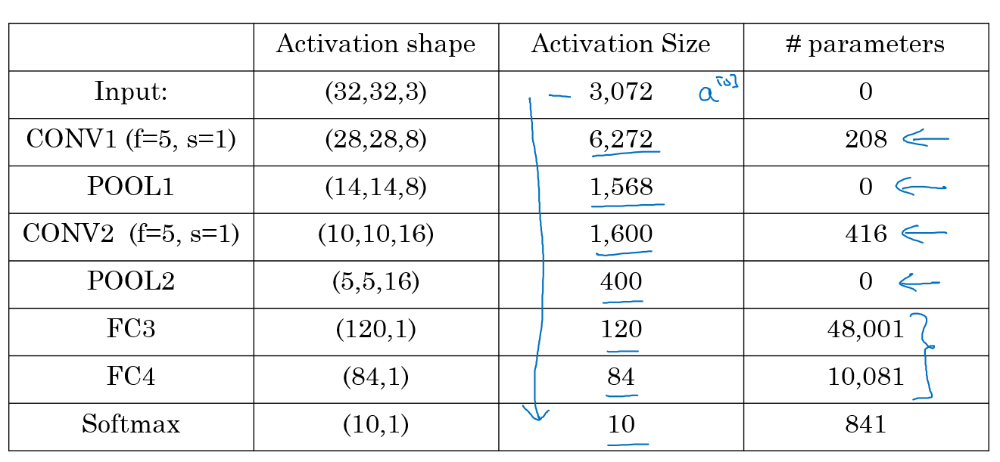
- Son muchos hiperparámetros.
- Normalmente el tamaño de la entrada se reduce al pasar por las capas mientras que el número de filtro va aumentando.
- Una CNN normalmente consiste en una o más convoluciones seguidas del pooling.
- Las capas completamente conectadas son las que más parámetros tienen de la red.

### ¿Por qué convoluciones?

- 2 principales razones:
  - Compartir parámetros.
    - Un detector de una característica (como un detector de bordes verticales) que es útil en una parte de la imagen es probable que también lo sea en otra parte de la imagen.
  - 	Escasez de conexiones.
    - En cada capa, cada valor de salida depende solo de un número bajo de entradas, lo que hace que la traslación sea invariable.
- Juntando todo:
  - 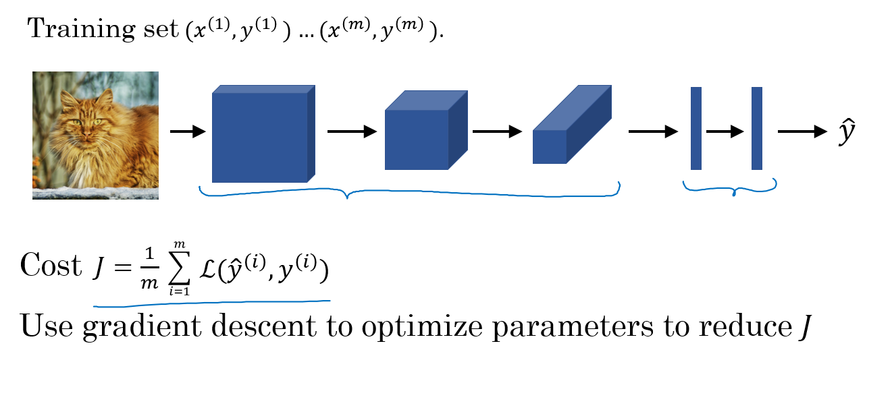

## Modelos de convolución profunda: estudio de casos

### ¿Por qué observar estudios de casos?

- Algunas arquitecturas de NN que funcionan bien en algunas tareas pueden funcionar bien en otras.
- CNN clásicas:
  - **LeNet-5**
  - **AlexNet**
  - **VGG**
- La mejor arquitectura de CNN que ganó una de las competiciones ImageNet es la **ResNet** y tiene 152 capas.
- Otra arquitectura llamada **Inception**, creada por Google, es muy útil de aprender para aplicar a las tareas propias.
- Leyendo y probando los modelos mencionados se pueden mejorar las ideas para resolver las tareas.

### Redes clásicas

- **LeNet-5**

  - El objetivo de este modelo es identificar dígitos escritos a mano en una imagen gris de `32x32x1`:
  - 
  - Este modelo es de 1998. Entonces no usaba softmax.
  - 60k parámetros.
  - Las dimensiones de la imagen decrecen conforme el número de canales se incrementa.
  - `Conv ==> Pool ==> Conv ==> Pool ==> FC ==> FC ==> softmax` es muy común.
  - La función de activación usada era Sigmoid o Tanh. Las implementaciones modernas usan RELU en la mayoría de casos.
  - [[LeCun et al., 1998. Gradient-based learning applied to document recognition]](http://ieeexplore.ieee.org/document/726791/?reload=true)

- **AlexNet**

  - El objetivo del modelo era el reto de ImageNet de clasificar imágenes de 1000 clases:

  - 

  - Resumiendo:

    
      		Conv => Max-pool => Conv => Max-pool => Conv => Conv => Conv => Max-pool ==> Flatten ==> FC ==> FC ==> Softmax
       
  - Similar a LeNet-5, pero mayor.
  - 60 Millones de parámetros.
  - Usa RELU como función de activación.
  - El artículo original contiene múltiples GPUs y The original paper contains Multiple GPUs y Normalización de respuesta local (RN).
    - Múltiples GPUs porque las de entonces no eran tan rápidas.
    - Los investigadores probaron que la normalización de respuesta local no era tan útil realmente. 
  - [[Krizhevsky et al., 2012. ImageNet classification with deep convolutional neural networks]](https://papers.nips.cc/paper/4824-imagenet-classification-with-deep-convolutional-neural-networks.pdf)

- **VGG-16**

  - Una variación de AlexNet.
  - En vez de tener tantos hiperparámetros, se simplifica la red.
  - Centrarse en tener solo estos bloques:
    - CONV = filtro 3 X 3, s = 1  
    - MAX-POOL = 2 X 2 , s = 2
  - La arquitectura:
    - 
  - Esta red es larga incluso para los estándares modernos. Tiene cerca de 138 millones de parámetros.
    - Muchos de los parámetros están en las capas completamente conectadas.
  - Tiene una memoria total de 96MB por cada imagen solo para la propagación hacia adelante.
    - La mayoría de la memoria está en las capas iniciales.
  - El número de filtros se incrementa a 64, 128, 256, 512.
  - Pooling era lo único responsable de la reducción de sus dimensiones.
  - Hay otra versión llamada **VGG-19** que es mayor. Pero la mayoría usa VGG-16 porque hacen lo mismo.
  - El artículo de VGG es interesante porque trata de crear algunas reglas para respecto al uso de CNNs.
  - [[Simonyan & Zisserman 2015. Very deep convolutional networks for large-scale image recognition]](https://arxiv.org/abs/1409.1556)

### Redes residuales (ResNets)

- Las NN demasiado profundas son difíciles de entrenar debido a los problemas de desvanecimiento y explosión del gradiente .
- En esta sección se trata el salto de conexiones para tomar la activación de una capa e inmediatamente pasarla a una capa mucho más profunda, lo que permite entrenar mayores NN incluso de más de 100 capas.
- **Bloque residual**
  - Las ResNets se construyen a partir de bloques residuales.
  - 
  - Se añade un acceso directo/salto de conexión antes de la segunda activación.
  - [[He et al., 2015. Deep residual networks for image recognition]](https://arxiv.org/abs/1512.03385)
- **Redes residuales**
  - NN constituidas de bloques residuales.
  - 
  - Estas redes pueden profundizar más sin afectar al rendimiento. Según la teoría, conforme más profundo se va, se obtendrá una mejor solución, pero esto no ocurre debido a los problemas de desvanecimiento y explosión del gradiente. Gracias a las redes residuales se puede profundizar tanto como se desee.
  - 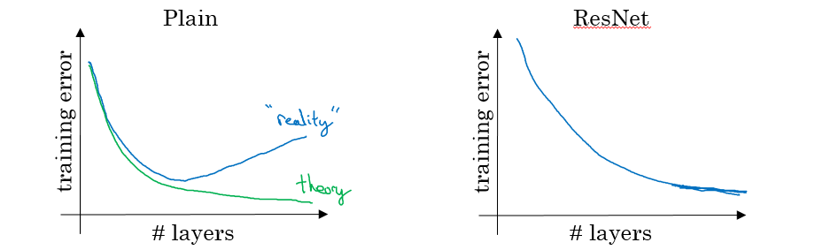
  - A la izquierda se encuentra una NN normal, a la derecha una ResNet.
  - En algunos casos, profundizar no afectará como se desea y esto depende del problema al que nos enfrentemos.
  - [He et al., 2015. Deep residual networks for image recognition]

### ¿Por qué funcionan las ResNet?

- Ejemplificando:
  - Se tiene una gran NN:
    - `X --> Big NN --> a[l]`
  - Se añaden dos capas a la red como bloques residuales:
    - `X --> Big NN --> a[l] --> Layer1 --> Layer2 --> a[l+2]`
    - Y a`[l]` tiene una conexión directa con `a[l+2]`
  - Suponer que se usan activaciones RELU.
  - Entonces:
  
		      a[l+2] = g( z[l+2] + a[l] ) = g( W[l+2] a[l+1] + b[l+2] + a[l] )
 
  - Si se usa regularización L2, por ejemplo, `W[l+2]` será 0. Digamos que `b[l+2]` será 0 también.
  - Entonces `a[l+2] = g( a[l] ) = a[l]` sin valores negativos.
  - Esto muestra que la función identidad es fácil de aprender por bloques residuales.
  - Las dos capas añadidas no perjudican el rendimiento de la gran NN.
  - Consejo: las dimensiones de z[l+2] y a[l] tienen que ser iguales en las resNets. De no ser así, se añaden parámetros de la matriz (que pueden ser aprendidos o establecidos)
    - `a[l+2] = g( z[l+2] + ws * a[l] ) # Ws iguala las dimensiones`
    - ws puede ser un padding de 0.
- Usar un salto de conexiones ayuda al gradiente en la propagación hacia atrás y, por lo tanto, a las redes de aprendizaje profundo.
- ResNet con imágenes.
  - Arquitectura de **ResNet-34**:
  - 
  - Todas las conv 3x3 son convoluciones mismas.
  - Mantener un diseño simple.
  - tamaño espacial /2 => # filtro x2
  - Sin capas FC, no se usa dropout.
  - Dos tipos principales de bloques son usados en una ResNet, dependiendo de si las dimensiones de las entradas/salidas son iguales o distintas. Se van a implementar ambos.
  - Las líneas de puntos son los casos donde las dimensiones son distintas. Para resolverlo se submuestrea la entrada en 2 y se rellena de 0 para que coincidan las dos dimensiones. Existe otro truco llamado cuello de botella.

- Concepto útil (**Espectro de profundidad**):

  - 
  - Taken from [icml.cc/2016/tutorials/icml2016_tutorial_deep_residual_networks_kaiminghe.pdf](icml.cc/2016/tutorials/icml2016_tutorial_deep_residual_networks_kaiminghe.pdf)

- Tipos de bloques residuales:
  - Bloque identidad:
    - 
    - Notar que la convolución es seguida de una normalización por lote `BN` (Batch Normalization) antes de una `RELU`. Las dimensiones son iguales.
    - Este salto es sobre 2 capas. El salto de conexión puede saltar n conexiones donde n>2
    - Este dibujo representa las capas en [Keras](https://keras.io/).
  - El bloque convolucional:
    - 
    - La convolución puede ser una convolución  1 x 1 de cuello de botella.

### Redes dentro de redes y convoluciones 1 X 1

- Una convolución 1 x 1, también llamada red dentro de red, es muy útil en muchos modelos de CNN.
- ¿En qué consiste una convolución 1x1?
  - Ejemplo:
    - Entrada: `6x6x1`
    - Conv: filtro `1x1x1`.        `# conv 1 x 1`
    - Salida: `6x6x1`
  - Otro ejemplo:
    - Entrada: `6x6x32`
    - Conv: 5 filtros `1x1x32`.     `# conv 1 x 1`
    - Salida: `6x6x5`
- Se usa en muchos modelos de CNN modernas como ResNet y modelos Inception.
- Una convolución 1 x 1 es útil cuando:
  - Se desea reducir el número de canales. Este proceso también se llama transformación.
  - Si se configura el número de filtros convolucionales 1x1 para que sea igual que el número de canales de entrada, la salida tendrá la misma cantidad. 
- Yann LeCun piensa que las capas FC se pueden reemplazar con convoluciones 1x1 ya que atuan igual.
- [[Lin et al., 2013. Network in network]](https://arxiv.org/abs/1312.4400)

### Motivación de la red Inception

- Cuando se diseña una CNN se tienen que decidir todas las capas. Si se escoge una conv 3 x 3 Conv o 5 x 5 o una capa max pooling... Muchas decisiones.
- **Inception** sugiere usar todas a la vez.
- **Módulo Inception**:
  - 
  - Los max-pool son los mismo.
  - La entrada para el módulo inception es de 28 x 28 x 192 y la salida 28 x 28 x 256.
  - Se aplican todas las convoluciones y pools que se pudieran desear y se deja a la red aprender y decidir cuáles usar.
  - [[Szegedy et al. 2014. Going deeper with convolutions]](https://arxiv.org/abs/1409.4842)
- El problema del costo computacional:
  - Al centrarse en una conv 5x5 como en el ejemplo anterior.
  - Hay 32 filtros iguales de 5x5, y las entradas son de 28 x 28 x 192.
  - Las salidas 28 x 28 x 32
  - La cantidad total de multiplicaciones necesarias:
    - Número de salidas * Tamaño del filtro * Tamaño del filtro * Dimensiones de entrada
    - Equivalente a: `28 * 28 * 32 * 5 * 5 * 192 = 120 Mil` 
    - 120 Mil multiplicaciones siguen siendo una problema para los ordenadores actuales.
  - Usar una conv 1x1 reduce 120 mil a solo 12 mil.
- Reducción del coste:
  - Nueva arquitectura:
    - Dimensiones de X0 (28, 28, 192)
    - Se aplican 16 (conv 1 x 1)
    - Transforma X1 (28, 28, 16)
      - Se han reducido las dimensiones.
    - Se aplican 32  (conv 5 x 5)
    - Redimensiona X2 (28, 28, 32)
  - El número de multiplicaciones:
    - Primera Conv: `28 * 28 * 16 * 1 * 1 * 192 = 2.5 Mil`
    - Segunda Conv: `28 * 28 * 32 * 5 * 5 * 16 = 10 Mil`
    - Aproximadamente 12.5 Mil.
- Una conv 1 x 1 en este caso se llama cuello de botella `BN` (Bottleneck).
- Resulta que las conv 1 x 1 no perjudican el rendimiento.
- **Módulo Inception**, versión de reducción de dimensiones:
  - 
- Ejemplo de modelo inception en Keras:
  - 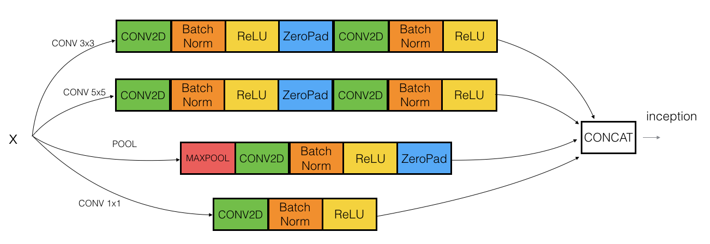

### Red Inception (GoogleNet)

- La red consiste en una concatenación de bloques de módulos inception.
- Modelo completo:
  - 
- En ocasiones, un bloque Max-Pool block se coloca antes del módulo inception para reducir las dimensiones de la entrada.
- Hay 3 ramas Sofmax en distintas posiciones para forzar la red hacia su objetivo. Y ayuda a asegurar que las características intermedias son lo suficiente buenas para que la red las aprenda, y resulta que softmax0 y softmax1 aplican un efecto de regularización.
- Desde el desarrollo del módulo inception, los autores y otros han construído otras versiones de esta red (v2, v3, y v4). Incluso existe una red que usa el módulo inception y ResNet juntos).
- [[Szegedy et al., 2014, Going Deeper with Convolutions]](https://arxiv.org/abs/1409.4842)

### Usando una implementación open-source

- Resulta que muchas de las NN son difíciles de replicar. Ya que hay muchos detalles que no aparecen en los artículos:
  - Decaída del aprendizaje.
  - Ajuste de parámetros.
- Muchos investigadores publican sus códigos en sitios como [Github](Github.com).
- Si se desea implementar un modelo de un artículo, lo primero que se debería hacer es buscar una implementación open source del mismo.
- Una ventaja de esto es que quizás se consigue la implementación junto con los parámetros/pesos Es un ahorro de tiempo y computación.

### Aprendizaje por transferencia

- Si se usa una arquitectura de NN que ha sido entrenda previamente, se puden dejar los parámetros/pesos preentrenados en vez de inicializar de forma aleatoria.
- Puede ayudar a mejorar el rendimiento.
- Los modelos preentrenados quizás han entrenado con conjuntos grandes de datos como ImageNet, Ms COCO o pascal y haber pasado mucho tiempo para aprender esos parámetros/pesos con hiperparámetros optimizados.
- Un ejemplo:
  - Si se tiene un problema de clasificación de gatos de 3 clases con Tigger, Misty o ninguno.
  - No se tienen muchos datos con los que entrenar la red.
  - Se recomienda buscar en internet y descargar una buena red con sus pesos, eliminar la capa de activación softmax y poner una propia y dejar que aprenda la última capa mientras que se ajustan/congelan los pesos de las demás capas.
  - Los frameworks tienen opciones para congelar los parámetros en algunas capas usando `trainable = 0` o `freeze = 0`.
  - Uno de los trucos que pueden acelerar el entrenamiento es ejecutar la NN preentrenada sin capa softmax final y obtener una representación intermedia de las imágenes y guardarlas. Después, usar estar representaciones en una NN superficial.
    - Sería como convertir las imágenes en vectores.
- Otro ejemplo:
  - En el caso de tener muchas imágenes de gatos para el ejemplo dado, se prodría congelar algunas capas al principio de la red preentrenada y aprender los pesos de las demás capas.
  - Otra idea es descartar las capas que no se congelen y colocar nuevas capas.
- Otro ejemplo:
  - Si no se tiene suficientes datos, se pueden ajustar todas las capas de la red preentrenada, pero no inicializar de forma aleatoria los parámetros, dejarlos como están y aprender desde ahí. 

### Aumento de datos

- Si se aumenta la cantidad de datos, la NN profunda tendrá un mejor desempeño. El aumento de datos es una de las técnicas que se usan para mejorar el rendimiento.
- Algunos métodos usados en tareas de visión artificial:
  - Imagen espejo.
  - Recorte aleatorio.
    - La cuestión con esta técnica es no tomar malos recortes.
    - La solución es hacer recortes lo suficientemente grandes.
  - Rotaciones.
  - Shearing.
  - Deformación local.
  - Cambios de color.
	- Se añaden distorsiones a R, G, B.
    - Se añaden valores obtenidos de una distribución de probabilidad.
    - El algoritmo ***aumento de color PCA*** decide los cambio de forma automática.
- Implementar distorsiones durante el entreno:
  - Se pueden usar hilos de CPU para crear mini lotes distorsionados mientras que se entrena la NN.
- El aumento de datos tiene algunos hiperparámetros. Un buen comienzo es encontrar una implementación de aumento de datos open source y usarla o ajustar sus hiperparámetros.

### Estado de la visión artificial

- Si se tiene el problema de tener una gran cantidad de datos, hay unas tendencias:
  - Algoritmos más simples.
  - Menos produccióna a mano.
- Como no se tiene muchos datos en visión artificial, se depende mucho de la producción a mano.
- En la detección de objetos, al haber menos datos, se tiende a arquitecturas de NN más complejas.
- Consejos para buenos puntos de referencia en competiciones:
  - Ensamblaje.
    - Entrenar varias redes de forma independiente y promediar los resultados. Fusionar algunos clasificadores.
    - Después de decidir la mejor arquitectura para el problema, inicializar aleatoriamente algunos valores y entrenarlos de forma independiente.
    - Puede frenar la producción según el número de ensamblajes. Y requiere más memoria para guardar los modelos.
    - Se usa en competiciones, pero realmente poco en producciones reales.
  - Multi-recortes durante el entreno.
    - Ejecutar el clasificador en mútiples versiones de versiones de prueba y promediar los resultados.
    - La técnica 10 recortes la usa.
    - Puede dar un mejor resultado en producción.
- Usar código open source
  - Usar arquitecturas de redes publicadas en la literatura.
  - Usar implementaciones open source si es posible.
  - Usar modelos preentrenados y ajustar de forma precisa en el conjuto de datos.

## Detección de objetos

### Localización de objetos

- ¿Qué es la localización y la detección?

  - **Clasificación de imágenes**: 
    - Clasificar una imagen como una clase específica. Toda la imágen representa una clase. Se ignora el lugar donde se encuentra el objeto.
    - 
  - **Clasificación con localización**:
    - Dada una imagen, se desea saber la clase de la imágen y dónde se encuentra en la imágen. Es necesario detectar la clase y un rectángulo sobre dónde está.
    - 
  - **Detección de objetos**:
    - Dada una imagen, se deea detectar todos los objetos de la imágen que pertenezcan a unas clases específicas y dar su ubicación.
    - 
  - **Segmentación semántica**:
    - Se desea etiquetar cada píxel de la imágen con una etiqueta de la categoría. No se distinguen instancias, solo importan los píxeles. Solo detecta píxeles, no objetos.
    - Si hay más de dos objetos de la misma clase interseccionados, no se podrán separar.
    - 
  - **Segmentación de instancias**
    - Este es un problema completo. En vez de predecir una caja contenedora, se desea saber la etiqueta de píxel y distinguirlos.
    - 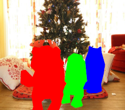
- Para clasificar imágenes se usan una red convolucional con una SoftMax al final de la misma y cuatro números `bx`, `by`, `bh` y `bw` para indicar la localización de la clase de la imágen. El conjunto de datos debería tener estos cuatro números con la clase también.
- Definiendo la etiqueta objetivo Y en la clasificación con localización: 
 

	    Y = [
	      		Pc				# Probabilidad de que se encuentre el objeto
	      		bx				# Caja contenedora
	      		by				# Caja contenedora
	      		bh				# Caja contenedora
	      		bw				# Caja contenedora
	      		c1				# Las clases
	      		c2
	      		...
	    ]
     

  - Ejemplo (objeto presente):

    
		      Y = [
		        		1		# el objeto está presente
		        		0
		        		0
		        		100
		        		100
		        		0
		        		1
		        		0
		      ]
       

  - Ejemplo (objeto no presente):

    
		      Y = [
		        		0		# objeto no presente
		        		?		# ? indica que los demás valores no importan
		        		?
		        		?
		        		?
		        		?
		        		?
		        		?
		      ]
      

- La función de pérdida para la Y que se ha creado (Ejemplo de error cuadrático):

 
	    L(y',y) = {
	      			(y1'-y1)^2 + (y2'-y2)^2 + ...       if y1 = 1
	      			(y1'-y1)^2							if y1 = 0
	    		}
  

  - En la práctica se usa la regresión losgística para `pc`, logaritmo de la probabilidad de pérdida para las clases, y el error cuadrático para la caja contenedora.

### Detección de puntos de referencia

- En algunos casos visión artificial se necesitará devolver unos puntos.
- Por ejemplo, en reconocimiento facial se deseará saber algunas posiciones como las esquinas de los ojos, de la boca, de la nariz y demás.
- Forma de Y para reconocimiento facial que necesita devolver 64 puntos de referencia:

  
	    Y = [
	      		THereIsAface				# Probabilidad de una cara 0 o 1
	      		l1x,
	      		l1y,
	      		....,
	      		l64x,
	      		l64y
	    ]
 
- Otra aplicación sería conseguir el esqueleto de una persona usando distintos puntos de referencia.
- Nota, en los datos etiquetados, si `l1x,l1y` es la esquina izquierda del ojo izquierdo, los otros `l1x,l1y` de las demás muestras tienen que representar lo mismo.

### Detección de objetos

- Se usa una red convolucional para la detección de objetos, usando una técnica llamada el algoritmo de detección de ventana deslizante.
- En un caso de detección de coches, primero se entrena la red conv con recortes de imágenes de coches e imágenes sin coches.
  - 
- Después del entrenamiento, se usa la red con la técnica mencionada.
- Algoritmo de detección con ventana corrediza:
  1. Se escoge el tamño del rectángulo.
  2. Se separa la imagen en rectángulos del tamaño escogido.
  3. Para cada rectángulo, pasar la imagen a la red y que decida si es un coche o no.
  4. Elegir rectángulos más grandes/pequeños y repetir el proceso de 2 a 3 veces.
  5. Alamacenar los rectángulos que continen los coches.
  6. Si se tienen dos o más rectángulos con intersecciones, escoger el de mejor precisión.
- La desventaja de esta técnica es el tiempo de computación.
- Para resolver este problema se puede implementar la técnica con un **enfoque convolucional**.
- Otra idea es comprimir el modelo de deep learning.

### Implementación convolucional de ventanas corredizas

- Pasar de capas FC a convolucionales (predecir 4 clases de imágenes):
  - 
  - Se usa una convolución con un tamaño de ancho y alto del filtro iguales a los de la entrada.
- **Implementación convolucional de ventanas corredizas**:
  - Considera que la red convolucional entrenada es como esta (sin capas FC, todas conv):
    - 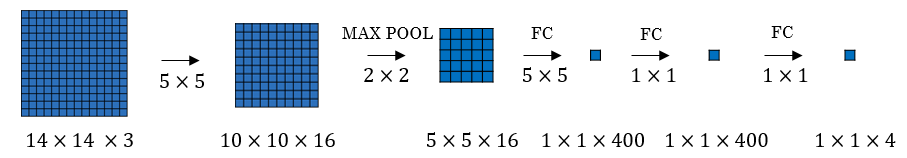
  - Se tiene imágenes de 16 x 16 x 3 donde se aplicarán las ventanas. Según la implementación normal modificada que ha sido mencionada antes, se ejecuta la red convolucional 4 veces, cada rectángulo será de 16 x 16.
  - Implementación convolucional:
    - 
  - Proporcionar la imagen a la misma red convolucional que se ha entrenado.
  - Las celdas azules representan la primera ventana de una implementación normal.
  - Ahora es más eficiente, ya que comparte la computación de las cuatro veces que se necesita.
  - Otro ejemplo:
    - 
  - Este ejemplo tiene un total de 16 ventanas que comparten la computación juntas.
  - [[Sermanet et al., 2014, OverFeat: Integrated recognition, localization and detection using convolutional networks]](https://arxiv.org/abs/1312.6229)
- La desventaja del algoritmo es que la posición del rectángulo no será tan precisa. Quizás ninguno de los rectángulos está exactamente en el objeto que se desea reconocer.
  - 
  - En rojo, el rectángulo que se desea, y en azul el que se obtiene.

### Predicciones de cajas contenedoras

- Un algoritmo mejor que el presentado es [YOLO](https://arxiv.org/abs/1506.02640).
- YOLO viene de *you only look once* (solo se mira una vez), y se desarrollo en el 2015.
- Algoritmo Yolo:
  - 
  1. Dada una imagen de 100 X 100
  2. Colocar una cuadrícula de 3 x 3 en la imagen. Para resultados más suaves, 19 x 19
  3. Aplicar el algoritmo de clasificación y localización de la sección previa para cada sección de la cuadrícula. `bx` y `by` representarán el punto central del objeto en cada cuadrícula y será relativo a la caja, por lo que el rango es de 0 a 1, mientras que `bh` y `bw` representarán la altura y el ancho del objeto, que puede ser mayor a 1, pero un número con valor decimal.
  4. Realizar todo a la vez con la convolución de ventana corrediza. Si Y es 1 x 8, tal como se ha mencionado, la salida de la imagen de 100 x 100 debería ser 3 x 3 x 8, correspondiendo a los 9 resultados de celdas.
  5. Fusionar los resultados usando una predicción de localización del punto medio.
- Hay un problema si se encuentran más de un objeto en una caja cuadrícula.
- Una de las ventajas que hacen a este algoritmo popular es que tiene una gran velocidad y una implementación de red convolucional.
- ¿En qué se diferencia YOLO de otros detectores de objetos? YOLO usa una sola CNN
  tanto para clasificación como para localización con cajas contenedoras.

### Intersección sobre Unión

- La Intersección sobre Unión es una función usada para evaluar los algoritmos de detección de objetos.
- Calcula el tamaño de la intersección y la divide sobre la union. Generalmente, *IoU* *es una medida de superposición entre dos cajas*.
- Ejemplo:
  - 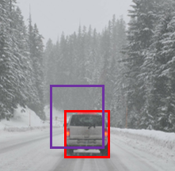
  - El rojo es la etiqueta de salida y el morado la salida predicha.
  - Para computar la Intersección sobre Unión, primero hay que calcular el área de unión de los dos rectángulos, la cuál es "primer rectángulo + segundo rectángulo". Después, calcular la intersercción entre ambos.
  - `IOU = área de intersección / área de unión`
- Si `IOU >=0.5`, es un buen resultado. La mejor opción es 1.

### Supresión no máxima

- Uno de los problemas que ocurren con YOLO es que puede detectar un objeto múltiples veces.
- La supresión no máxima es una forma de que YOLO detecte el objeto una única vez.
- Por ejemplo:
  - 
  - Cada coche se detecta dos o más veces con distintas probabilidades. Esto viene de que las cuadrículas piensan que es el centro del objeto.
- Algoritmo:
  1. Se asume que el objetivo es una clase de salida.
  2. Dimension de Y `[Pc, bx, by, bh, hw]`, donde Pc es la probabilidad de que ocurra el objeto.
  3. Descartar todas las cajas con `Pc < 0.6`  
  4. Mientras no hayan cajas restantes:
     1. Escoger la caja con el valor Pc de salida más alto como una predicción.
     2. Descartar las cajas restantes con `IoU > 0.5` con esa caja de salida en el paso anterior.
- Si hay múltiples clases/objetos tipo `c`, se debería ejecutar la supresión no máxima `c` veces, una por cada salida de clase.

### Cajas ancla

- En YOLO, una cuadrícula solo detecta un objeto. ¿Qué ocurre si una celda puede contener múltiples objetos?
  - 
  - La cuadrícula del coche y de la persona es la misma.
  - En la práctica, esto ocurre raramente.
- Si Y = `[Pc, bx, by, bh, bw, c1, c2, c3]`, se pueden usar dos cajas anclas de este modo:
  - Y = `[Pc, bx, by, bh, bw, c1, c2, c3, Pc, bx, by, bh, bw, c1, c2, c3]`, simplemente se repite el ancla Y.
  - Las dos cajas anclas que se eligen deberían conocerse como una forma:
    - 
- Cada objeto en la imagen de entrenamiento es asignado a una celda de la cuadrícula que contiene el punto central.
- Con dos cajas ancla, cada objeto en la imagen de entrenamiento es asignado a la celda de la cuadrícula que contiene el punto central del objeto y la caja ancla para la celda de la cuadrícula con el IoU más alto. Hay que comprobar dónde debería estar el objeto en función del rectángulo más cercano a la caja ancla.
- Ejemplo:
  - 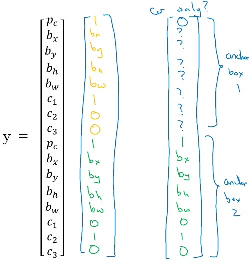
  - Donde el coche estaba más cerca del ancla 2 que de la 1.
- Quizás se tienen dos o más anclas, pero se deberían conocer las formas.
  - Normalmente se suelen escoger a mano. Quizás cinco o diez formas de cajas ancla que abarquen una variedad de formas que cubran los tipos de objetos que se detecten con frecuencia.
  - Quizás se puede usar un algoritmo de k-medias para especificarlo.
- Las cajas ancla permiten al algoritmo especializarse, es decir, detectar fácilmente imágenes más altas o anchas en el caso.

### Algoritmo YOLO

- YOLO es un modelo del estado del arte de detección de objetos que es rápido y preciso.
- En un caso de detección de objetos de un sistema de conducción automática se necesitan detectar 3 objetos, entre otros:
  1. Peatón.
  2. Coche.
  3. Moto.
- Se decide escoger dos cajas anclas, una alta y una ancha.
  - Como se mencionó, es normal usar 5 o más hechas a mano o generadas por k-medias.
- Las dimensiones de la etiqueta Y `[Ny, HeightOfGrid, WidthOfGrid, 16]`, donde Ny es el número de instancias y cada fila (de tamaño 16) es del siguiente formato:
  - `[Pc, bx, by, bh, bw, c1, c2, c3, Pc, bx, by, bh, bw, c1, c2, c3]`
- El conjunto de datos podría ser una imagen con múltiples etiquetas y un rectángulo por cada etiqueta, se debería ir al conjunto de datos y establecer la forma y valores de Y como se ha acordado.
  - Un ejemplo:
    - 
  - Primero, se inicializan todos a 0 y ?, por cada etiqueta y rectángulo, elegir el punto de cuadrícula más cercano a la forma a rellenarlo y el mejor punto de caja ancla basado en el IOU. La forma de Y para una imagen será `[HeightOfGrid, WidthOfGrid,16]`
- Entrenar las imágenes etiquetadas en la red conv. Se debería recibir una salida `[HeightOfGrid, WidthOfGrid,16]` en este caso.
- Para crear predicciones, ejecutar la red en la imagen y ejecutar el algortimo de supresión no máxima para cada clase que se tenga (3 en este caso).
  - Se obtendría algo así:
    - 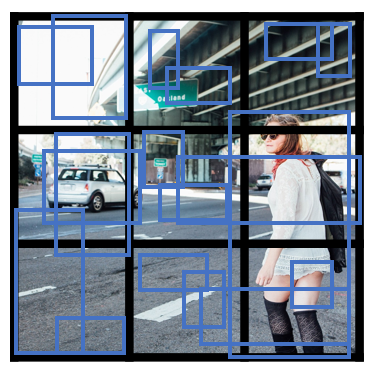
    - Número total de cajas generadas grid_width * grid_height * no_of_anchors = 3 x 3 x 2
  - Eliminando las predicciones de baja probabilidad se tiene:
    - 
  - Se obtiene la mejor probabilidad seguida del filtrado IOU:
    - 
- YOLO no es muy bueno para detectar objetos pequeño.
- [YOLO9000 Better, faster, stronger](https://arxiv.org/abs/1612.08242)
  - Resumen:

  - ```
    ________________________________________________________________________________________
    Layer (type)                     Output Shape          Param #     Connected to                
    ========================================================================================
    input_1 (InputLayer)             (None, 608, 608, 3)   0                                 
    ________________________________________________________________________________________
    conv2d_1 (Conv2D)                (None, 608, 608, 32)  864         input_1[0][0]         
    ________________________________________________________________________________________
    batch_normalization_1 (BatchNorm (None, 608, 608, 32)  128         conv2d_1[0][0]       
    ________________________________________________________________________________________
    leaky_re_lu_1 (LeakyReLU)        (None, 608, 608, 32)  0     batch_normalization_1[0][0] 
    ________________________________________________________________________________________
    max_pooling2d_1 (MaxPooling2D)   (None, 304, 304, 32)  0           leaky_re_lu_1[0][0]   
    ________________________________________________________________________________________
    conv2d_2 (Conv2D)                (None, 304, 304, 64)  18432       max_pooling2d_1[0][0] 
    ________________________________________________________________________________________
    batch_normalization_2 (BatchNorm (None, 304, 304, 64)  256         conv2d_2[0][0]       
    ________________________________________________________________________________________
    leaky_re_lu_2 (LeakyReLU)        (None, 304, 304, 64)  0     batch_normalization_2[0][0] 
    _______________________________________________________________________________________
    max_pooling2d_2 (MaxPooling2D)   (None, 152, 152, 64)  0           leaky_re_lu_2[0][0]   
    ________________________________________________________________________________________
    conv2d_3 (Conv2D)                (None, 152, 152, 128) 73728       max_pooling2d_2[0][0] 
    ________________________________________________________________________________________
    batch_normalization_3 (BatchNorm (None, 152, 152, 128) 512         conv2d_3[0][0]       
    ________________________________________________________________________________________
    leaky_re_lu_3 (LeakyReLU)        (None, 152, 152, 128) 0     batch_normalization_3[0][0] 
    ________________________________________________________________________________________
    conv2d_4 (Conv2D)                (None, 152, 152, 64)  8192        leaky_re_lu_3[0][0]   
    ________________________________________________________________________________________
    batch_normalization_4 (BatchNorm (None, 152, 152, 64)  256         conv2d_4[0][0]       
    ________________________________________________________________________________________
    leaky_re_lu_4 (LeakyReLU)        (None, 152, 152, 64)  0     batch_normalization_4[0][0] 
    ________________________________________________________________________________________
    conv2d_5 (Conv2D)                (None, 152, 152, 128) 73728       leaky_re_lu_4[0][0]   
    ________________________________________________________________________________________
    batch_normalization_5 (BatchNorm (None, 152, 152, 128) 512         conv2d_5[0][0]       
    ________________________________________________________________________________________
    leaky_re_lu_5 (LeakyReLU)        (None, 152, 152, 128) 0     batch_normalization_5[0][0] 
    ________________________________________________________________________________________
    max_pooling2d_3 (MaxPooling2D)   (None, 76, 76, 128)   0           leaky_re_lu_5[0][0]   
    ________________________________________________________________________________________
    conv2d_6 (Conv2D)                (None, 76, 76, 256)   294912      max_pooling2d_3[0][0] 
    _______________________________________________________________________________________
    batch_normalization_6 (BatchNorm (None, 76, 76, 256)   1024        conv2d_6[0][0]       
    ________________________________________________________________________________________
    leaky_re_lu_6 (LeakyReLU)        (None, 76, 76, 256)   0     batch_normalization_6[0][0] 
    _______________________________________________________________________________________
    conv2d_7 (Conv2D)                (None, 76, 76, 128)   32768       leaky_re_lu_6[0][0]   
    ________________________________________________________________________________________
    batch_normalization_7 (BatchNorm (None, 76, 76, 128)   512         conv2d_7[0][0]       
    _______________________________________________________________________________________
    leaky_re_lu_7 (LeakyReLU)        (None, 76, 76, 128)   0     batch_normalization_7[0][0] 
    ________________________________________________________________________________________
    conv2d_8 (Conv2D)                (None, 76, 76, 256)   294912      leaky_re_lu_7[0][0]   
    ________________________________________________________________________________________
    batch_normalization_8 (BatchNorm (None, 76, 76, 256)   1024        conv2d_8[0][0]       
    ________________________________________________________________________________________
    leaky_re_lu_8 (LeakyReLU)        (None, 76, 76, 256)   0     batch_normalization_8[0][0] 
    ________________________________________________________________________________________
    max_pooling2d_4 (MaxPooling2D)   (None, 38, 38, 256)   0           leaky_re_lu_8[0][0]   
    ________________________________________________________________________________________
    conv2d_9 (Conv2D)                (None, 38, 38, 512)   1179648     max_pooling2d_4[0][0] 
    ________________________________________________________________________________________
    batch_normalization_9 (BatchNorm (None, 38, 38, 512)   2048        conv2d_9[0][0]       
    ________________________________________________________________________________________
    leaky_re_lu_9 (LeakyReLU)        (None, 38, 38, 512)   0     batch_normalization_9[0][0] 
    ________________________________________________________________________________________
    conv2d_10 (Conv2D)               (None, 38, 38, 256)   131072      leaky_re_lu_9[0][0]   
    ________________________________________________________________________________________
    batch_normalization_10 (BatchNor (None, 38, 38, 256)   1024        conv2d_10[0][0]       
    ________________________________________________________________________________________
    leaky_re_lu_10 (LeakyReLU)       (None, 38, 38, 256)   0    batch_normalization_10[0][0]
    ________________________________________________________________________________________
    conv2d_11 (Conv2D)               (None, 38, 38, 512)   1179648    leaky_re_lu_10[0][0]   
    ________________________________________________________________________________________
    batch_normalization_11 (BatchNor (None, 38, 38, 512)   2048        conv2d_11[0][0]       
    ________________________________________________________________________________________
    leaky_re_lu_11 (LeakyReLU)       (None, 38, 38, 512)   0    batch_normalization_11[0][0]
    _______________________________________________________________________________________
    conv2d_12 (Conv2D)               (None, 38, 38, 256)   131072      leaky_re_lu_11[0][0] 
    ________________________________________________________________________________________
    batch_normalization_12 (BatchNor (None, 38, 38, 256)   1024        conv2d_12[0][0]       
    ________________________________________________________________________________________
    leaky_re_lu_12 (LeakyReLU)       (None, 38, 38, 256)   0   batch_normalization_12[0][0]
    ________________________________________________________________________________________
    conv2d_13 (Conv2D)               (None, 38, 38, 512)   1179648     leaky_re_lu_12[0][0] 
    ________________________________________________________________________________________
    batch_normalization_13 (BatchNor (None, 38, 38, 512)   2048        conv2d_13[0][0]       
    ________________________________________________________________________________________
    leaky_re_lu_13 (LeakyReLU)       (None, 38, 38, 512)   0    batch_normalization_13[0][0]
    ________________________________________________________________________________________
    max_pooling2d_5 (MaxPooling2D)   (None, 19, 19, 512)   0           leaky_re_lu_13[0][0] 
    _______________________________________________________________________________________
    conv2d_14 (Conv2D)               (None, 19, 19, 1024)  4718592     max_pooling2d_5[0][0] 
    ________________________________________________________________________________________
    batch_normalization_14 (BatchNor (None, 19, 19, 1024)  4096        conv2d_14[0][0]       
    ________________________________________________________________________________________
    leaky_re_lu_14 (LeakyReLU)       (None, 19, 19, 1024)  0    batch_normalization_14[0][0]
    ________________________________________________________________________________________
    conv2d_15 (Conv2D)               (None, 19, 19, 512)   524288      leaky_re_lu_14[0][0] 
    ________________________________________________________________________________________
    batch_normalization_15 (BatchNor (None, 19, 19, 512)   2048        conv2d_15[0][0]       
    ________________________________________________________________________________________
    leaky_re_lu_15 (LeakyReLU)       (None, 19, 19, 512)   0    batch_normalization_15[0][0]
    ________________________________________________________________________________________
    conv2d_16 (Conv2D)               (None, 19, 19, 1024)  4718592     leaky_re_lu_15[0][0] 
    ________________________________________________________________________________________
    batch_normalization_16 (BatchNor (None, 19, 19, 1024)  4096        conv2d_16[0][0]       
    ________________________________________________________________________________________
    leaky_re_lu_16 (LeakyReLU)       (None, 19, 19, 1024)  0    batch_normalization_16[0][0]
    ________________________________________________________________________________________
    conv2d_17 (Conv2D)               (None, 19, 19, 512)   524288      leaky_re_lu_16[0][0] 
    ________________________________________________________________________________________
    batch_normalization_17 (BatchNor (None, 19, 19, 512)   2048        conv2d_17[0][0]       
    ________________________________________________________________________________________
    leaky_re_lu_17 (LeakyReLU)       (None, 19, 19, 512)   0    batch_normalization_17[0][0]
    _______________________________________________________________________________________
    conv2d_18 (Conv2D)               (None, 19, 19, 1024)  4718592     leaky_re_lu_17[0][0] 
    ________________________________________________________________________________________
    batch_normalization_18 (BatchNor (None, 19, 19, 1024)  4096        conv2d_18[0][0]       
    ________________________________________________________________________________________
    leaky_re_lu_18 (LeakyReLU)       (None, 19, 19, 1024)  0    batch_normalization_18[0][0]
    ________________________________________________________________________________________
    conv2d_19 (Conv2D)               (None, 19, 19, 1024)  9437184     leaky_re_lu_18[0][0] 
    ________________________________________________________________________________________
    batch_normalization_19 (BatchNor (None, 19, 19, 1024)  4096        conv2d_19[0][0]       
    ________________________________________________________________________________________
    conv2d_21 (Conv2D)               (None, 38, 38, 64)    32768       leaky_re_lu_13[0][0]
    ________________________________________________________________________________________
    leaky_re_lu_19 (LeakyReLU)       (None, 19, 19, 1024)  0    batch_normalization_19[0][0]
    ________________________________________________________________________________________
    batch_normalization_21 (BatchNor (None, 38, 38, 64)    256         conv2d_21[0][0]       
    ________________________________________________________________________________________
    conv2d_20 (Conv2D)               (None, 19, 19, 1024)  9437184     leaky_re_lu_19[0][0]
    ________________________________________________________________________________________
    leaky_re_lu_21 (LeakyReLU)       (None, 38, 38, 64)    0    batch_normalization_21[0][0]
    ________________________________________________________________________________________
    batch_normalization_20 (BatchNor (None, 19, 19, 1024)  4096        conv2d_20[0][0]       
    ________________________________________________________________________________________
    space_to_depth_x2 (Lambda)       (None, 19, 19, 256)   0           leaky_re_lu_21[0][0] 
    ________________________________________________________________________________________
    leaky_re_lu_20 (LeakyReLU)       (None, 19, 19, 1024)  0    batch_normalization_20[0][0]
    ________________________________________________________________________________________
    concatenate_1 (Concatenate)      (None, 19, 19, 1280)  0         space_to_depth_x2[0][0] 
                                                                      leaky_re_lu_20[0][0] 
    ________________________________________________________________________________________
    conv2d_22 (Conv2D)               (None, 19, 19, 1024)  11796480    concatenate_1[0][0]   
    ________________________________________________________________________________________
    batch_normalization_22 (BatchNor (None, 19, 19, 1024)  4096        conv2d_22[0][0]       
    ________________________________________________________________________________________
    leaky_re_lu_22 (LeakyReLU)       (None, 19, 19, 1024)  0    batch_normalization_22[0][0]
    ________________________________________________________________________________________
    conv2d_23 (Conv2D)               (None, 19, 19, 425)   435625      leaky_re_lu_22[0][0] 
    ===============================================================================================
    Total params: 50,983,561
    Trainable params: 50,962,889
    Non-trainable params: 20,672
    _______________________________________________________________________________________________
    ```

- Implementaciones de YOLO:

  - https://github.com/allanzelener/YAD2K
  - https://github.com/thtrieu/darkflow
  - https://pjreddie.com/darknet/yolo/

### Propuestas de región (R-CNN)

- R-CNN es un algoritmo de detección de objetos.
- Yolo es más rápido:
  - > El modelo busca en toda la imagen durante el entrenamiento y el test, por lo que las predicciones son generadas por el contexto general de la imagen. También crea las predicciones con una sola red de evaluación, no como R-CNN que requiere miles para una sola imagen. Esto lo hace 1000x veces más rápido que R-CNN y 100x veces más que Fast R-CNN.
- Pero lo malo de YOLO es que procesa muchas áreas donde no ha objetos presentes.
- **R-CNN** proviene de regions with Conv Nets (regiones con redes convolucionales).
- R-CNN trata de seleccionar unas pocas ventanas y ejecutar la red sobre ellas.
- El algoritmo usado para seleccionar ventanas es un algoritmo de segmentación. Devuelve resultados como los siguientes:
  - 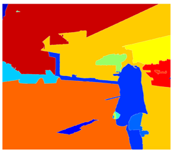
- Si un algoritmo de segmentación devuelve 2000 manchas, se debería ejecutar el clasificador/CNN sobre estas manchas.
- Ha habido mucho trabajo para que R-CNN sea más rápido:
  - R-CNN:
    - Propuestas de regiones . Clasificar las propuestas de regiones de una en una. Etiqueta de salida + Caja contenedora.
    - Lo malo es que es lento.
    - [[Girshik et. al, 2013. Rich feature hierarchies for accurate object detection and semantic segmentation]](https://arxiv.org/abs/1311.2524)
  - Fast R-CNN:
    - Propuestas de regiones. Usa una implementación convolucional de ventanas corredizas para clasificar todas las regiones propuestas.
    - [[Girshik, 2015. Fast R-CNN]](https://arxiv.org/abs/1504.08083)
  - Faster R-CNN:
    - Usa una red convolucional para proponer regiones.
    - [[Ren et. al, 2016. Faster R-CNN: Towards real-time object detection with region proposal networks]](https://arxiv.org/abs/1506.01497)
  - Mask R-CNN:
    - [[https://arxiv.org/abs/1703.06870]](https://arxiv.org/abs/1703.06870)
- Muchas de las implementaciones de faster R-CNN son aún así más lentas que YOLO.
- La idea YOLO trata de realizar todo en una solo vez, en vez de hacerlo en dos.
- Otros algoritmos que de una única vez obtienen los resultados son **SSD** y **MultiBox**.
  - [[Wei Liu, et. al 2015 SSD: Single Shot MultiBox Detector]](https://arxiv.org/abs/1512.02325)
- **R-FCN** es similar a Faster R-CNN, pero más eficiente.
  - [[Jifeng Dai, et. al 2016 R-FCN: Object Detection via Region-based Fully Convolutional Networks ]](https://arxiv.org/abs/1605.06409)

## Aplicaciones especiales: Reconocimiento facial y Transferencia de estilo

### Reconocimiento facial

#### ¿Qué es el reconocimiento facial?

- Los sistemas de reconocimiento facial identifican las caras de las personas. Puede ser tanto en vídeo como en foto.
- **<u>Detección en vivo</u>** en un sistema de reconocimiento facial previene de que la red identifique la cara en una imagen. Puede aprender con aprendizaje supervisado profundo usando un conjunto de datos humanos en vivo.
- Verificación facial vs reconocimiento facial:
  - Verificación:
    - Entrada: Imagen, Nombre/ID. (1 : 1)
    - Salida: Si la imagen de entrada es de la persona indicada o no.
  - Reconocimiento:
    - Tiene un conjunto de datos de k personas
    - Obtiene una imagen de entrada
    - Devuelve el ID si la imagen corresponde a alguna de las k personas (o si no es reconocida)
- Se puede usar la verificación facial para crear un sistema de reconocimiento facial. La precisión de la verificación tiene que ser mayor (99.9% o más) para que sea preciso el reconocimiento. 

#### Aprendizaje de una sola vez

- Uno de los retos del reconocimiento facial es resolver los problemas de aprendizaje de una sola vez.
- Aprendizaje de una sola vez: un sistema de reconocimiento es capaz de reconocer una persona, aprender de una imagen.
- Históricamente, el deep learning no funciona bien con pequeñas cantidades de datos.
- En lugar de esto, se usará la **función de similitud**:
  - d( **img1**, **img2** ) = grado de diferencia.
  - Se busca que el resultado de d sea bajo en el caso de que las caras sean la misma.
  - Se usa tau T como un umbral para d:
    - Si d( **img1**, **img2** ) <= T    Las caras son la misma.
- La función de similitud ayuda a resolver el el aprendizaje de una sola vez. Y es robusto a nuevas entradas.

#### Red siamesa

- Es una red que implementa la función de similitud en la que se pueden pasar múltiples entradas a las dos o más redes con la misma arquitectura y parámetros.
- Arquitectura:
  - 
  - Se construyen dos redes convolucionales idénticas que codifican la imagen de entrada en un vector. En la anterior imagen, las dimensiones del vector son (128, )
  - La función de pérdida es `d(x1, x2) = || f(x1) - f(x2) ||^2`
  - Si `X1`, `X2` son la misma persona, se busca que d sea bajo.
  - [[Taigman et. al., 2014. DeepFace closing the gap to human level performance]](https://www.cv-foundation.org/openaccess/content_cvpr_2014/html/Taigman_DeepFace_Closing_the_2014_CVPR_paper.html)

#### Pérdida de triplete

- La pérdida de triplete es una de las funciones de pérdida que se pueden usar para resolver la distancia de similitud en redes siamesas.
- El objetivo en la función de pérdida de tripletes es obtener la distancia entre la imagen **ancla** y una imagen **positiva** o **negativa**.
  - Positiva indica que es la misma persona.
- El nombre de triplete viene de comparar el ancla A con una imagen positiva P y una negativa N.
- Formalmente:
  - Que la distancia positiva sea menor que la negativa
  - `||f(A) - f(P)||^2  <= ||f(A) - f(N)||^2`
  - Entonces
  - `||f(A) - f(P)||^2  - ||f(A) - f(N)||^2 <= 0`
  - Para asegurarse de que la NN no devuelve una salida con ceros con facilidad:
  - `||f(A) - f(P)||^2  - ||f(A) - f(N)||^2 <= -alpha`
    - Alpha es un valor pequeño. A veces es llamado margen.
  - Entonces
  - `||f(A) - f(P)||^2  - ||f(A) - f(N)||^2 + alpha <= 0`
- Función de pérdida final:
  - Dadas 3 imágenes (A, P, N)
  - `L(A, P, N) = max (||f(A) - f(P)||^2  - ||f(A) - f(N)||^2 + alpha , 0)`
  - `J = Sum(L(A[i], P[i], N[i]) , i)` para todos los tripletes de imágenes.
- Se necesitan imágenes de la misma persona en el dataset. Después, sacar algunos tripletes del dataset. El dataset debería ser lo suficientemente grande.
- Escogiendo los tripletes A, P, N:
  - Durante el entrenamiento, si A, P, N se escogen aleatoriamente (el sujeto A y P son la misma persona y A y N son distintas), entonces, uno de los problemas de restricción está cubierto
    - `d(A, P) + alpha <= d (A, N)` 
    - Por lo que la NN no aprenderá mucho
  - Se busca escoger un triplete que sea **difícil** de entrenar.
    - Para todos los tripletes, se desea que se cumpla lo siguiente:
    - `d(A, P) + alpha <= d (A, N)`
- Detalles del artículo[[Schroff et al.,2015, FaceNet: A unified embedding for face recognition and clustering]](https://arxiv.org/abs/1503.03832)
- Los sistemas de reconocimiento comerciales se entrenan en datasets de 10/100 millones de imágenes.
- Hay muchos modelos y parámetros preentrenados en internet para reconocimietno facial.

#### Verificación facial y clasificación binaria

- La pérdida de triplete es un modo de aprender los parámetros del reconocimiento facial. Hay otro modo de aprenderlos como una clasificación binaria directamente.
- Aprender la función de similitud:
  - 
  - La capa final es una capa sigmoid.
  - `Y' = wi * Sigmoid ( f(x(i)) - f(x(j)) ) + b`, donde la resta es la distancia Manhattan entre f(x(i)) y f(x(j))
  - Otras similitudes pueden ser euclidiana y similitud del cuadrado Ki.
  - La NN en este caso es siamesa, con lo que las convoluciones superior e ingerior tienen los mismos parámetros.
- Artículo: [[Taigman et. al., 2014. DeepFace closing the gap to human level performance]](https://www.cv-foundation.org/openaccess/content_cvpr_2014/html/Taigman_DeepFace_Closing_the_2014_CVPR_paper.html)
- Un truco de buen desempeño/despliegue:
  - Pre-computar todas las imágenes que se usan como una comparación con el vector f(x(j))
  - Cuando una nueva imagen que necesita ser comparada, obtener su vector f(x(i)) y ponerlo con todas los vectores precomputados y pasarlo a la función sigmoid.
- Esta versión funciona tan bien como la función de pérdida de triplete..
- Implementaciones disponibles para reconocimiento facial usando deep learning:
  - [Openface](https://cmusatyalab.github.io/openface/)
  - [FaceNet](https://github.com/davidsandberg/facenet)
  - [DeepFace](https://github.com/RiweiChen/DeepFace)

### Transferencia de estilo neuronal

#### ¿Qué es la transferencia de estilo neuronal?

- La transferencia de estilo neuronal toma el contenido de la imagen  `C` el estilo de la imagen `S` y genera el contenido de la imagen  `G` con el estilo obtenido.
- 
- Para implementarlo, es necesario apuntar a las características obtenidas por la red conv en capas superficiales y profundas.
- Se hace uso de redes convolucionales previamente entrenadas como VGG, y se contruye sobre esta.

#### ¿Qué aprenden las ConvNets profundas?

- Visualizando lo que una red profunda aprende:
  - Dada la AlexNet como una red conv:
    - 
  - Escoger una unidad de la capa 1. Encontrar las nueve parcelas de imagen que maximizan la activación de la unidad.
    - Notar que una unidad oculta en la capa uno verá una porción pequeña de la NN, por lo que si se parcela esta, coincidirá con una imagen pequeña en la capa superficial, mientras que se obtendrá una imagen grande en las capas más profundas.
  - Repetir con las otras unidades y capas.
  - Resulta que la capa 1 aprende sobre representaciones a bajo nivel como bordes o colores.
- Cada capa va aprendiendo representaciones más complejas.
  - 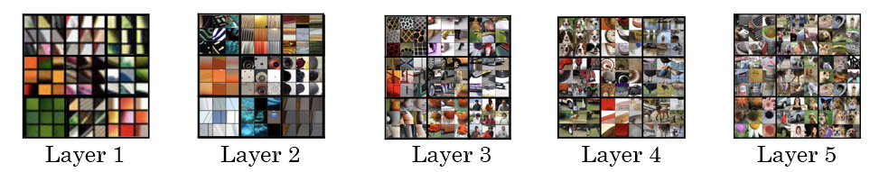
- La primera capa se crea usando los pesos de la primera capa. Otras imágenes se generan utilizando el campo receptivo en la imagen que provocó que la neurona se maximice.
- [[Zeiler and Fergus., 2013, Visualizing and understanding convolutional networks]](https://arxiv.org/abs/1311.2901)
- Una buena explicación de cómo obtener los **campos receptivos** dada una capa:
  - 
  - De [A guide to receptive field arithmetic for Convolutional Neural Networks](https://medium.com/@nikasa1889/a-guide-to-receptive-field-arithmetic-for-convolutional-neural-networks-e0f514068807)

#### Función de coste

- Dada una imagen generada, permite medir qué tan buena es.
- Dado el contenido de una imagen C, el estilo S, y la imagen generada G:
  - `J(G) = alpha * J(C,G) + beta * J(S,G)`
  - `J(C, G)` mide la similitud del contenido.
  - `J(S, G)` mide la similitud del estilo.
  - alpha y beta son pesos relativos a la similitud y son hiperparámetros.
- Encontrar la imagen generada G:
  1. Inicializar G aleatoriamente
     - Por ejemplo G: 100 X 100 X 3
  2. Usar el descenso del gradiente para minimizar `J(G)`
     - `G = G - dG`  Se calcula el gradiente de la imagen y se usa el descenso del gradiente para minimizar la función de coste.
- Las iteraciones quizás se dan de la siguiente manera:
  - Para generar con esto:
    - 
  - Los pasos:
    - 

#### Función de coste del contenido

- Necesaria para medir la similitud.
- Se usa una capa oculta `l` para calcular el coste del contenido. 
  - Si se escoge una `l` pequeña (como la capa 1), se forzará a la red a devolver resultados similares a la original.
  - En la práctica, `l` no es demasiado superficial ni demasiado profunda, algo intermedio.
- Usar ConvNet preentrenadas. (por ejemplo, VGG)
- Dejar que `a(c)[l]` y `a(G)[l]` sean la activación de la capa `l` sobre las imágenes.
- Si `a(c)[l]` y `a(G)[l]` son similares, tendrán el mismo contenido
  - `J(C, G) en la capa l = 1/2 || a(c)[l] - a(G)[l] ||^2`

#### Función de coste de estilo

- ***Estilo*** de una imagen:
  - Si se usa la activación de la capa l para medir el estilo.
  - Definir el estilo como la correlación entre las activaciones a través de canales. 
    - Eso significa que dada una activación como esta:
      - 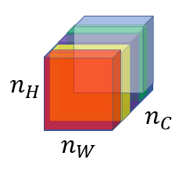
    - ¿Cómo de correlacionados están los canales naranja y amarillo?
    - La correlación indica que si un valor que aparece en un canal específico, otro valor específico aparecerá (depende del otro).
- La correlación de canales de estilo de imágenes debería aparecer en los canales de imagen generados.
- Matriz de estilo (matriz de Gram):
  - Si `a(l)[i, j, k]` es la activación de l con `(i=H, j=W, k=C)`
  - Entonces `G(l)(s)` es la matriz con `nc(l) x nc(l)`
    - Esta es la matriz de estilo o matriz de Gram.
    - En esta matriz, cada celda indica cómo de relacionados están unos canales con otros.
  - Para poblar la matriz, se estas las ecuaciones para computar la matriz de estilo de la imagen de estilo y la imagen generada.
    - 
    - Es la suma de las multiplicaciones de cada miembro en la matriz.
- Para calcular la matriz de Gram eficientemente:
  - Redimensionar la activación de H X W X C a HW X C
  - Nombrar la activación redimensionada F.
  - `G[l] = F * F.T`
- Finalmente, la función de coste será tal que así:
  - `J(S, G) en la capa l = (1/ 2 * H * W * C) || G(l)(s) - G(l)(G) ||`
- Y si se usa de algunas capas
  - `J(S, G) = Sum (lamda[l]*J(S, G)[l], por todas las capas)`
- Pasos a realizar si se desea crear un modelo en TensorFlow de transferencia de estilo neuronal:
  1. Crear una sesión interactiva.
  2. Cargar la imagen del contenido.
  3. Cargar la imagen del estilo
  4. Inicializar aleatoriamente la imgen a ser generada
  5. Cargar el modelo VGG16
  6. Construir el grafo TensorFlow:
     - Ejecutar el contenido de la imagen a través del modelo VGG16 y calcular el coste del contenido
     - Ejecutar el estilo de la imagen a través del modelo VGG16 y calcular el coste del estilo
     - Calcular el coste total
     - Definir el optimizador y el ratio de aprendizaje
  7. Inicializar el grafo de TensorFlow y ejecutar por un largo número de iteraciones, actualizando la imagen generada en cada paso.

#### Generalizaciones 1D y 3D

- Hasta ahora se han usado redes conv para imágenes 2D.
- Ejemplo de convolución 1D:
  - Dimensiones entrada (14, 1)
  - Aplicando 16 filtros con F = 5 , S = 1
  - Dimensiones de salida 10 X 16
  - Aplicando 32 filtro con F = 5, S = 1
  - Dimensiones de salida 6 X 32
- La ecuación general `(N - F)/S + 1` se puede aplicar aquí, pero devuelve un vector en vz de una matriz 2D.
- Los datos 1D pueden venir de recursos como ondas, sonidos, latidos de corazón. 
- En la mayoría de aplicaciones que usan datos 1D se usa Recurrent Neural Network RNN (Red neuronal recurrente).
- Los datos 3D también están disponibles en algunas aplicaciones como escáneres CT:
  - 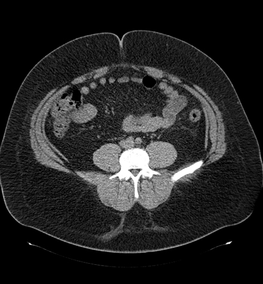
- Ejemplo de convolución 3D:
  - Dimensiones entrada (14, 14,14, 1)
  - Aplicando 16 filtros con F = 5 , S = 1
  - Dimensión salida (10, 10, 10, 16)
  - Aplicando 32 filtros con F = 5, S = 1
  - Dimensión salida (6, 6, 6, 32)

## Extras

### Keras

- Keras es una API de redes neuronales de alto nivel escrita en Python y es capaz de ser ejecutada sobre diversos frameworks de bajo nivel como TensorFlow, Theano y CNTK.
- Así como TensorFlow es un framework a más alto nivel que Python, Keras es incluso de más alto nivel y provee de abstracciones adicionales.
- Keras trabaja bien con muchos modelos comunes.
- Capas en Keras:
  - Densas(FC).
    - Una función lineal seguida de una no lineal.
  - Capas convolucionales.
  - Capas de pooling.
  - Capas de normalización.
    - Una capa de normalización por lotes.
  - Capa Flatten
    - Aplana una matriz a un vector.
  - Capa de activación
    - Diferentes activaciones incluidas: relu, tanh, sigmoid, y softmax.
- Para entrenar y testear el modelo en Keras hay 4 pasos:
  1. Crear el modelo.
  2. Compilar el modelo llamando a `model.compile(optimizer = "...", loss = "...", metrics = ["accuracy"])`
  3. Entrenar el modelo con los datos de entrenamiento llamando a `model.fit(x = ..., y = ..., epochs = ..., batch_size = ...)`
     - Se puede añadir un conjunto de validación durante el entrenamiento.
  4. Testear el modelo con los datos de test llamando a `model.evaluate(x = ..., y = ...)`
- Resumen de los pasos en Keras: Crear->Compilar->Ajuste/Entreno->Evaluar/Test
- `Model.summary()` ofrece mucha información valios sobre el modelo, que incluye cada capa de entrada, salidas, y el número de parámetros de cada capa.
- Para escoger el backend de Keras, se debería ir a `$HOME/.keras/keras.json` y cambiar el archivo al backend deseado como Theano o TensorFlow.
- Después de crear el modelo, se puede ejecutar el modelo en una sesión tensorflow sin capacidad de compilar, entrenar y testear.
- Se puede guardar el modelo con `model_save` y cargar usando `model_load `. Esto almacena todo el modelo de entrenamiento en disco con los pesos entrenados.

