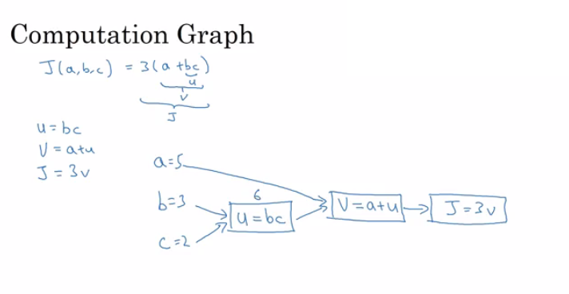

## Curso 1: Redes Neuronales y Deep Learning

### Índice

   * [Introducción al Deep Learning](#introducción-al-deep-learning)
      * [¿Qué es una Red Neuronal (Neural Network) NN?](#qué-es-una-red-neuronal-neural-network-nn)
      * [Aprendizaje supervisado con redes neuronales](#aprendizaje-supervisado-con-redes-neuronales)
      * [¿Por qué está despegando el Deep Learning?](#por-qué-está-despegando-el-deep-learning)
   * [Redes neuronales básicas](#redes-neuronales-básicas)
      * [Clasificación Binaria](#clasificación-binaria)
      * [Regresión Logística](#regresión-logística)
      * [Coste de la función de regresión logística](#coste-de-la-función-de-regresión-logística)
      * [Descenso de Gradiente](#descenso-de-gradiente)
      * [Grafos computacionales](#grafos-computacionales)
      * [Derivadas con grafos computacionales](#derivadas-con-grafos-computacionales)
      * [Descenso de Gradiente con regresión logística](#descenso-de-gradiente-con-regresión-logística)
      * [Descenso del Gradiente en m ejemplos](#descenso-del-gradiente-en-m-ejemplos)
      * [Vectorización](#vectorización)
      * [Vectorizando la regresión logística](#vectorizando-la-regresión-logística)
      * [Notas para Python y NumPy](#notas-para-python-y-numpy)
      * [Notas generales](#notas-generales)
   * [Redes neuronales de poca profundidad](#redes-neuronales-de-poca-profundidad)
      * [Introducción](#introducción)
      * [Representación de las redes neuronales](#representación-de-las-redes-neuronales)
      * [Cálculo del resultado de una red neuronal](#cálculo-del-resultado-de-una-red-neuronal)
      * [Vectorización a través de varios ejemplos](#vectorización-a-través-de-varios-ejemplos)
      * [Función de activación](#función-de-activación)
      * [Por qué se necesitan funciones de activación no lineales?](#por-qué-se-necesitan-funciones-de-activación-no-lineales)
      * [Derivadas de las funciones de activación](#derivadas-de-las-funciones-de-activación)
      * [Descenso de gradiente para redes neuronales](#descenso-de-gradiente-para-redes-neuronales)
      * [Inicialización aleatoria](#inicializaciónaleatoria)
   * [Redes neuronales profundas](#redes-neuronales-profundas)
      * [Redes neuronales profundas de L-capas](#redes-neuronales-profundas-de-l-capas)
      * [Propagación hacia adelante en una red profunda](#propagación-hacia-adelante-en-una-red-profunda)
      * [Estableciendo las dimensiones correctas de la matriz](#estableciendo-las-dimensiones-correctas-de-la-matriz)
      * [¿Por qué representaciones profundas?](#por-qué-representaciones-profundas)
      * [Construyendo bloques de redes neuronales profundas](#construyendo-bloques-de-redes-neuronales-profundas)
      * [Propagación hacia adelante y hacia atrás](#propagación-hacia-adelante-y-hacia-atrás)
      * [Parámetros vs hiperparámetros](#parámetros-vs-hiperparámetros)

## Introducción al Deep Learning

### ¿Qué es una Red Neuronal (Neural Network) NN?

- Una neurona == regresión linear sin aplicar la activación (perceptrón).
- Básicamente, una única neurona calculará la suma ponderada de la entrada (W.T*X) y, entonces, se establece el umbral para predecir el resultado del perceptrón. Si el la suma ponderada de entrada alcanza el umbral, el perceptrón lo devuelve.
- El perceptrón puede tomar valores reales de entrada o lógicos.
- Por lo tanto, si w⋅x+b=0, el perceptrón devuelve 0.
- La desventaja del perceptrón es que solo devuelve valores binarios, y si se intenta realizar algún cambio pequeño en los pesos, puede cambiar el resultado. Para solucionar esto, aparece la función Sigmoid.
- Si se cambia el perceptrón en la funcion sigmoid, solo devuelve un pequeño cambio en el resultado.
- Si se aplica la funcion de activación de sigmoid, la red de una única neurona actuará como un regresión logística.
- NN simple:
  - 
  - Image taken from [tutorialspoint.com](http://www.tutorialspoint.com/)
- RELU (rectified linear unit) es la función de activación más popular actual que permite entrenos de NNs profundas más rápidos.
- Las capas ocultas predicen la conexión entre las entradas de forma automática, esto es lo que se le da bien al deep learning.
- Una NN profunda consiste en más capas ocultas (capas más profundas)
  - 
  - Image taken from [opennn.net](http://www.opennn.net/)
- Cada entrada se conectará con la capa oculta y la NN decidirá las conexiones.
- El entrenamiento supervisado significa que existe (X,Y) y es necesario conseguir la función que mapee X con Y.

### Aprendizaje supervisado con redes neuronales

- Hay diferentes tipos de redes neuronales para aprendizaje supervisado:
  - CNN o redes convolucionales (útiles para visión artificial)
  - RNN o redes recurrentes (útiles para el reconocimiento de habla o NLP)
  - Standard NN (útil para datos estructurados)
  - Híbrida/personalizada o una colección de varios tipos
- Los datos estructurados se refiere a bases de datos y tablas.
- Los datos desestructurados se refieren a imagen, vídeo, audio y texto.

### ¿Por qué está despegando el Deep Learning?
  1. Datos:
       - 
     - Para una NN con pocos datos, se puede rendir con una regresión lineal o SVM (Support vector machine)
     - Cuanto más datos usemos, es más probable necesitar redes más profundas
  2. Computación:
     - GPUs.
     - CPUs.
     - Computación distribuída.
     - ASICs
  3. Algoritmos:
 		
	- Creativos algoritmos que han aparecido han cambiado el modo de trabajar de las redes neuronales.
        - Por ejemplo, RELU es mucho mejor que SIGMOID a la hora de entrenar ya que elimina el problema del gradiente.

  ​

## Redes neuronales básicas

### Clasificación Binaria

- Se centra en cómo realizar una regresión logística para hacer clasificaciones binarias.
  - 
  - Image taken from [3.bp.blogspot.com](http://3.bp.blogspot.com)
- Por ejemplo, reconocer en una imagen si aparece o no un gato.
- Anotaciones que serán usadas más adelante:
  - `M es el número de vectores de entrenamiento`
  - `Nx es el tamaño del vector de entrada`
  - `Ny es el tamaño del vector de salida`
  - `X(1) es el primer vector de entrada`
  - `Y(1) es el primer vector de salida`
  - `X = [x(1) x(2).. x(M)]`
  - `Y = (y(1) y(2).. y(M))`
- We will use python in this course.
- Con NumPy (una librería de Python)  se pueden crear matrices y operar con ellas con solo una sentencia.

### Regresión Logística

- Algoritmo que es usado para la clasificación de 2 clases.
- Ecuaciones:
  - Simple:	`y = wx + b`
  - Si x es un vector: `y = w(transposicion)x + b`
  - Si se necesita que y esté entre 0 y 1 (probabilidad): `y = sigmoid(w(transposicion)x + b)`
- En clasificación binaria `Y` toma valores entre `0` y `1`.
- En la última ecuación, `w` es un vector de `Nx` y `b` un valor real.

### Coste de la función de regresión logística

- La primera función de pérdida sería la raíz del error cuadrático medio:  `L(y',y) = 1/2 (y' - y)^2`
  - No será usada porque puede derivar en errores de optimización al tener posibles puntos óptimos locales.
- Se usará: `L(y',y) = - (y*log(y') + (1-y)*log(1-y'))`
- Explicación:
  - Si `y = 1` ==> `L(y',1) = -log(y')`  ==> se busca que `y'` sea el mayor posible ==> el máximo de `y`' es 1
  - Si `y = 0` ==> `L(y',0) = -log(1-y')` ==> se busca que `1-y'` el mayor posible ==> el mínimo `y'` para que resulte en valor 1.
- La función de coste: `J(w,b) = (1/m) * Sum(L(y'[i],y[i]))`
- La función de pérdida calcula el error para una sola muestra de entrenamiento; función de coste es la media de las funciones de pérdida de todo el conjunto de entrenamiento.

### Descenso de Gradiente

- Se desea `w` y `b` que minimicen la función de coste.
- Es una función convexa.
- Primero se inicializa `w` y `b` a 0,0 o valores aleatorios de la función y se intenta mejorar los valores para alcanzar el mínimo valor.
- En la regresión logística, normalmente se usa 0,0 en vez de valores aleatorios.
- El algoritmo del descenso de gradiente repite: `w = w - alpha * dw`
  donde alpha es el ratio de aprendizaje y `dw` es la derivada de `w` además de la pendiente de `w`
- La derivada permite conocer la dirección en la que modificar los parámetros de mejora.

- La ecuación:
  - `w = w - alpha * d(J(w,b) / dw)`        (cuánto cambia la pendiente en la dirección de w)
  - `b = b - alpha * d(J(w,b) / db)`        (cuánto cambia la pendiente en la dirección de d)

### Grafos computacionales

- Es un grafo que organiza el cálculo de izquierda a derecha. Por lo que será de ayuda a la hora de determinar la dependencia entre los valores.
  - 

### Derivadas con grafos computacionales

- Según la regla de la cadena de cálculo:
  Si `x -> y -> z`          (x afecta a 'y' y 'y' afecta a z)
  Entonces `d(z)/d(x) = d(z)/d(y) * d(y)/d(x)`
- Se muestra un ejemplo.
  - 
- Calcular las derivadas en un grafo de derecha a izquierda, facilitará el trabajo.
- `dvar` indica que las derivadas de un resultado final con respecto a cantidades intermedias.

### Descenso de Gradiente con regresión logística

- Se estudian las derivadas del descenso de gradiente para una muestra con dos características `x1` y `x2`.
  - 

### Descenso del Gradiente en m ejemplos

- Se tienen las siguientes variables:

	  	X1                  Característica
	  	X2                  Característica
	  	W1                  Peso de la primera característica.
	  	W2                  Peso de la segunda característica.
	  	B                   Parámetro de la regresión logística.
	  	M                   Número de los ejemplos de entrenamiento
	  	Y(i)                Valor esperado de i

- Entonces:
  

- De derecha a izquierda se calculan las derivadas comparadas con el resultado:

	  	d(a)  = d(l)/d(a) = -(y/a) + ((1-y)/(1-a))
	  	d(z)  = d(l)/d(z) = a - y
	  	d(W1) = X1 * d(z)
	  	d(W2) = X2 * d(z)
	  	d(B)  = d(z)

- Pseudo código de la regresión logística:

	
	  	J = 0; dw1 = 0; dw2 =0; db = 0;                 (# Derivadas.)
	  	w1 = 0; w2 = 0; b=0;							(# Pesos)
	  	for i = 1 to m
	  		# Forward pass
	  		z(i) = W1*x1(i) + W2*x2(i) + b
	  		a(i) = Sigmoid(z(i))
	  		J += (Y(i)*log(a(i)) + (1-Y(i))*log(1-a(i)))
	
	  		# Backward pass
	  		dz(i) = a(i) - Y(i)
	  		dw1 += dz(i) * x1(i)
	  		dw2 += dz(i) * x2(i)
	  		db  += dz(i)
	  	J /= m
	  	dw1/= m
	  	dw2/= m
	  	db/= m
	
	  	# Gradient descent
	  	w1 = w1 - alpha * dw1
	  	w2 = w2 - alpha * dw2
	  	b = b - alpha * db
  

- El código debería ejecutarse varias iteraciones para minimizar el error.

- Por lo que habrán dos bucles anidados.

- Es importante la vectorización en el deep learning para reducir los bucles.

### Vectorización

- El deep  learning está pensado para grandes conjuntos de datos. Para evitar la computación de algunos bucles es necesaria la vectorización.
- NumPy usa vectorización por defecto.
- Puede ser procesada por CPU o GPU a través de operaciones SIMD, pero es más rápida en GPU.
- Siempre que sea posible, evitar bucles.
- La mayoría de métodos de la librería NumPy son versiones vectorizadas.

### Vectorizando la regresión logística

- Como entrada, se tiene la matriz `X` con `[Nx, m]` y la matriz `Y` con `[Ny, m]`.
- Se calcula para la instancia `[z1,z2...zm] = W' * X + [b,b,...b]`. En python:

    		Z = np.dot(W.T,X) + b    # Vectorización, después se transmite, las dimensiones de Z son (1, m)
    		A = 1 / 1 + np.exp(-Z)   # Vectorización, dimensión de A (1, m)

- Resultado del gradiente de la regresión logística:

   			dz = A - Y                  # Vectorization, dimensión de dz  (1, m)
   			dw = np.dot(X, dz.T) / m    # Vectorization, dimensión de dw (Nx, 1)
   			db = dz.sum() / m           # Vectorization, dimensión de dz (1, 1)

### Notas para Python y NumPy

- Con NumPy, `obj.sum(axis = 0)` suma las columnas, mientras que `obj.sum(axis = 1)` suma las filas.
- Con NumPy, `obj.reshape(1,4)` cambia las dimensiones de la matriz pasando los valores.
- Redimensionar tiene un bajo costo computacional, así que es mejor usarlo cuando no se esté seguro de cuáles son las actuales.
- Pasar los valores funciona cuando se opera con matrices que no ajustan a las dimensiones de la operación. NumPy prepara de forma automática las dimensiones para operar pasando los valores.
- Si se tiene un matriz (m,n) y se suma, resta, multiplica o divide con una matriz (1,n), se copiará m veces en una matriz (m,n). Lo mismo ocurre si es (m , 1). Después se realiza la operación.
- Algunos consejos para eliminar posibles errores de código:
  - Si no se especifica la dimensión del vector, tomará `(m,)` y la transpuesta no funcionará. Redimensionar a `(m, 1)`
  - Evitar matrices de rango 1.
  - No dudar en usar `assert(a.shape == (5,1))` para comprobar las dimensiones.
  - Redimensionar matrices de rango 1.
- Jupyter / IPython notebooks son librerías útiles de python que facilitan la integración de código y documentación. Se ejecuta en el navegador y no necesita el entorno de desarrollo.
  - En la linea de comandos: `jupyter-notebook` .
- Para calcular la derivada de Sigmoid:

	  	s = sigmoid(x)
	  	ds = s * (1 - s)       

- Para convertir una imagen con `(width,height,depth)` en un vector:

	 	 v = image.reshape(image.shape[0]*image.shape[1]*image.shape[2],1)

- El descenso de gradiente converge antes si se normalizan las matrices de entrada.

### Notas generales

- Los pasos principales para construir una red neuronal son los siguientes:
  - Definir el modelo de la estructura (así como en número de características de entrada y salida)
  - Inicializar los parámetros del modelo.
  - Bucle.
    - Calcular la pérdida actual (propagación hacia adelante)
    - Calcular el gradiente actual (propagación hacia atrás)
    - Actualizar parámetros (descenso de gradiente)
- Es importante preprocesar el conjunto de datos.
- Ajustar el ratio de aprendizaje (es un ejemplo de hiperparámetro) puede suponer una gran mejora del algoritmo.
- [kaggle.com](kaggle.com) es un buen lugar para conjuntos de datos y competiciones.
- [Pieter Abbeel](https://www2.eecs.berkeley.edu/Faculty/Homepages/abbeel.html) es uno de los mejores en aprendizaje reforzado.

## Redes neuronales de poca profundidad

> Redes neuronales de una sola capa oculta.

### Introducción

- En la regresión logística se tiene:

	 	 X1  \ 
	 	 X2   ==>  z = XW + B ==> a = Sigmoid(z) ==> l(a,Y)
	 	 X3  /

- Y en redes de una capa:

		X1  \  
	  	X2   =>  z1 = XW1 + B1 => a1 = Sigmoid(z1) => z2 = a1W2 + B2 => a2 = Sigmoid(z2) => l(a2,Y)
	  	X3  /

- `X` es el vector de entrada `(X1, X2, X3)`, y `Y` es la variable de salida `(1x1)`
- La red neuronal es un conjunto de regresiones logísticas.

### Representación de las redes neuronales

- Las NN contienen capas de entrada, ocultas y de salida.
- Las capas ocultas significa que no se pueden ver las capas en el conjunto de entrenamiento.
- `a0 = x` (capa de entrada)
- `a1` representa la activación de las neuronas ocultas.
- `a2` representa la capa de salida.
- Hablamo de una NN de 2 capas, la capa de entrada no se cuenta.

### Cálculo del resultado de una red neuronal

- Ecuaciones de las capas ocultas:
  - 
- Información que se puede obtener:
  - `noOfHiddenNeurons = 4`
  - `Nx = 3`
  - Dimensiones de las variables:
    - `W1` es la matriz de la primera capa oculta, `(noOfHiddenNeurons,nx)`
    - `b1` es la matriz de la primera capa oculta, `(noOfHiddenNeurons,1)`
    - `z1` es el resultado de `z1 = W1*X + b`, `(noOfHiddenNeurons,1)`
    - `a1` es el resultado de `a1 = sigmoid(z1)`, `(noOfHiddenNeurons,1)`
    - `W2` es la matriz de la segunda capa oculta, `(1,noOfHiddenNeurons)`
    - `b2` es la matriz de la segunda capa oculta,  `(1,1)`
    - `z2` es el resultado de `z2 = W2*a1 + b`, `(1,1)`
    - `a2` es el resultado de `a2 = sigmoid(z2)`, `(1,1)`

### Vectorización a través de varios ejemplos

- Pseudo código con propagación hacia adelante para una NN de 2 capas:

	  	for i = 1 to m
	
		    z[1, i] = W1*x[i] + b1      # dimensiones de z[1, i],(noOfHiddenNeurons,1)
		    a[1, i] = sigmoid(z[1, i])  # dimensiones de a[1, i], (noOfHiddenNeurons,1)
		    z[2, i] = W2*a[1, i] + b2   # dimensiones de z[2, i], (1,1)
		    a[2, i] = sigmoid(z[2, i])  # dimensiones de a[2, i], (1,1)

- Si se tiene `X` de `(Nx,m)`:

		  Z1 = W1X + b1     # shape of Z1 (noOfHiddenNeurons,m)
		  A1 = sigmoid(Z1)  # shape of A1 (noOfHiddenNeurons,m)
		  Z2 = W2A1 + b2    # shape of Z2 is (1,m)
		  A2 = sigmoid(Z2)  # shape of A2 is (1,m)

- m siempre es el número de columnas.
- En el ejemplo anterior `X` = `A0`. Por lo que se puede reescribir como: 

		Z1 = W1A0 + b1    # Z1 de (noOfHiddenNeurons,m)
	    A1 = sigmoid(Z1)  # A1 de (noOfHiddenNeurons,m)
	    Z2 = W2A1 + b2    # Z2 de (1,m)
	    A2 = sigmoid(Z2)  # A2 de (1,m)
  

### Función de activación

- A veces es mejor usar otra función que no sea sigmoid.
- Sigmoid puede tener problemas de descenso de gradiente donde las actualizaciones son muy pequeñas.
- El rango de la función Sigmoid es [0,1]
  `A = 1 / (1 + np.exp(-z)) # donde z es la matriz de entrada`
- La función de activación Tanh tiene un rango de [-1,1]   (versión modificada de sigmoid)
  - En NumPy se implementa Tanh usando el siguiente método:
    
			A = (np.exp(z) - np.exp(-z)) / (np.exp(z) + np.exp(-z)) # donde z es la matriz de entrada
		    O
		    A = np.tanh(z)   # donde z es la matriz de entrada

- En la función de activación de las capas ocultas, la media del resultado de salida es más cercana a 0, así que ajusta mejor los datos para la siguiente capa.
- Tanto en Sigmoid como Tanh, si los las entradas son demasiadas o muy pocas, las variaciones se acercarán a 0 y llevará a problemas en el descenso de gradiente.
- RELU es una función que resuelve este problema.
  `RELU = max(0,z) # si z es negativa, la variación es 0 y si z es positiva, la variación permanece lineal.`
- Si la clasificación está entre 0 y 1, usar una activación de salida como sigmoid u otras como RELU.
- Leaky RELU es una variación donde, si la entrada es negativa, la variación será mucho menor.
  `Leaky_RELU = max(0.01z,z)  # 0.01 puede ser un parámetro del algoritmo.`
- Se tienen que tomar decisiones como:
  - No de capas ocultas.
  - No de neuronas en cada capa oculta.
  - Ratio de aprendizaje.       (El más importante)
  - Función de activación.
  - Otros..
- No hay una guía, hay que probar para cada caso.

### ¿Por qué se necesitan funciones de activación no lineales?

- Si se quita la función de activación del algoritmo, se puede considerar que se tiene una función de activación lineal.
- Las funciones de activación lineales devuelven activaciones lineales
  - Sin importar la cantidad de capas ocultas que se añadan, la activación siempre será lineal como en la regresión logística (Por lo que es inútil en muchos problemas complejos)
- Se puede usar una función de activación lineal en la capa de salida cuando la capa de salida devuelve un número real (problema de regresión). Pero incluso aquí, si el valor es no negativo, se puede usar RELU.

### Derivadas de las funciones de activación

- Sigmoid:

		  g(z)  = 1 / (1 + np.exp(-z))
		  g'(z) = (1 / (1 + np.exp(-z))) * (1 - (1 / (1 + np.exp(-z))))
		  g'(z) = g(z) * (1 - g(z))
  

- Tanh:

		  g(z)  = (e^z - e^-z) / (e^z + e^-z)
		  g'(z) = 1 - np.tanh(z)^2 = 1 - g(z)^2
  

- RELU:

		  g(z)  = np.maximum(0,z)
		  g'(z) = { 0  if z < 0
	            1  if z >= 0  }

- leaky RELU:

		  g(z)  = np.maximum(0.01 * z, z)
		  g'(z) = { 0.01  if z < 0
		            1     if z >= 0   }
  

### Descenso de gradiente para redes neuronales
- Se verá la propagación hacia atrás de forma completa
- Gradient descent:
  - Parámetros de la NN:
    - `n[0] = Nx`
    - `n[1] = NoOfHiddenNeurons`
    - `n[2] = NoOfOutputNeurons = 1`
    - `W1` de `(n[1],n[0])`
    - `b1` de `(n[1],1)`
    - `W2` de `(n[2],n[1])`
    - `b2` de `(n[2],1)`
  - Función de coste `I =  I(W1, b1, W2, b2) = (1/m) * Sum(L(Y,A2))`
  - Algoritmo:

		    Repetir:
		    		Calcular predicciones (y'[i], i = 0,...m)
		    		Obtener derivadas: dW1, db1, dW2, db2
		    		Actualizar: W1 = W1 - LearningRate * dW1
		    				b1 = b1 - LearningRate * db1
		    				W2 = W2 - LearningRate * dW2
		    				b2 = b2 - LearningRate * db2

- Propagación hacia adelante:

	     Z1 = W1A0 + b1# A0 es X
    	 A1 = g1(Z1)
    	 Z2 = W2A1 + b2
    	 A2 = Sigmoid(Z2)      # Sigmoid porque el resultado está entre 0 y 1

- Propagación hacia atrás (derivaciones):   

		  dZ2 = A2 - Y      # derivada de la función de coste* derivada de la función sigmoid
		  dW2 = (dZ2 * A1.T) / m
		  db2 = Sum(dZ2) / m
		  dZ1 = (W2.T * dZ2) * g'1(Z1)  # multiplicación de matrices (*)
		  dW1 = (dZ1 * A0.T) / m   # A0 = X
		  db1 = Sum(dZ1) / m
		  # Tener en cuenta que hay multiplicaciones con transposiciones para mantener las dimensiones correctas
- Derivación de la propagación hacia atrás:   
  

### Inicialización aleatoria

- En la regresión logística no era importante, pero a partir de ahora se realizará de esta forma.

- Inicializar todos los pesos con 0 no funcionará (el valor de bias, b, sí se puede):
  - Todas las unidades ocultas serán identicas y ejecutarán la misma función.
  - En cada iteración del descenso de gradiente, todas las neuronas ocultas se actualizarán de forma idéntica.

- Para solucionarlo, inicializamos las W con pequeños valores aleatorios:

		  W1 = np.random.randn((2,2)) * 0.01    # 0.01 para que sea bajo
		  b1 = np.zeros((2,1))                  # se puede tener b a 0

- Se necesitan valores bajos en sigmoid (o tanh). Si los pesos son muy altos, es más probable acabar donde se comienza el entrenamiento con valores altos de Z. Lo que provoca que tanh o sigmoid se saturen, con lo que se ralentiza el aprendizaje. Si no se usa sigmoid o tanh en la NN, no tiene importancia.

- La constante 0.01 es acertada para una NN de 1 capa oculta, pero si es más profunda, se pueden tomar menores valores.

## Redes neuronales profundas

> Serán necesarias para la visión artificial.

### Redes neuronales profundas de L-capas

- NN de poca profundidad solo tienen una o dos capas.
- Deep NN tienen 3 o más.
- `L` indicará la cantidad de capas de la NN.
- `n[l]` es el número de neuronas de la capa `l`.
- `n[0]` indica el número de neuronas de la capa de entrada. `n[L]` de la de salida.
- `g[l]` es la función de activación.
- `a[l] = g[l](z[l])`
- `w[l]` son los pesos de `z[l]`
- `x = a[0]`, `a[l] = y'`
- Entonces:
  - `n`, vector de `(1, NoOfLayers+1)`
  - `g`, vector de `(1, NoOfLayers)`
  - Una lista de diferentes dimensiones `w` basada en el número de neuronas de la anterior y actual capa.
  - Una lista de distintas dimensiones `b` basada en el número de neuronas de la capa actual.

### Propagación hacia adelante en una red profunda

- Regla general de propagación hacia adelante para una entrada:

		  z[l] = W[l]a[l-1] + b[l]
		  a[l] = g[l](a[l])

- Regla general de propagación hacia adelante para `m` entradas:

		  Z[l] = W[l]A[l-1] + B[l]
		  A[l] = g[l](A[l])

- No se puede calcular la propagación hacia adelante de todas las capas sin un bucle, por lo no hay problema en añadir uno.
- Es muy importarte descubrir las dimensiones de las matrices.

### Estableciendo las dimensiones correctas de la matriz

- La mejor forma es con papel y lápiz.
- `W` es de `(n[l],n[l-1])`.
-  `b` es de `(n[l],1)`
- `dw` tiene las mismas que `W`, mientras que `db` las mismas que`b`
- `Z[l],` `A[l]`, `dZ[l]`, y `dA[l]`  son de `(n[l],m)`

### ¿Por qué representaciones profundas?

- Deep NN crean relaciones con los datos, de simples a complejas. En cada capa, se intenta relacionar con la anterior capa:
  - 1) Reconocimiento de rostros:
      - Imagen ==> Bordes ==> Partes del rostro ==> Caras ==> cara deseada
  - 2) Reconocimiento de audio:
      - Audio ==> Características a un nivel muy bajo del sonido ==> Fonemas==> Palabras ==> Frases
- Los investigadores de neuronas piensan que las redes neuronales funcionan como el cerebro (simple ==> complejo)
- Circuito teórico y deep learning:
  - 
- Al empezar, empezar con la solución más simple e ir añadiendo poco a poco complejidad.

### Construyendo bloques de redes neuronales profundas

- Propagación hacia adelante y atrás para la capa 1:
  - 
- Bloques de una deep NN:
  - 

### Propagación hacia adelante y hacia atrás

- Pseudo código de propagación hacia adelante para capa 1:

		  Entrada  A[l-1]
		  Z[l] = W[l]A[l-1] + b[l]
		  A[l] = g[l](Z[l])
		  Salida A[l], cache(Z[l])

- Pseudo código de propagación hacia atrás para capa 1:

		  Entrada da[l], Caches
		  dZ[l] = dA[l] * g'[l](Z[l])
		  dW[l] = (dZ[l]A[l-1].T) / m
		  db[l] = sum(dZ[l])/m                # No olvidar axis=1, keepdims=True
		  dA[l-1] = w[l].T * dZ[l]            # La multiplicación es el producto escalar
		  Salida dA[l-1], dW[l], db[l]

- Si se ha usado la función de pérdida:

		  dA[L] = (-(y/a) + ((1-y)/(1-a)))

### Parámetros vs hiperparámetros

- Los principales parámetros de la NN son `W` y `b`
- Hiperparámetros (parámetros que controlan el algoritmo):
  - Ratio de aprendizaje.
  - Número de iteraciones.
  - Número de capas ocultas `L`.
  - Número de unidades ocultas `n`.
  - Elección de la función de activación.
- Hay que ir probando distintos valores.
