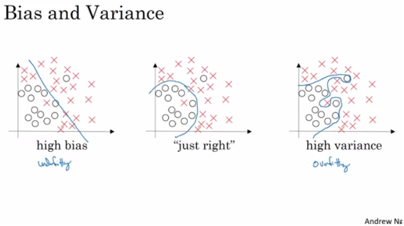
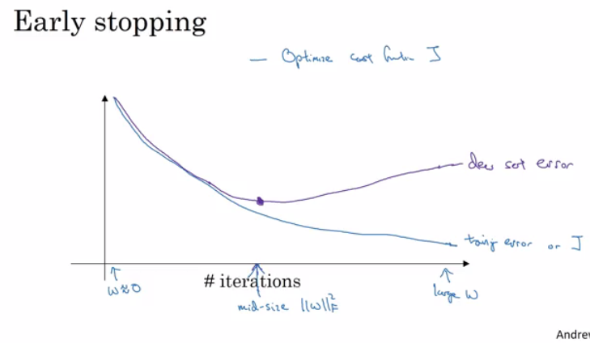
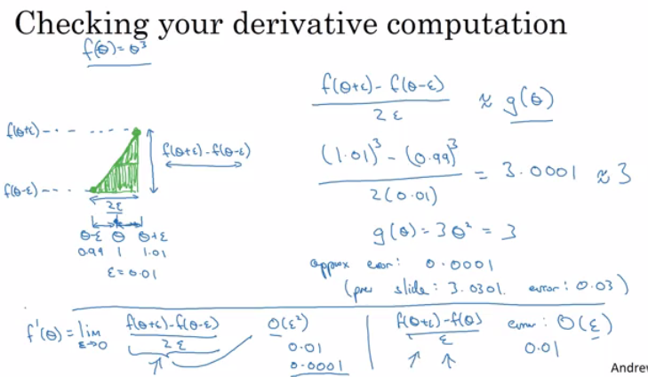
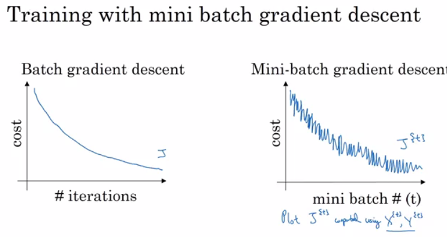
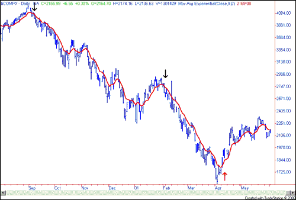

# Curso 2: Mejorando redes neuronales profundas: Ajuste de hiperparámetros, regularización y optimización

## Índice
 * [Aspectos prácticos del Deep Learning](#aspectos-prácticos-del-deep-learning)
      * [Train / Dev / Test sets](#train--dev--test-sets)
      * [Bias / Variance](#bias--variance)
      * [Receta básica para machine learning](#receta-básica-para-machine-learning)
      * [Regularización](#regularización)
      * [¿Por qué la regularización reduce el sobreajuste?](#por-qué-la-regularización-reduce-el-sobreajuste)
      * [Regularización: Dropout](#regularización-dropout)
      * [Comprendiendo el dropout](#comprendiendo-el-dropout)
      * [Otros métodos de regularización](#otros-métodos-de-regularización)
      * [Normalizar entradas](#normalizar-entradas)
      * [Desvaneciendo/Explotando gradientes](#desvaneciendo--explotando-gradientes)
      * [Inicialización de pesos en redes profundas](#inicialización-de-pesos-en-redes-profundas)
      * [Aproximación numérica del gradiente](#aproximación-numérica-del-gradiente)
      * [Notas sobre la implementación del gradiente](#notas-sobre-la-implementación-del-gradiente)
      * [Resumen inicialización](#resumen-inicialización)
      * [Resumen regularización](#resumen-regularización)
 * [Optimizando algoritmos](#optimizando-algoritmos)
      * [Descenso del gradiente con mini-lotes](#descenso-del-gradiente-con-mini-lotes)
      * [Comprendiendo el descenso del gradiente con mini-lotes](#comprendiendo-el-descenso-del-gradiente-con-mini-lotes)
      * [Promedios ponderados exponencialmente](#promedios-ponderados-exponencialmente)
      * [Comprendiendo promedios ponderados exponencialmente](#comprendiendo-promedios-ponderados-exponencialmente)
      * [Corrección de Bias en promedios ponderados exponencialmente](#corrección-de-bias-en-promedios-ponderados-exponencialmente)
      * [Descenso del gradiente con impulso](#descenso-del-gradiente-con-impulso)
      * [RMSprop](#rmsprop)
      * [Algoritmo de optimización de Adam](#algoritmo-de-optimización-de-adam)
      * [Decaída del ratio de aprendizaje](#decaída-del-ratio-de-aprendizaje)
      * [El problema de los óptimos locales](#el-problema-de-los-óptimos-locales)
 * [Ajuste de hiperparámetros,normalización por lotes y entornos de programación](#ajuste-de-hiperparámetros-normalización-por-lotes-y-entornos-de-programación)
      * [Proceso de ajuste](#proceso-de-ajuste)
      * [Usando una escala apropiada para seleccionar hiperparámetros](#usando-una-escala-apropiada-para-seleccionar-hiperparámetros)
      * [Ajuste de hiperparámetros en práctica: Pandas vs. Caviar](#ajuste-de-hiperparámetros-en-práctica-pandas-vs-caviar)
      * [Normalizando activaciones en una red](#normalizando-activaciones-en-una-red)
      * [Ajuste de normalización por lotes en NN](#ajuste-de-normalización-por-lotes-en-nn)
      * [¿Por qué funciona la normalización por lotes?](#por-qué-funciona-la-normalización-por-lotes)
      * [Normalización por lotes en el momento del test](#normalización-por-lotes-en-el-momento-del-test)
      * [Regresión Softmax](#regresión-softmax)
      * [Entrenando un clasificador Softmax](#entrenando-un-clasificador-softmax)
      * [Frameworks de Deep learning](#frameworks-de-deep-learning)
      * [TensorFlow](#tensorflow)

## Aspectos prácticos del Deep Learning

### Train / Dev / Test sets

- Es imposible establecer correctamente todos los hiperparámetros a la primera.
- Se repite un proceso para encontrarlos: `Idea ==> Code ==> Experiment`.
- De forma cíclica hasta que se ajusten.
- Los datos se dividen en tres conjuntos:
  - Training set.       (Has to be the largest set)
  - El conjunto de validación cruzada de retención / Development o "dev" set.
  - Testing set.
- Se tendrá que construir un modelo sobre el training set e intentar optimizar los hiperparámetros en el dev set cuanto sea posible. Una vez terminado el modelo, se prueba y evalúa el testing set.
- La proporción de los conjuntos:
  - Si el dataset contiene de 100 a 1000000  ==> 60/20/20
  - Si es de 1000000 a INF  ==> 98/1/1 or  99.5/0.25/0.25
- Asegurar que los dev y test set vienen de la misma distribución.
- La regla del dev set es probarlos en modelos correctos que ya se tengan.
- No hay problema si solo se tiene un dev set sin un testing set. En este caso, es común llamar dev set al test set. 

### Bias / Variance

- Las técnicas de Bias / Variance son fáciles de aprender, pero difíciles de dominar.
- Ejemplos:
  - Si el modelo no se ajusta lo suficiente (regresión logística de datos no lineales) tiene "bias elevado"
  - Si el modelo se sobreajusta, tiene "variance elevada"
  - El modelo es correcto si existe un balance entre el Bias / Variance
  - Ilustración:
    - 
- Otra idea para obtener el bias /  variance si no se dispone un mecanismo gráfico:
  - Elevada variance (overfitting):
	    - Training error: 1%
	    - Dev error: 11%
  - Elevada Bias (underfitting):
	    - Training error: 15%
	    - Dev error: 14%
  - Elevada Bias (underfitting) y elevada variance (overfitting):
	    - Training error: 15%
	    - Test error: 30%
  - Óptimo:
	    - Training error: 0.5%
	    - Test error: 1%
  - Esto es asumiendo que el error humano es 0%. Si no es el caso, se debe partir de ahí.

### Receta básica para machine learning

- Si se tiene elevada bias:
  - Incrementar la NN (número de unidades ocultas, número de capas)
  - Intentar con un modelo distinto que se ajuste a las condiciones de los datos.
  - Realizar una ejecución más larga.
  - Distintos algoritmos de optimización (avanzado).
- Si hay elevada variance:
  - Usar más datos.
  - Intentar regularización.
  - Intentar un modelo distinto que se ajuste a las condiciones de los datos.
- Se deben intentar los puntos anteriores hasta tener baja bias y variance.
- Entrenar una mayor red neuronal nunca está de más.

### Regularización

- Añadir regularización a una NN ayudará a reducir la variance (overfitting)
- Normalización L1 de una matriz:
  	 `||W|| = Sum(|w[i,j]|)  # suma de los valores absolutos de w`
- Normalización L2 de una matriz (normalización de Frobenius):
  	 `||W||^2 = Sum(|w[i,j]|^2)	# suma de los cuadrados de w`
  - También se puede calcular:
				`||W||^2 = W.T * W # si W es un vector`
- Regularización para regresión logística:
  - La función de coste normal a minimizar: `J(w,b) = (1/m) * Sum(L(y(i),y'(i)))`
  - Regularización L2: `J(w,b) = (1/m) * Sum(L(y(i),y'(i))) + (lambda/2m) * Sum(|w[i]|^2)`
  - Regularización L1: `J(w,b) = (1/m) * Sum(L(y(i),y'(i))) + (lambda/2m) * Sum(|w[i]|)`
  - La versión L1 provoca que muchos valores de w sean 0, lo que reduce el tamaño del modelo.
  - La versión L2 es mucho más frecuente.
  - `lambda` es el parámetro de regularización (hiperparámetro)
- Regularizacion de una NN:
  - La función de coste normal a minimizar:   
    `J(W1,b1...,WL,bL) = (1/m) * Sum(L(y(i),y'(i)))`
  - L2:   
   		 `J(w,b) = (1/m) * Sum(L(y(i),y'(i))) + (lambda/2m) * Sum((||W[l]||^2)`
  - Agrupamos la matriz como un solo vector `(mn,1)` y aplicamos `sqrt(w1^2 + w2^2.....)`
  - Propagación hacia atrás (antiguo método):   
    `dw[l] = (from back propagation)`
  - Nuevo método:   
    `dw[l] = (from back propagation) + lambda/m * w[l]`
  - Se añade en el paso de la actualización de pesos:

	      	   w[l] = w[l] - learning_rate * dw[l]
	           = w[l] - learning_rate * ((from back propagation) + lambda/m * w[l])
	           = w[l] - (learning_rate*lambda/m) * w[l] - learning_rate * (from back propagation) 
	           = (1 - (learning_rate*lambda)/m) * w[l] - learning_rate * (from back propagation)
	
  - En la práctica, esto penaliza los pesos altos y limita la libertad del modelo.

  - El nuevo término `(1 - (learning_rate*lambda)/m) * w[l]`  provoca una **decaída de los pesos** en proporción al tamaño.


### ¿Por qué la regularización reduce el sobreajuste?

  - Posibilidad 1:
     - Si `lambda` es muy alto, muchos w se acercarán a 0, lo que simplificará la NN.
     - Si `lambda` es lo suficientemente bueno, reducirá algunos pesos, que harán que la NN se sobreajuste.
  - Posibilidad 2 (con la función de activación tanh):
     - Si `lambda` es muy alto, los w se acercarán a 0, se usará la parte lineal de la función de activación tanh, y se pasará de una función de activación no lineal a una aproximadamente lineal.
     - Si `lambda` es lo suficientemente bueno, hará que algunas de las activaciones tanh aproximadamente lineales, lo que prevendrá el sobreajuste.

### Regularización: Dropout

- Se aconseja usar la regularización L2.
- La regularización dropout elimina algunas neuronas/pesos en cada iteración basándose en una probabilidad.
- Una técnica común de implementarla es el dropout invertido.
- Código del dropout invertido:
		
		python
		  keep_prob = 0.8   # 0 <= keep_prob <= 1
		  l = 3  # este código es solo para la capa 3
		  # los valores generados que son menores a 0.8 se descartan. 80% permanece, 20% se descarta
		  d3 = np.random.rand(a[l].shape[0], a[l].shape[1]) < keep_prob
		
		  a3 = np.multiply(a3,d3)   # mantener solo los valores en d3
		
		  # incrementar a3 para reducir los valores esperados de salida
		  # (asegurar que los valores esperados de a3 permanecen igual) - para prevenir problemas de escalabilidad
		  a3 = a3 / keep_prob       

- El vector d[l] es usado para la propagación en ambos sentidos y es el mismo para ambas, pero es diferente para cada iteración (pass) o muestra de entrenamiento.
- Durante el test no se usa dropout. En caso de hacerlo, añadirá ruido a las predicciones.

### Comprendiendo el dropout

- Se podría decir que el dropout eliminar de forma aleatoria unidades de la red, con lo que trabajamos una red más pequeña en cada iteración, creando el efecto de una regularización.
- Dropout tiene efectos similares a la regularización L2.
- Dropout puede tener distintos `keep_prob` por capa.
- La capa de entrada tiene que estar cerca de 1 (o 1 - no dropout) para no eliminar muchas características.
- Si hay más preocupación por el sobreajuste de unas capas que otras, se puede establecer un bajo `keep_prob`. Aunque esto aumenta la cantidad de hiperparámetros que tener en cuenta. Una alternativa es tener droput en solo algunas capas y tener un único `keep_prob` para estas.
- Se está usando mucho el dropout en Visión Artificial ya que hay unos datos de entrada de tamaño muy elevado y casi nunca se tienen suficientes datos, así que es frecuente el sobreentreno.
- Una desventaja es que la función de coste J no es bien definida y es complicado depurar (aislar J para cada iteración).
  - Para resolverlo, desactivar el dropout ajustando el valor de `keep_prob` a 1, y ejecutar el código y comprobar que J se reduce monotómicamente, después volver a activar el dropout.

### Otros métodos de regularización

- **Aumento de datos**:
  - En visión artificial, por ejemplo:
    - Se pueden invertir todas las imágenes de forma horizontal.
    - Se puede aplicar zoom y rotación de una imagen.
  - Aunque estos nuevos datos no son tan buenos como los reales.
- **Detención temprana**:
  - En esta técnica se juntan los costes de los training y dev set para cada iteración y llegará alguna iteración en la que el coste dejará de reducirse y empezará a incrementar.
  - Se escogerá el punto con los mejores valores de error de los sets (menores costes).
  - Se tomarán estos parámetros como los mejores.
    - 
  - Hay quien prefiere usar L2 debido a que esta técnica intenta minimizar el coste y no sobreajustarse (contradice la ortogonalidad).
  - Pero no es necesario buscar otros hiperparámetros (como `lambda` en la regularización L2).
- **Conjuntos modelo**:
  - Algoritmo:
    - Entrenar múltiples modelos independientes.
    - En el momento del test promediar los resultados.
  - Se puede obtener un rendimiento extra del 2%.
  - Reduce la generalización de error.

### Normalizar entradas

- Si se normalizan las entradas, se acelerará el proceso de entrenamiento en gran medida.
- Pasos:
  1. Obtener la media del training set: `mean = (1/m) * sum(x(i))`
  2. Restar la media a cada entrada: `X = X - mean`
     	- Esto acerca los valores a 0.
  3. Calcular la varianza del set: `variance = (1/m) * sum(x(i)^2)`
  4. Normalizar la varianza. `X /= variance`
- Los pasos deberían aplicarse a los training, dev, y testing sets (pero usando la media y varianza del train set).
- Por qué normalizar?
  - Si no se normalizan las entradas, la función de coste se profundizará y las dimensiones serán inconsistentes y optimizar llevará mucho tiempo.
  - Si se realiza, ocurre lo contrario, la función de coste será consistente y se puede usar un mayor ratio de aprendizaje.

### Desvaneciendo/Explotando gradientes

- Desvanecer/Explotar los gradientes se da cuando las derivadas se vuelven muy pequeñas o muy grandes.
- Si se tuvieran una cantidad de capas L, y todas las funciones de activación fueran **lineales** con cada `b = 0`
  - Entonces:   
    ```
    Y' = W[L]W[L-1].....W[2]W[1]X
    ```
  - Si se tienen 2 unidades ocultas por capa y x1 = x2 = 1:


		    if W[l] = [1.5   0] 
		              [0   1.5] #(l != L por las distintas dimensiones en la capa de salida)
		    Y' = W[L] [1.5  0]^(L-1) X = 1.5^L 	# por lo que será elevado
		              [0  1.5]
			-------------------------------
		    if W[l] = [0.5  0]
		              [0  0.5]
		    Y' = W[L] [0.5  0]^(L-1) X = 0.5^L 	# por lo que será reducido
		              [0  0.5]

- Esto explica cómo las activaciones (y derivadas similares) serán reducidas/incrementadas exponencialmente en función del número de capas.
- Si W > I (Matriz identidad), la activación y gradiente se sobreelevarán.
- Si W < I (Matriz identidad),  la activación y gradiente se desvanecerán.
- Conforme se vaya incrementando el número de capas, se irá haciendo una aprendizaje más complejo. Una solución parcial sería escoger los pesos iniciales.

### Inicialización de pesos en redes profundas
- En un modelo Perceptrón: 
			`Z = w1x1 + w2x2 + ... + wnxn`
  - Si `n_x` es elevado, se busca que `W` sean lo menor posible para no sobreelevar los costes.
- Resulta que se necesita que la varianza `1/n_x` esté en el rango de los `W`
- Si se inicializan `W` así (mejor con la activación `tanh`):   
	 		 `np.random.rand(shape) * np.sqrt(1/n[l-1])`
  o la variación (Bengio et al.):   
		  	`np.random.rand(shape) * np.sqrt(2/(n[l-1] + n[l]))`
- Añadiendo la inicialización dentro de la raíz de `2/n[l-1]` para `ReLU` es mejor: 
			`  np.random.rand(shape) * np.sqrt(2/n[l-1])`
- Los valoes 1 o 2 en el numerador pueden ser hiperparámetros a ajustar (pero no los primeros con los que empezar)
- Este es uno de los mejores mods de solucionar parcialmente el desvanecimiento/explosión de gradientes (ReLU + inicialización de pesos con varianza), con lo que se frena al comienzo.

### Aproximación numérica del gradiente

- La comprobación del gradiente es una técnica que indica si la implementación de la propagación hacia atrás es correcta.
- Hay forma numérica de calcular la derivada:   
  
- La comprobación del gradiente aproxima el gradiente de una forma muy útil para encontrar los errores de la implementación de la propagación, pero es más lenta que el descenso del gradiente, así que solo usar para depuración.
- Fácil de implementar.
- Comprobación del gradiente:
  - Primer se toma `W[1],b[1],...,W[L],b[L]` y se redimensiona a un gran vector (`theta`)
  - La función de coste será `J(theta)`
  - Se toma `dW[1],db[1],...,dW[L],db[L]` en un gran vector (`d_theta`)
  - **Algoritmo**:   
 
			eps = 10^-7   # valor pequeño
			for i in len(theta):
			d_theta_approx[i] = (J(theta1,...,theta[i] + eps) -  J(theta1,...,theta[i] - eps)) / 2*eps

  - Finalmente, se evalúa la fórmula `(||d_theta_approx - d_theta||) / (||d_theta_approx||+||d_theta||)` (`||` - norma euclídea) y se comprueba (con `eps = 10^-7`):
    - Si `eps < 10^-7`  - genial
    - Si se aproxima a `10^-5`   - puede estar correcto, pero hay que comprobar si no hay valores muy elevados en el vector `d_theta_approx - d_theta`.
    - Si `eps >= 10^-3` - error, seguramente haya un error en la implementación de la propagación hacia atrás.

### Notas sobre la implementación del gradiente

- No usar el algoritmo de comprobación del gradiente en el entrenamiento, ya que es muy lento.
- Usar solo la comprobación del gradiente para depurar.
- Si el algoritmo falla la comprobación del gradiente, echar un vistazo a los componentes.
- No olvidar añadir `lamda/(2m) * sum(W[l])` a `J` si se usan las regularizaciones L1 o L2.
- La comprobación del gradiente no funciona con dropout porque J no es consistente. 
  - Se puede desactivar el dropout primero (`keep_prob = 1.0`), comprobar y volver a activar.
- Ejecutar la comprobación del gradiente con inicialización aleatoria y entrenar la red puede derivar en errores cuando los w y b se agrandan (alejan de 0) y cuando no se pueden verse en la primera iteración (w y b muy pequeños).

### Resumen inicialización

- Los pesos W[l] deberían inicializarse de forma aleatoria para evitar la simetría.
- Se pueden inicializar los biases b[l] a 0. La simetría se evitaría con W[l] aleatorios.
- Las diferentes inicializaciones derivan en que las neuronas aprenden de forma diferente.
- No inicializar con valores altos.
- La inicialización funciona bien cuando se usa la activación RELU. 

### Resumen regularización
#### 1. Regularización L2   
**Observaciones**:   
  - El valor de λ es un hiperparámetro que se puede ajustar usando el dev set.
  - L2 suaviza los límites de decisión. Si λ es elevado, se puede "sobresuavizar", resultando en un modelo con elevada bias.

**¿Qué hace L2 realmente?**:   
  - La regularización L2 depende la asunción de que un modelo con pesos pequeños es más simple que uno con elevados. Así, al penalizar los valores cuadráticos de los pesos en la función de coste, se consigue que sean menores valores. Es muy costoso para la función de coste usar pesos elevados. Esto deriva en un modelo en el que los cambios en la entrada tienen una variación más suave en la salida.

**A recordar:**   
Implicaciones de la regularización L2 en:

  - el coste computacional:	  
	- Se añade un término ala función de coste
 - la función de propagación hacia atrás:
    - Hay términos extra en el gradiente con respecto a las matrices de los pesos
  - los pesos: 
    - Se reducen ("decaída de pesos") - los valores se disminuyen.
    
#### 2. Dropout   
**A recordar:**   
- Es una técnica de regularización
- Solo usar durante el entrenamiento. No usar durante el test (eliminar nodos aleatoriamente).
- Aplicar tanto en la propagación hacia adelante como hacia atrás.
- Durante el entrenamiento, dividir cada capa de dropout por su keep_prob para mantener el mismo valor esperado para las activaciones. Si `keep_prob` es 0.5,  se eliminarán la mitad de los nodos y la salida estará a escala 0.5. Dividiendo entre 0.5 es equivalente a multiplicar por 2. Por tanto, la salida tendrá el mismo valor esperado.


## Optimizando algoritmos

### Descenso del gradiente con mini-lotes

- Entrenar una NN con muchos datos es un proceso lento.
- Si se tienen 50 millones, no cabrán en la memoria a la vez y será necesario otro procesamiento.
- Se puede acelerar el algoritmo para que el descenso del gradiente procese algunos elementos antes de terminar los 50 millones.
- Si dividimos m en **mini lotes** de 1000.
  - `X{1} = 0    ...  1000`
  - `X{2} = 1001 ...  2000`
  - `...`
  - `X{bs} = ...`
- Separamos de forma similar `X` y `Y`.
- La definición de los mini lotes ==> `t: X{t}, Y{t}`
- En el **descenso del gradiente por lotes** se ejecuta para todo el dataset.
- En cambio, en los **mini-lotes del descenso del gradiente** se ejecuta en dataset parciales.
- Mini-Batch pseudo código:

		for t = 1:No_of_batches                       # se llama epoch
		AL, caches = forward_prop(X{t}, Y{t})
		cost = compute_cost(AL, Y{t})
		grads = backward_prop(AL, caches)
		update_parameters(grads)

- El código dentro de cada epoch debería ser vecorizado.
- El descenso del gradiente con mini lotes se ejecuta más rápido en grandes datasets.

### Comprendiendo el descenso del gradiente con mini-lotes

- En los algoritmos por mini lotes el coste no se va reduciendo por cada paso como ocurre en uno sin mini lotes. Puede haber subidas y bajadas, aunque de forma general bajadas (en el descenso del gradiente por lotes se va a menos en cada iteración).
  
- Tamaño de los mini lotes (mini-batch):
  - (`mini batch = m`)  ==>    Descenso del gradiente por lotes
  - (`mini batch = 1`)  ==>    Descenso del gradiente estocástico (SGD)
  - (`mini batch = entre 1 y m`) ==>    Descenso del gradiente por mini lotes
- Descenso del gradiente por lotes:
  - Muy largo por cada iteración (epoch)
- Descenso del gradiente estocástico:
  - Mucho ruido con respecto a la la minimización de costos (se puede reducir usando un ratio de aprendizaje menor)
  - nunca converge (alcanzar el mínimo coste)
  - pierde velocidad de la vectorización
- Descenso del gradiente por mini lotes:
  1. aprendizaje más rápido:
      - ventaja con la vectorización
      - realiza progresos sin esperar a procesar el training set al completo
  2. no siempre converge (oscila en una región muy cercana, pero se puede reducir el ratio de aprendizaje)
- Indicaciones para escoger el tamaño:
  1. Si es un training set pequeño (< 2000 muestras) - usar descenso del gradiente por lotes.
  2. Tiene que ser potencia de 2 (por cómo la memoria se carga y es accedida):
    `64, 128, 256, 512, 1024, ...`
  3. Asegurarse de que el mini lote cabe en la memoria de la CPU/GPU.
- El tamaño es un hiperparámetro.

### Promedios ponderados exponencialmente

- Existen algoritmos de optimización mejores que el **descenso del gradiente**, pero antes se debería aprender sobre los promedios ponderados exponencialmente.
- Si tenemos los datos de la temperatura a lo largo de un año:
		  
		  t(1) = 40
		  t(2) = 49
		  t(3) = 45
		  ...
		  t(180) = 60
		  ...
- Los datos serán bajos en invierno y elevados en verano. Si se agrupan, puede haber ruido.
- Ejecutamos los promedios ponderados exponencialmente:

		  V0 = 0
		  V1 = 0.9 * V0 + 0.1 * t(1) = 4		# 0.9 y 0.1 son hiperparámetros
		  V2 = 0.9 * V1 + 0.1 * t(2) = 8.5
		  V3 = 0.9 * V2 + 0.1 * t(3) = 12.15
  		  ...

- Ecuación general

 		 V(t) = beta * v(t-1) + (1-beta) * theta(t)
- Si agrupamos, esto representa la media a lo largo de las `~ (1 / (1 - beta))` entradas:
    - `beta = 0.9` promedia las últimas 10 entradas
    - `beta = 0.98` promedia las últimas 50 entradas
    - `beta = 0.5` promedia las últimas 2 entradas
- La mejor beta promedio para el caso es entre 0.9 y 0.98
- **Información**: La razón por la que son útiles los promedios ponderados exponencialmente es porque se puede dar un major valor a los últimos valores que van entrando (`theta`) basandose en el valor de `beta`. Si `beta` es alto (0.9), suaviza la media de los puntos sesgados. Esto reduce la oscilación del descenso del gradiente y acelera el descenso y lo suaviza hacia el mínimo.
- Otro ejemplo:   
       
    _(taken from [investopedia.com](https://www.investopedia.com/))_

### Comprendiendo promedios ponderados exponencialmente

- Ayuda:   
    
- Se puede implementar este algoritmo más preciso usando una ventana móvil, pero el código es más eficiente y rápido con promedios ponderados exponencialmente.
- El algoritmo:
	
		v = 0
		Repeat{
			Get theta(t)
			v = beta * v + (1-beta) * theta(t)
		}

### Corrección de Bias en promedios ponderados exponencialmente

- La correción de bias ayuda a los promedios ponderados exponencialmente a ser más precisos.
- Dado que `v(0) = 0`, el bias de los promedios ponderados se va modificando y sufre al comienzo.
- Para solucionarlo se usa la siguiente ecuación:

		v(t) = (beta * v(t-1) + (1-beta) * theta(t)) / (1 - beta^t)
- Conforme t va creciendo, `(1 - beta^t)` se va acercando a `1`.

### Descenso del gradiente con impulso

- El algoritmo impulso funciona casi siempre más rápido que el descenso del gradiente estándar.
- La idea es calcular los promedios ponderados exponencialmentepara los gradientes y actualizar los pesos con los nuevos valores.
- Pseudo código:

		vdW = 0, vdb = 0
		iteración t:
		# mini-batch o batch
		calcular dw, db en el mini-batch actual
		  			
		vdW = beta * vdW + (1 - beta) * dW
		vdb = beta * vdb + (1 - beta) * db
		W = W - learning_rate * vdW
		b = b - learning_rate * vdb

- El impulso ayuda a que la función de coste llegue al punto mínimo de una forma más rápida y consistente.
- `beta` es otro `hiperparámetro`. `beta = 0.9` es muy común y funciona muy bien en la mayoría de los casos.
- En la práctica, no tiene mucha importancia implementar **la correción de bias**.

### RMSprop

- Viene de **Root mean square prop**, apoyo de la raíz cuadrática media.
- Este algoritmo acelera el descenso del gradiente.
- Pseudo código:
  
		  sdW = 0, sdb = 0
		  en la iteración t:
		  # mini-batch o batch
		  calcular dw, db en el mini lote actual
		  
		  sdW = (beta * sdW) + (1 - beta) * dW^2  # el cuadrado es por elementos
		  sdb = (beta * sdb) + (1 - beta) * db^2  # el cuadrado es por elementos
		  W = W - learning_rate * dW / sqrt(sdW)
		  b = B - learning_rate * db / sqrt(sdb)
  
- RMSprop hará que la función de coste se mueva más lenta verticalmente y más rápida horizontalmente:
    
- Asegurar que `sdW` no es 0 añadiendo un pequeño valor `epsilon` (`epsilon = 10^-8`):   
   `W = W - learning_rate * dW / (sqrt(sdW) + epsilon)`
- Con RMSprop se puede incrementar el ratio de aprendizaje.

### Algoritmo de optimización de Adam

- Viene de **Adaptive Moment Estimation**, estimación del momento adaptativo.
- La optimización de Adam y de RMSprop están entre los algoritmos que funcionan muy bien con muchos tipos de arquitecturas de NN.
- Adam une RMSprop y el impulso!
- Pseudo código:

		  vdW = 0, vdW = 0
		  sdW = 0, sdb = 0
		  en la iteración t:
		  	# mini-batch o batch
		  	calcular dw, db en el mini-batch actual               
		  			
		  	vdW = (beta1 * vdW) + (1 - beta1) * dW     # impulso
		  	vdb = (beta1 * vdb) + (1 - beta1) * db     # impulso
		  			
		  	sdW = (beta2 * sdW) + (1 - beta2) * dW^2   # RMSprop
		  	sdb = (beta2 * sdb) + (1 - beta2) * db^2   # RMSprop
		  			
		  	vdW = vdW / (1 - beta1^t)      # corrigiendo bias
		  	vdb = vdb / (1 - beta1^t)      # corrigiendo bias
		  			
		  	sdW = sdW / (1 - beta2^t)      # corrigiendo bias
		  	sdb = sdb / (1 - beta2^t)      # corrigiendo bias
		  					
		  	W = W - learning_rate * vdW / (sqrt(sdW) + epsilon)
		  	b = B - learning_rate * vdb / (sqrt(sdb) + epsilon)

- Hiperparámetros para Adam:
  - Ratio de aprendizaje: necesario su ajuste.
  - `beta1`: impulso - `0.9` se recomienda por defecto.
  - `beta2`: RMSprop - `0.999` se recomienda por defecto.
  - `epsilon`: `10^-8` se recomienda por defecto.

### Decaída del ratio de aprendizaje

- Reduce lentamente el ratio de aprendizaje.
- El descenso de gradiente con mini-batch no alcanzará el punto óptimo (convergencia). Pero reduciendo el ratio de aprendizaje, se acercará cada vez más.
- Una técnica de ecuación es `learning_rate = (1 / (1 + decay_rate * epoch_num)) * learning_rate_0`  
  - `epoch_num` es para todos los datos (no un solo mini-batch).
- Otro métodos de decaída (continua):
  - `learning_rate = (0.95 ^ epoch_num) * learning_rate_0`
  - `learning_rate = (k / sqrt(epoch_num)) * learning_rate_0`
- Hay quien lleva a cabo decaídas discretas del ratio de aprendizaje - reduce repetidamente después de un número de epochs.
- Otros realizan los cambios del ratio de aprendizaje manualmente.
- `decay_rate` es otro `hiperparámetro`.
- Para Andrew Ng, la decaída del ratio de aprendizaje tiene menos prioridad.

### El problema de los óptimos locales

- El óptico local normal no es común que se halle en deep NN porque los datos suelen tener muchas dimensiones. Para que un punto sea un óptimo local, tiene que ser el óptimo de todas las variables, lo cuál es poco probable.
- Es improbable quedarse en un óptimo local malo con muchas dimensiones. Es más probable quedarse en un punto de montura, lo cuál no es un problema.
- Plateaus pueden frenar el aprendizaje:
  - Plateau es una región donde la derivada es cercana a 0 durante un largo tramo.
  - Los algoritmo como impulso, RMSprop o Adam pueden ayudar en estos casos.

## Ajuste de hiperparámetros,normalización por lotes y entornos de programación

### Proceso de ajuste

- Importancia de hiperparámetros (según Andrew Ng):
  1. Ratio de aprendizaje.
  2. Impulso beta.
  3. Tamaño de mini-lotes.
  4. No. de unidades ocultas.
  5. No. de capas.
  6. Decaída del ratio de aprendizaje.
  7. Regularización lambda.
  8. Función de activación.
  9. Adam `beta1`, `beta2` y `epsilon`.
- Es complejo decidir qué hiperparámetro es más importante. Depende mucho del problema en concreto.
- Un modo de ajustar es usar una cuadrícula de muestreo con `N` configuraciones de hiperparámetros.
- Intentar valores random: no usar cuadrícula.
- Se puede usar un `Esquema de muestreo de grueso a fino`:
  - Cuando se encuentra los valores de algunos hiperparámetros que aumentan el rendimiento - estudiar una región menor cercana a estos y realizar un muestro más denso en este espacio..
- Estos métodos se pueden automatizar.

### Usando una escala apropiada para seleccionar hiperparámetros

- Si se tiene un rango específico para un hiperparámetro de "a" a "b". Es mejor buscar los correctos usando una escala logarítmica que una lineal:
  - Calcular: `a_log = log(a)  # a = 0.0001 ==> a_log = -4`
  - Calcular: `b_log = log(b)  # b = 1  ==> b_log = 0`
  - Entonces:

		    r = (a_log - b_log) * np.random.rand() + b_log
		    # En el ejemplo, el rango sería de [-4, 0] porque el rango de rand es [0,1)
		    result = 10^r

    Esto muestrea uniformemente los valoes en una escala logarítmica de [a,b].
- Si se usa este método para explorar el "impulso beta":
  - El mejor rango de Beta es de 0.9 a 0.999.
  - Se debe buscar en `1 - beta en el rango 0.001 a 0.1 (1 - 0.9 y 1 - 0.999)` y usar `a = 0.001` y `b = 0.1`. Entonces:
 
		    a_log = -3
		    b_log = -1
		    r = (a_log - b_log) * np.random.rand() + b_log
		    beta = 1 - 10^r   # porque 1 - beta = 10^r
		 

### Ajuste de hiperparámetros en práctica: Pandas vs. Caviar

- Indicaciones sobre hiperparametrización de un área de aplicación quizás no puedan ser usadas en otra distinta.
- Si no se disponen de muchos recursos computaciones, se puede usar el "modelo de niñera":
  - Día 0 quizás se puede inicializar los parámetros aleatoriamente y comenzar el entrenamiento.
  - Se observa como se reduce gradualmente la curva de aprendizaje a lo largo del día.
  - En cada día se tienen que empujar los parámetros un poco durante el entrenamiento.
  - Se llama aproximación panda.
- Si hay suficientes recursos computacionales, se pueden ejecutar varios modelos en paralelo y al final del día(s) comprobar los resultados.
  - Se llama aproximación caviar.

### Normalizando activaciones en una red

- La normalización del lote (batch) acelera el aprendizaje.
- Antes se normalizaba la entrada restando la media y dividiendo por la varianza. Esto ayudaba a la dimensión de la función de coste y alcanzar el punto mínimo antes.
- La normalización del lote consiste en normalizar `A[l]` para entrenar `W[l+1]`, `b[l+1]` más rápido?.
- Hay debates en la literatura sobre si normalizar los valores antes de la función de activación `Z[l]` o después de aplicar la función de activación `A[l]`. En la práctica, normalizar `Z[l]` es mucho más frecuente.
- Algoritmo:
  - Dado `Z[l] = [z(1), ..., z(m)]`, i = 1 to m (para cada entrada)
  - Calcular `mean = 1/m * sum(z[i])`
  - Calcular `variance = 1/m * sum((z[i] - mean)^2)`
  - Entonces `Z_norm[i] = (z[i] - mean) / np.sqrt(variance + epsilon)` (añadir `epsilon` para estabilidad numérica si la varianza = 0)
    - Forzar las entradas a una distribución de media 0 y varianza 1.
  - Entonces `Z_tilde[i] = gamma * Z_norm[i] + beta`
    - Para que las entradas pertenezcan a la otra distribución (con otra media y varianza).
    - gamma y beta son parámetros aprendibles del modelo.
    - Haciendo que la NN aprenda la distribución de las salidas.
    - _Nota:_ si `gamma = sqrt(variance + epsilon)` y `beta = mean` entoces `Z_tilde[i] = z[i]`

### Ajuste de normalización por lotes en NN

- Usando normalización por lotes en una NN de 3 capas ocultas:
    
- Los parámetros:
  - `W[1]`, `b[1]`, ..., `W[L]`, `b[L]`, `beta[1]`, `gamma[1]`, ..., `beta[L]`, `gamma[L]`
  - `beta[1]`, `gamma[1]`, ..., `beta[L]`, `gamma[L]` se actualizan usando cualquier algoritmo de optimización (GD, RMSprop, Adam)
- Si se una framework de deep learning no hace falta implementar la propagación hacia atrás:
  - Ej. En Tensorflow  se puede añadir esta linea: `tf.nn.batch-normalization()`
- La normalización por lotes es aplicada normalmente con mini-lotes.
- Si se usan los parámetros de lotes `b[1]`, ..., `b[L]` no importa, porque se eliminarán después del paso de la resta de la media, entonces:
  
		  Z[l] = W[l]A[l-1] + b[l] => Z[l] = W[l]A[l-1]
		  Z_norm[l] = ...
		  Z_tilde[l] = gamma[l] * Z_norm[l] + beta[l]
  
  - Si se toma la media de una constante, se eliminará la constante.
- Se puede eliminar b[l] en una normalización por lotes o darle el valor de 0.
- Los parámetros son `W[l]`, `beta[l]`, y `alpha[l]`.
- Dimensiones:
  - `Z[l]       - (n[l], m)`
  - `beta[l]    - (n[l], m)`
  - `gamma[l]   - (n[l], m)`

### ¿Por qué funciona la normalización por lotes?

- Principalmente por lo mismo que se normaliza X.
- La normalización por lotes reduce el problema de los cambios de valor de entrada (shifting).
- Aplica regularización:
  - Cada mini lote está en escala gracias a la media/varianza calulada en cada mini-lote.
  - Esto añade algo de ruido a los valores `Z[l]` en ese mini-lote. Similar al dropout, añade ruido a cada activación de unidad oculta.
  - Esto es un ligero efecto de la regularización.
  - Usar un mayor tamaño de mini-lotes reduce el ruido y, por tanto, el efecto de la regularización.
  - No depender de la normalización por lotes como regularización. Su intención es normalizar las unidades ocultas, activaciones y, por tanto, acelerar el aprendizaje. Para regularizaciones usar otras técnicas (L2 o dropout).

### Normalización por lotes en el momento del test

- Cuando se entrena una NN con normalización por lotes, se calcula la media y la varianza del mini lote.
- En el testing quizás es necesario procesar muestras de una en una. La media y la varianza de un caso no tienen sentido.
- Se necesita calcular un estimado del valor de la media y la varianza para usar en el testing.
- Se puede usar el promedio ponderado de los mini lotes.
- Este método es llamado a veces "Running average" ("Promedio en ejecución").
- En práctica, al usar frameworks, es frecuente encontrar implementaciones por defecto haciendo uso de ello.

### Regresión Softmax

- Existe una generalización de la regresión logística llamada regresión Softmax, usada para clasificación/regresión de múltiples clases.
- Por ejemplo
  - Perro `class = 1`
  - Gato `class = 2`
  - Pollito `class = 3`
  - Ninguno `class = 0`
  - Vector de un perro `y = [0 1 0 0]`
  - Vector de un gato `y = [0 0 1 0]`
  - Vector de un pollito `y = [0 0 0 1]`
  - Vector de ninguno `y = [1 0 0 0]`
- Anotaciones:
  - `C = no. de clases`
  - El rango de las clases es `(0, ..., C-1)`
  - La capa de salida `Ny = C`
- Cada valor de C en la capa de salida contiene la probabilidad de que el ejemplar pertenecza a cada clase.
- En la última capa se activa la función de activación Softmax en vez de la activación de sigmoid.
- Ecuación de activación Softmax:

		  t = e^(Z[L])                # dimensiones(C, m)
		  A[L] = e^(Z[L]) / sum(t)    # dimensiones(C, m), sum(t) - sum de t's por cada ejemplar (dimensiones (1, m))


### Entrenando un clasificador Softmax

- Existe una activación llamada hard max, que obtiene 1 para el máximo valor y 0 para el resto.
  - Si se usa Numpy, `np.max` sobre el eje vertical.
- El nombre Softmax viene de suavizar los valores y no forzarlos como hard max.
- Softmax es una generalización de la función de activación logística a `C` clases. Si `C = 2` softmax se reduce a regresión logística.
- La función de pérdida de softmax:

 		 L(y, y_hat) = - sum(y[j] * log(y_hat[j])) # j = 0 to C-1

- Lo función coste de softmax:

 		 J(w[1], b[1], ...) = - 1 / m * (sum(L(y[i], y_hat[i]))) # i = 0 to m

- Propagación hacia atrás con softmax:

  		dZ[L] = Y_hat - Y

- Derivada de softmax:

 		 Y_hat * (1 - Y_hat)

- Ejemplo:
    

### Frameworks de Deep learning

- No es práctico implementar todo desde 0.
- El deep learning está en la fase de hacer algo con los frameworks en vez de empezar desde 0.
- Algunos de los mejores frameworks de deep learning:
  - Caffe/ Caffe2
  - CNTK
  - DL4j
  - Keras
  - Lasagne
  - mxnet
  - PaddlePaddle
  - TensorFlow
  - Theano
  - Torch/Pytorch
- Se pueden ver las comparaciones [aquí](https://en.wikipedia.org/wiki/Comparison_of_deep_learning_software).
- Cómo escoger el framework:
  - Facilidad de programación (desarrollo y despliegue)
  - Velocidad de ejecución
  - Realmente libre
- Los frameworks no solo facilitan la programación, sino que mejoran el rendimiento de ejecución y a veces lo optimizan el código.

### TensorFlow

- Estructura básica de programas TensorFlow.
- Función de minimización:
  - Ejemplo: `J(w) = w^2 - 10w + 25`
  - El resultado debería ser `w = 5` ya que la función es `(w-5)^2 = 0`
  - Code v.1:
  
  			python
			    import numpy as np
			    import tensorflow as tf
			    
			    
			    w = tf.Variable(0, dtype=tf.float32)                 # creating a variable w
			    cost = tf.add(tf.add(w**2, tf.multiply(-10.0, w)), 25.0)        # can be written as this - cost = w**2 - 10*w + 25
			    train = tf.train.GradientDescentOptimizer(0.01).minimize(cost)
			
			    init = tf.global_variables_initializer()
			    session = tf.Session()
			    session.run(init)
			    session.run(w)    # Runs the definition of w, if you print this it will print zero
			    session.run(train)
			
			    print("W after one iteration:", session.run(w))
			
			    for i in range(1000):
			    	session.run(train)
			
			    print("W after 1000 iterations:", session.run(w))
    
  - Code v.2 (las entradas de los algoritmos están mejoradas con coeficientes):

			  python
			    import numpy as np
			    import tensorflow as tf
			    
			    
			    coefficients = np.array([[1.], [-10.], [25.]])
			
			    x = tf.placeholder(tf.float32, [3, 1])
			    w = tf.Variable(0, dtype=tf.float32)      # Creating a variable w
			    cost = x[0][0]*w**2 + x[1][0]*w + x[2][0]
			
			    train = tf.train.GradientDescentOptimizer(0.01).minimize(cost)
			
			    init = tf.global_variables_initializer()
			    session = tf.Session()
			    session.run(init)
			    session.run(w)    # Runs the definition of w, if you print this it will print zero
			    session.run(train, feed_dict={x: coefficients})
			
			    print("W after one iteration:", session.run(w))
			
			    for i in range(1000):
			    	session.run(train, feed_dict={x: coefficients})
			
			    print("W after 1000 iterations:", session.run(w))

- En TensorFlow solo se implementa la propagación hacia adelantey TensorFlow la propagación hacia atrás.
- En TensorFlow un placeholder es una variable que se le puede asignar un valor más tarde.
- Si se usa un entrenamiento con mini lotes, se debería cambiar `feed_dict={x: coefficients}` a los datos del mini lote actual.
- Casi todos los programas de TensorFlow usan esto:
		
		python
		  with tf.Session() as session:       # better for cleaning up in case of error/exception
		  	session.run(init)
		  	session.run(w)

- En los frameworks de deep learning hay un montón de acciones que se pueden escribir en una solo instrucción, como cambiar el optimizador.
_**Notas aparte:**_
- Pasos para escribir y ejecutar programas en TensorFlow:
  1. Cear Tensors (variables) que no son ejecutadas/evaluadas todavía.
  2. Escribir operaciones entre esos Tensors.
  3. Inicializar los Tensors.
  4. Crear una Session.
  5. Ejecutar la Session. Esto ejecutará las operaciones escritas arriba.
- En lugar de necesitar escribir código para calcular el la función de coste:
  `tf.nn.sigmoid_cross_entropy_with_logits(logits = ...,  labels = ...)`
- Para inicializar pesos en una NN:

		  W1 = tf.get_variable("W1", [25,12288], initializer = tf.contrib.layers.xavier_initializer(seed = 1))
		
		  b1 = tf.get_variable("b1", [25,1], initializer = tf.zeros_initializer())

- Para una NN de 3 capas es importante que la propagación hacia adelante se detenga en `Z3`. La razón es que, en TensorFlow, la última capa lineal de salida se usa como entrada para la función de pérdida. Por lo tanto, no se necesita `A3`!
- Para resetear el grafo `tf.reset_default_graph()`