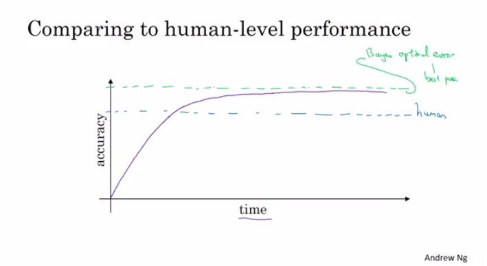

# Estructurando proyectos de machine learning

## Índice
   * [Estrategia de ML 1](#estrategia-de-ml-1)
      * [¿Por qué estrategia de ML?](#por-qué-estrategia-de-ml)
      * [Ortogonalización](#ortogonalización)
      * [Métrica de evaluación de un único número](#métrica-de-evaluación-de-un-único-número)
      * [Métrica de satisfacción y optimización](#métrica-de-satisfacción-y-optimización)
      * [Distribuciones Train/dev/test](#distribuciones-traindevtest)
      * [Tamaño de los dev y test set](#tamaño-de-los-dev-y-test-set)
      * [Cuándo cambiar los dev/test sets y métricas](#cuándo-cambiar-los-devtest-sets-y-métricas)
      * [¿Por qué el desempeño a nivel humano?](#por-qué-el-desempeño-a-nivel-humano)
      * [Bias evitable](#bias-evitable)
      * [Comprendiendo el desempeño a nivel humano](#comprendiendo-el-desempeño-a-nivel-humano)
      * [Sobrepasando el nivel de desempeño humano](#sobrepasando-el-nivel-de-desempeño-humano)
      * [Mejorando el rendimiento del modelo](#mejorando-el-rendimiento-del-modelo)
   * [Estrategia de ML 2](#estrategia-de-ml-2)
      * [Realización de análisis de errores](#realización-de-análisis-de-errores)
      * [Limpiando datos incorrectamente etiquetados](#limpiando-datos-incorrectamente-etiquetados)
      * [Contruir el primer sistema rápidamente, después iterar](#contruir-el-primer-sistema-rápidamente-después-iterar)
      * [Entrenando y testeando en distribuciones diferentess](#entrenando-y-testeando-en-distribuciones-diferentess)
      * [Bias y varianza con distribuciones de datos disparejos](#bias-y-varianza-con-distribuciones-de-datos-disparejos)
      * [Abordar la discrepancia de datos](#abordar-la-discrepancia-de-datos)
      * [Aprendizaje por transferencia](#aprendizaje-por-transferencia)
      * [Aprendizaje multi-tarea](#aprendizaje-multi-tarea)
      * [¿Qué es el aprendizaje profundo de extremo a extremo?](#qué-es-el-aprendizaje-profundo-de-extremo-a-extremo)
      * [Cuándo usar end-to-end deep learning](#cuándo-usar-end-to-end-deep-learning)

## Estrategia de ML 1

### ¿Por qué estrategia de ML?

- Hay muchas ideas sobre cómo mejorar la precisión del sistema de deep learning:
  - Conseguir más datos.
  - Conseguir un training set más diverso.
  - Entrenar el algoritmo durante más tiempo con descenso del gradiente.
  - Probar distintos algoritmos de optimización.
  - Probar aumentar el tamaño de la red.
  - Probar reducir el tamaño de la red.
  - Probar dropout.
  - Añadir regularización L2.
  - Cambiar la arquitectura de la red (funciones de activación, No. de unidades ocultas, etc.).

### Ortogonalización

- Es el proceso de ajustar determinados parámetros en concreto para conseguir determinados efectos.
- Es necesario ajustar el sistema para conseguir 4 objetivos:
  1. Hay que ajustar el training set bien en la función de coste (cerca al rendimiento humano si es posible).
     - Si no es posible, intentar una red mayor, otro algoritmo de optimización...
  2. Ajustar el dev set bien en la función de coste.
     - Si no se consigue, intentar regularizar, un training set mayor...
  3. Ajustar bien el test set en la función de coste.
     - Si no se consigue, intentar aumentar el dev set...
  4. Buen rendimiento en el mundo real.
     - Si no se consigue, cambiar el dev set, cambiar la función de coste...

### Métrica de evaluación de un único número

- Es mejor y más rápido establecer una métrica de evaluzación de un único número para el proyecto antes de comenzarlo.
- Direfenciar entre precición y recall:
  - Si ejecutamos el clasificador con 10 imágenes donde 5 son gatos y 5 no. El clasificador identifica que 4 son gatos, pero identifica de forma erronea un gato.
  - Matriz de confusión:

		      |                   | Gatos predichos  | No-gatos predichos|
		      | ----------------  | -----------------| ----------------- |
		      | Gatos actuales 	  | 3                | 2                 |
		      | No-gatos actuales | 1                | 4                 |
  - **Precisión**: porcentaje de gatos reales en los resultados reconocidos: P = 3/(3 + 1) 
  - **Recall**: porcentaje de gatos reconocidos correctamente del total real: R = 3/(3 + 2)
  - **Acierto**: (3+4)/10
- Usando precisión/recall para evaluar es correcto en muchos casos, pero de forma separada no indican qué algoritmo es mejor. Ej:

		  | Classifier | Precision | Recall |
		  | ---------- | --------- | ------ |
		  | A          | 95%       | 90%    |
		  | B          | 98%       | 85%    |
- Una mejor opción es combinar ambos valores para obtener un resultado. La puntuación `F1`
  - `F1` se puede considerar como el promedio de ambos
    `F1 = 2 / ((1/P) + (1/R))`

### Métrica de satisfacción y optimización

- En ocasiones cuesta obtener la métrica de evaluación de un único número. Ej:

		  |Clasificador| F1   |Tiempo de ejec|
		  | ---------- | ---- | ------------ |
		  | A          | 90%  | 80 ms        |
		  | B          | 92%  | 95 ms        |
		  | C          | 92%  | 1,500 ms     |
- Por lo que se puede escoger en función de otras métricas que interesen. Ej:

	Maximizar F1                     # métrica de optimización
	tiempo de ejecución < 100ms 	 # métrica de satisfacción

- Como regla general:
 
		maximizar 1     # métrica de optimización (una)
		sujeto a N-1 #  métrica de satisfacción (N-1)
		 

### Distribuciones Train/dev/test 

- Los sets dev y test tienen que venir de la misma distribución.
- Escoger un dev set y test set que reflejen los datos que se eperan conseguir en el futuro.
- Establecer el dev set, al igual que la métrica de validación define el objetivo al que se apunta.

### Tamaño de los dev y test set

- Una forma de dividir los datos era 70% training, 30% test o 60% training, 20% dev, 20% test. 
- Esta división era válida para un número de muestras ~ <100000 
- En los sistemas modernos se posee millones de datos o más. Sería más acertado 98% training, 1% dev, 1% test. 

### Cuándo cambiar los dev/test sets y métricas

- En el ejemplo de la clasificación de gatos, se tenía:

		  | Métrica     | Error de clasificación|
		  | ----------- | ------------------------------------------------------------ |
		  | Algoritmo A | 3% error (Pero imágenes porno son consideradas gatos)        |
		  | Algoritmo B | 5% error                                                     |

  - En este caso se cambiaría la métrica. 
  - `OldMetric = (1/m) * sum(y_pred[i] != y[i] ,m)`
    - Donde m es el número de elementos del dev set.
  - `NewMetric = (1/sum(w[i])) * sum(w[i] * (y_pred[i] != y[i]) ,m)`
    - Donde:
       - `w[i] = 1                   si x[i] no es porno`
       - `w[i] = 10                 si x[i] es porno`

- Este es un ejemplo de ortogonalización donde un problema habría que separarlo en distintos pasos:
	1. Averiguar cómo definir una métrica que recoge lo que se desea realizar - se selecciona el objetivo. 
	2. Preocuparse de que la precisión del objetivo en la métrica sea acertada.

- Conclusión: Si se realiza bien la métrica + los sets dev/set no se ajustan a un correcto funcionamiento en la aplicación, cambiar la métrica y/o los dev/test set.

### ¿Por qué el desempeño a nivel humano?

- Se compara con el desempeño humano por dos razones:
  1. Por los avances, los algoritmos son cada vez más rápidos y aplicables a más campos de aplicación hasta el punto de competir con el desempeño humano. 
  2. El flujo de trabajo de diseñar y contruir los sistemas de aprendizaje son mucho mucho más eficientes cuando se trata de una tarea que podría realizar una persona.
- Cuando se alcanza el desempeño humano, el progreso y la precisión se frenan.
    
- No se puede pasar pasar del llamano "Error óptimo de Bayes".
- No hay mucho margen entre este y el humano.
- Los humanos somos buenos en muchas tareas. Mientras que el machine learning sea peor que los humanos, se puede:
  - Establecer etiquetas.
  - Obtener información a partir del análisis manual de errores: ¿por qué una persona lo hizo bien?
   - Mejor análisis de bias/varianza.

### Bias evitable

- Suponer de la clasificación de gatos:

		  | Humano                     | 1%   | 7.5% |
		  | -------------------------- | ---- | ---- |
		  | **Error de entrenamiento** | 8%   | 8%   |
		  | **Error de desarrollo**    | 10%  | 10%  |
  - En el ejemplo de la izquierda, como el error humano es del 1%, nos centraremos en el **bias**.
  - En la derecha, como el error humano es del 7.5%, nos centraremos en la **varianza**.
  - El error humano tiene un proxy (estimado) para el error óptimo de Bayes. El error óptimo de Bayes es siempre menor (mejor), aunque el humano no está muy lejos de este.
  - No se puede mejorar el error de Bayes a menos que se sobreajuste.
  - `bias evitable= error de entrenamiento- error humano (Bayes)`
  - `Varianza = error de desarrollo - error de entrenamiento`

### Comprendiendo el desempeño a nivel humano

- Se pueden tener distintos desempeño a nivel humano dependiendo de la experiencia. Se escoge un desempeño que se ajuste más al sistema que se desea construir.
- Mejorar los algoritmos de deep learning algorithms es más complicado una vez se alcanza el desempeño humano.
- Resumen de bias/variance con desempeño humano:
  1. error humano (proxy al error de Bayes)
     - Calcular `bias evitable = error de entrenamiento - error humano`
     - Si la diferencia de **bias evitable** es mayor, es un problema de bias y se debería adoptar una estrategia para resolverlo.
  2. error de entrenamiento
     - Calcular `varianza = error de desarrollo - error de entrenamiento`
     - Si la diferencia de **varianza** es mayor, usar una estrategia para atacar la varianza.
  3. error de desarrollo
- Tener una estimación del nivel de desempeño humano ofrece una estimación del error de Bayes. Esto permite tomar decisiones más rápido dependiendo de cuál sea el objetivo.
- Estas técnicas funcionan bien siempre que no se pase el nivel de desempeño humano. 

### Sobrepasando el nivel de desempeño humano

- Hay campos en los que el deep learning ha pasado al hombre:
  - Publicidad online.
  - Recomendación de productos.
  - Aprobación de préstamos.
- Los últimos ejemplos no son perceptibles de forma natural. Los humanos son mucho mejor en percepciones naturales como visión artificial o reconocimiento de voz.
- Es más complicado superar a los hombres en este tipo de taras, pero hay sistemas que ya lo han conseguido.

### Mejorando el rendimiento del modelo

- Existen dos asunciones en el lenguaje supervisado:
  1. Se puede ajustar el training set muy bien. En otras palabras, se puede alcanzar una baja **bias evitable**. 
  2. El rendimiento del conjunto de entrenamiento se generaliza bastante bien para los set dev/test. La **varianza** no es tan mala.
- Para mejorar el deep learning supervisado seguir esta guía:
  1. Observar la diferencia entre el nivel de error humano y el error de entrenamiento - **bias evitable**.
  2. Observar la diferencia entre el error de los set dev/test y el training set - **varianza**.
  3. Con **bias evitable**:
     - Entrenar un modelo mayor.
     - Entrenar durante más tiempo/ mejores algoritmos de optimización (impulso, RMSprop, Adam).
     - Encontrar una mejor arquitectura de NN/búsqueda de hiperparámetros.
  4. Con **varianza** :
     - Obtener más datos para el entrenamiento.
     - Regularizar (L2, Dropout, aumentar datos).
     - Encontrar una mejor arquitectura de NN/búsqueda de hiperparámetros.

## Estrategia de ML 2

### Realización de análisis de errores

- Análisis de errores - proceso de examinar manualmente fallos que realiza el algoritmo. Puede dar información sobre qué hacer después:
  - En la clasificación de gatos, Si se tiene un 10% de error en el dev sety se desea reducir.
  - Se descubre que algunos de los datos etiquetados mal son perros que se parecen a gatos. ¿Se debería mejorar en el reconocimiento de perros? (Podría tomar semanas)
  - Análisis de error de aproximación:
    - Se obtienen 100 muestras del dev set mal etiquetadas de forma aleatoria.
    - Contar cuántos perror hay.
    - Si 5 de 100 son perros, entrenar el clasificador para que sea mejor con los perros reducirá el error hasta un 9.5% (a esto se le llama techo), lo cual puede ser muy poco.
    - Si 50 de 100 son perros se puede reducir el error hasta un 5%, lo cuál es razonable y es en lo que habría que trabajar.
- Los análisis de errores ayudan a analizar el error antes de tomar medidas que podría llevar mucho tiempo y noser necesarias.
- A veces, se pueden evaluar múltiples errores en paralelo y escoger la mejor idea:

		  | Image        | Dog    | Great Cats | blurry  | Instagram filters |    Comments    |
		  | ------------ | ------ | ---------- | ------- | ----------------- |--------------- |
		  | 1            | ✓     |            |         | ✓                 |  Pitbull       |
		  | 2            | ✓     |            | ✓       | ✓                |                |
		  | 3            |        |            |         |                   |Rainy day at zoo|
		  | 4            |        | ✓         |         |                   |                |
		  | ....         |        |            |         |                   |                |
		  | **% totals** | **8%** | **43%**    | **61%** |      **12%**      |                |
- En este ejemplo se tendría que trabajar en great cats o en blurry images para mejorar el desempeño.

### Limpiando datos incorrectamente etiquetados

- Los algoritmos de DL son bastante robustos con los errores aleatorios del training set, pero menos con los errores sistemáticos.
- Si se desea comprobar si hay datos mal etiquetados en el set dev/test, se podría intentar realizar un análisis de errores con la columna mal etiquetada:

		  | Image        | Dog    | Great Cats | blurry  | Mislabeled | Comments |
		  | ------------ | ------ | ---------- | ------- | ---------- | -------- |
		  | 1            | ✓     |            |         |            |          |
		  | 2            | ✓     |            | ✓      |            |          |
		  | 3            |        |            |         |            |          |
		  | 4            |        | ✓         |         |            |          |
		  | ....         |        |            |         |            |          |
		  | **% totals** | **8%** | **43%**    | **61%** | **6%**     |          |
  - Entonces:
    - Si el error general del dev set: 10%
      - Puede deberse por datos incorrectos: 0.6%
      - Otras causas: 9.4%
    - Centrarse en el 9.4% de error sería más acertado.
- Considerar estas indicaciones al corregir muestras de dev/test mal etiquetadas:
  - Aplicar el mismo proceso al dev y al test set para asegurar que continuan viniendo de la misma distribución.
  - Los datos de entreno y (dev/test) quizás vienen de distintas distribuciones.
  - Puede estar correcto que un train set venga de una distribución ligeramente cambiada.

### Contruir el primer sistema rápidamente, después iterar

- Los pasos de un proyecto de DL:
  - Configurar los set dev/test y métrica
  - Contruir un sistema inicial rápidamente
  - Usar un análisis de bias/varianza y análisis de errores para priorizar los siguiente pasos.

### Entrenando y testeando en distribuciones diferentes

- Muchos equipos trabajan con aplicaciones de DL que han sido entrenadas con sets de entrenamiento distintos a los dev/test debido al hambre de datos que tiene el DL.
- Estrategias a seguir:
  - Opción 1 (no recomendada): Mezclar todos los datos y extraer de forma aleatoria los sets de entrenamiento y dev/test.
    - Ventajas: todos los conjuntos vienen de la misma distribución.
    - Desventajas: la otra distribución (mundo real) que estaba en los set dev/test ocurrirá menos en los nuevos conjuntos dev/set y quizás no es lo que se desea conseguir.
  - Opción 2: Tomar algunas muestras de los set dev/testy añadirlas al set de entrenamiento.
    - Ventajas: la distribución que era importante es ahora el objetivo.
    - Desventaja: la distribución en los train y dev/test set son distintas. Pero se consigue un mejor desempeño a largo plazo.

### Bias y varianza con distribuciones de datos disparejos

- El análisis de bias y varianza cambia cuando los conjuntos vienen de distintas distribuciones.
- Ejemplo: el clasificador de gatos
  - Error humano: 0%
  - Train error: 1%
  - Dev error: 10%
  - En este ejemplo se pensaría que es un problema de varianza, pero es posible asegurarse debido a las distribuciones.
- Para resolverlo se crea un set llamado train-dev como un subconjunto del training set (misma distribución):
  - Error humano: 0%
  - Train error: 1%
  - Train-dev error: 9%
  - Dev error: 10%
  - Ahora se puede confirmar que es un problema de varianza alta.
- Distinta situación:
  - Error humano: 0%
  - Train error: 1%
  - Train-dev error: 1.5%
  - Dev error: 10%
  - En este caso, sí se puede decir que hay un problema llamado *Data mismatch* (	datos desajustados).
- Conclusión:
  1. Error humano(proxy del error de Bayes)
  2. Error de entrenamiento
     - Calcular `bias evitable = error de entrenamiento - error humano`
     - Si la diferencia es alta, es un problema de **bias evitable**, usar una estrategia de **bias** elevada.
  3. Error de train-dev
     - Calcular `varianza = error train-dev - error de entrenamiento`
     - Si la diferencia es alta, es un problema de **varianza** elevada.
  4. Error de dev
     - Calcular `data mismatch = error dev - error train-dev`
     - Si la diferencia es mucho mayor, el error de train-dev es un problema de **data mismatch**.
  5. Error de test
     - Calcular `grado de sobreentrenamiento sobre el dev set = error test- error dev`
     - Si la diferencia es alta (positiva), quizás se necesita un mayor conjunto dev (dev set y test set vienen de la misma distribución, para mejorar en el dev set con respecto al test es sobreentrenando de alguna manera el dev set).
- Desafortunadamente, no hay muchas formas sistemáticas de lidiar con este problema de data mismatch.

### Abordar la discrepancia de datos

- No hay un método sistemático, pero hay algunas posibles indicaciones.
1. Realizar un análisis de errores manual para tratar de comprender la diferencia entre los conjuntos de entrenamiento y dev/test.
2. Conseguir datos de entrenamiento más similares u obtener más datos similares a los de dev/test.
- Si el objetivo es que los datos de entrenamiento sean más similares a los del dev, una técnica que puede usarse es la **síntesis de datos artificiales** .
    - Combina parte de tus datos de entrenamiento con algo que pueda transformarlo a la distribución de dev/test.
      - Ejemplos:
        1. Combinar audio normal con ruido de coches para obtener audio con ruido de coches de fondo.
        2. Generar coches usando gráficos 3D en un ejemplo de clasificación de coches.
    - Ser precavido y tener en cuenta si es posible que esté simulando datos accidentalmente o no de solo un pequeño subconjunto de todos los posibles casos porque es posible que la red neuronal se sobreentrene con estos datos.

### Aprendizaje por transferencia

- Aplicar el conocimiento obtenido en la tarea A y aplicarlo en una tarea B.
- Para realizar un aprendizaje por transferencia, eliminar la última capa de la NN y sus pesos y:
  1. Opción 1: Si se tiene un data set pequeño - mantener los demás pesos como pesos ajustados. Añadir una nueva capa/s e inicializar los nuevos pesos de las capas y proveer con los nuevos datos a la NN y aprender los nuevos pesos.
  2. Opción 2: Si se tiene suficientes datos, se pueden reentrenar todos los pesos.
- Las opciones 1 y 2 son llamadas **fine-tuning** (ajuste fino) y el entreno en la tarea A, **pretraining**.
- Cuándo tiene sentido un aprendizaje por transferencia:
  - Las tareas A y B tienen los mismos datos de entrada.
  - Se tienen muchos datos en la tarea A, pero relativamente menos en la tarea B.
  - Características de bajo nivel de la tarea A podrían ser útiles para la tarea B.

### Aprendizaje multi-tarea

- En el aprendizaje multi-tarea se comienza con una NN que realizar el aprendizaje de varias tareas de forma simultánea. Y, con suerte, cada una de las tareas ayuda a las demás. 
- Ejemplo:
  - Se desea construir un sistema de reconocimiento de objetos que detecte peatones, automóviles, señales de alto y semáforos (la imagen tiene varias etiquetas).
  - Entonces la forma de Y será `(4, m)` porque tenemos 4 clases y cada una es binaria.
  - Entonces   
		  `Cost = (1/m) * sum(sum(L(y_hat(i)_j, y(i)_j))), i = 1..m, j = 1..4`, donde   
		  `L = - y(i)_j * log(y_hat(i)_j) - (1 - y(i)_j) * log(1 - y_hat(i)_j)`
- Entrenar una red neuronal para realizar cuatro tareas da como resultado un mejor rendimiento que entrenar 4 redes neuronales completamente separadas para hacer las cuatro tareas por separado. 
- El aprendizaje multitarea también funciona si y no está completa para algunas etiquetas:

		  Y = [1 ? 1 ...]
		      [0 0 1 ...]
		      [? 1 ? ...]
  - Y en este caso funcionará bien con los datos faltantes, pero la función de pérdida será diferente:   
    `Loss = (1/m) * sum(sum(L(y_hat(i)_j, y(i)_j) for all j which y(i)_j != ?))`
- Cuando usar aprendizaje multi-tarea:
  1. Entrenamiento de un conjunto de tareas que podrían beneficiarse de tener funciones compartidas a bajo nivel.
  2. La cantidad de datos que se tiene para cada tarea es bastante similar.
  3. Se puede entrenar una red los suficientemente grande para que lo haga bien en todas las tareas.
- Si se entrena una NN lo suficientemente grande, el rendimiento de la multitarea es mejor que de forma separadas.
- A día de hoy, el aprendizaje por transferencia es más usado que por multitarea.

### ¿Qué es el aprendizaje profundo de extremo a extremo?

- Algunos sistemas tienen varias etapas para implementar. Un sistema de aprendizaje profundo de extremo a extremo (end-to-end deep learning) implementa todas estas etapas con una única NN.
- Ejemplo 1:
  - Sistema de reconocimiento de voz:

		    Audio ---> Características --> Fonemas--> Palabras--> Transcripción # non-end-to-end system
			Audio ---------------------------------------> Transcripción # end-to-end deep learning system

  - End-to-end deep learning ofrece más libertad a los datos, quizás no es necesario hacer uso de los fonemas.
  - Para construir el sistema de deep learning end-to-end que funcione bien, necesitamos un gran conjunto de datos (más datos que en un sistema que no lo sea). Si tenemos un pequeño conjunto de datos, la implementación ordinaria podría funcionar bien.
- Ejemplo 2:
  - Sistema de reconocimiento facial:

		    Imagen ---------------------> Reconocimiento facial    # end-to-end deep learning system
		    Imagen --> Detección de caras--> Reconocimiento facial # deep learning system - mejor aproximación

  - En la práctica, la mejor aproximación es la segunda por ahora.
  - En la segunda implementación, es una aproximación de dos pasos donde ambas partes son implementadas usando deep learning.
  - Funciona bien porque es más difícil obtener muchas fotos con personas frente a la cámara que ver caras de personas y compararlas..
  - En el último paso de la segunda implementación, la NN toma dos caras como entrada y salidas si las dos caras son la misma persona o no.
- Ejemplo 3:
  - Sistema de traducción automática:

		    Inglés --> Análisis de texto--> ... --> Francés # non-end-to-end system
		    Inglés----------------------------> Francés # end-to-end deep learning system - mejor aproximación

  - End-to-end funciona mejor porque se tiene suficientes datos para construirlo.
- Ejemplo 4:
  - Estimación de la edad del niño a partir de la imagen de rayos X de una mano:
 
			  Imagen --> Huesos--> Edad # non-end-to-end system - mejor aproximación
			  Imagen ------------> Edad # end-to-end system
 
  - Funciona mejor el primer caso porque no se tienen suficientes datos de entrada para un sistema end-to-end.

### Cuándo usar end-to-end deep learning

- Ventajas del end-to-end deep learning:
  - Al tener un enfoque de aprendizaje automático puro, la entrada de la NN de X a Y puede ser más capaz de capturar las estadísticas que se encuentran en los datos, en lugar de verse obligado a reflejar las ideas preconcebidas humanas. 
  - Menos diseños a mano de los componentes necesarios.
- Contras del end-to-end deep learning:
  - Quizás se necesita un mayor cantidad de datos.
  - Excluye componentes de diseño a mano potencialmente útiles (ayudan más en conjuntos de datos más pequeños).
- Aplicando end-to-end deep learning:
  - Pregunta clave: ¿Se tienen datos suficientes para aprender una función de la **complejidad** necesaria para mapear x con y?
  - Usar ML/DL para aprender algunos componentes individuales.
  - Al aplicar el aprendizaje supervisado se debe elegir cuidadosamente qué tipos de asignaciones de X a Y se quiere aprender en función de la tarea para la que se pueda obtener datos.